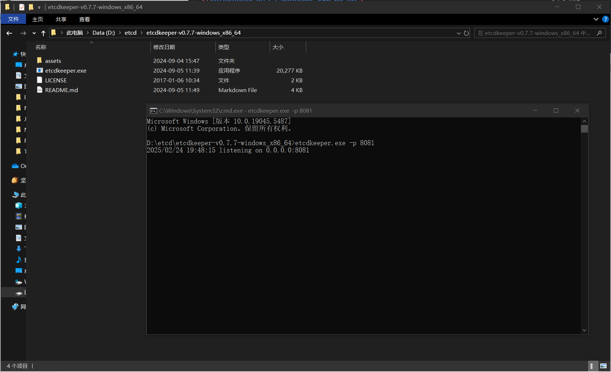

## Etcd介绍

[Etcd](https://github.com/etcd-io/etcd)是一个Go语言实现的、开源的、分布式的键值存储系统，它主要用于分布式系统中的服务发现、配置管理和分布式锁等场景。

因为Etcd是用Go语言实现的，所以Etcd的性能是很高的，而且它和云原生有着密切的关系，通常被作为云原生应用的基础设施，存储一些元信息。比如经典的容器管理平台`k8s`就使用了Etcd来存储集群配置信息、状态信息、节点信息等。

意思就是这玩意儿挂了，整个云都得挂。

除了性能之外，Etcd采用Raft一致性算法来保证数据的一致性和可靠性，具有高可用性、强一致性、分布式特性等特点。

最可气的是，Etcd还非常简单易用！提供了简单的`API`、数据的过期机制、数据的监听和通知机制等，完美满足注册中心的实现诉求。

Etcd的入门成本是极低的，只要你学过Redis、ZooKeeper或者对象存储中的一个，就能够很快理解Etcd并投入实战运用。

## Etcd数据结构与特性

Etcd在其数据模型和组织结构上更接近于ZooKeeper和对象存储，而不是Redis。它使用层次化的键值对来存储数据，支持类似于文件系统路径的层次结构，能够很灵活地单key查询、按前缀查询、按范围查询。

Etcd的核心数据结构包括：

1. Key (键)：Etcd中的基本数据单元，类似于文件系统中的文件名。每个键都唯一标识一个值，并且可以包含子键，形成类似于路径的层次结构。
2. Value (值)：与键关联的数据，可以是任意类型的数据，通常是字符串形式。

Etcd有很多核心特性，其中，应用校多的特性是：

1. Lease (租约)：用于对键值对进行TTL超时设置，即设置键值对的过期时间。当租约过期时，相关的键值对将被自动删除。

2. Watch (监听)：可以监视特定键的变化，当键的值发生变化时，会触发相应的通知。

有了这些特性，我们就能够实现注册中心的服务提供者节点过期和监听了。此外，Etcd的一大优势就是能够保证数据的强一致性。

## Etcd如何保持数据一致性

-   从表层来看，Etcd支持事务操作，能够保证数据一致性。

-   从底层来看，Etcd使用Raft一致性算法来保证数据的一致性。

Raft是一种分布式一致性算法，它确保了分布式系统中的所有节点在任何时间点都能达成一致的数据视图。

具体来说，Raft算法通过选举机制选举出一个领导者(Leader)节点，领导者负责接收客户端的写请求，并将写操作复制到其他节点上。当客户端发送写请求时，领导者首先将写操作写入自己的日志中，并将写操作的日志条目分发给其他节点，其他节点收到日志后也将其写入自己的日志中。一旦**大多数节点**（即半数以上的节点）都将该日志条目成功写入到自己的日志中，该日志条目就被视为已提交，领导者会向客户端发送成功响应。在领导者发送成功响应后，该写操作就被视为已提交，从而保证了数据的一致性。

如果领导者节点宕机或失去联系，Raft算法会在其他节点中选举出新的领导者，从而保证系统的可用性和一致性。新的领导者会继续接收客户端的写请求，并负责将写操作复制到其他节点上，从而保特数据的一致性。

理解Playground：http://play.etcd.io/play

## Etcd基本操作

和所有数据存储中间件一样，基本操作无非就是：增删改查。

## Etcd安装

Etcd官方的下载页：https://github.com/etcd-io/etcd/releases

也可以在这里下载：https://etcd.io/docs/v3.2/install/

找到自己操作系统的版本执行即可，这里我选择3.4.33-windows版本。

安装完成后，会得到三个脚本。

- etcd: etcd服务本身
- etcdctl: 客户端，用于操作etcd，比如读写数据
- etcdutl: 备份恢复工具

启动一下：

执行etcd 脚本后，可以启动etcd服务，服务默认占用2379和2380端口，作用分别如下：

- 2379：提供HTTP API服务，和etcdctl交互
- 2380：集群中节点之间通讯

## Etcd可视化工具

一般情况下，我们使用数据存储中间件时，一定要有一个可视化工具，能够更直观清晰地管理已经存储的数据，比如Redis的 Redis Desktop Manager。

同样的，Etcd也有一些可视化工具，比如：

-   etcdkeeper：https://github.com/evildecay/etcdkeeper/
-   kstone:https://github.com/kstone-io/kstone/tree/master/charts

本项目采用etcdkeeper，安装成本更低，学习使用更方便。安装etcdkeeper-v0.7.7-windows版本。

安装后，执行命令，可以在指定端口启动可视化界面（默认是8080端口），这里我通过`-p`命令指定8081端口启动。

成功启动，此时访问本地http://127.0.0.1:8081/etcdkeeper/，就能看到可视化界面了

## Etcd Java 客户端

所谓客户端，就是操作Etcd的工具。

etcd主流的Java客户端是 jetcd: https://github.com/etcd-io/jetcd

注意，Java版本必须大于11！

用法非常简单，就像curator能够操作ZooKeeper、jedis能够操作Redis一样。

1.   在项目中引入jetcd依赖

2.   按照官方文档的示例写Demo:

3.   在line38行删除数据处打断点，DEBUG模式运行`EtcdRegistry`类，观察EtcdKeeper中的数据变化

此时，可视化中心已经存入了测试键值对，继续运行

刷新页面，可以看到测试键值对已经被删除了。

在上述代码中，我们使用KVClient来操作etcd写入和读取数据。除了KVClient客户端外，Etcd还提供了很多其他客户端。

常用的客户端和作用如下，仅作了解即可：

1. kvClient: 用于对etcd中的键值对进行操作。通过kvClient可以进行设置值、获取值、删除值、列出目录等操作。
2. leaseClient: 用于管理etcd的租约机制。租约是etcd中的一种时间片，用于为键值对分配生存时间，并在租约到期时自动删除相关的键值对。通过leaseClient可以创建、获取、续约和撤销租约。
3. watchClient:用于监视etcd中键的变化，并在键的值发生变化时接收通知。
4. clusterClient:用于与etcd集群进行交互，包括添加、移除、列出成员、设置选举、获取集群的健康状态、获取成员列表信息等操作！
5. authClient::用于管理etcd的身份验证和授权。通过authClient可以添加、删除、列出用户、角色等身份信息，以及授予或撤销用户或角色的权限。
6. maintenanceClient:用于执行etcd的维护操作，如健康检查、数据库备份、成员维护、数据库快照、数据库压缩等。
7. lockClient:用于实现分布式锁功能，通过lockClient可以在etcd上创建、获取、释放锁，能够轻松实现并发控制。
8. electionClient:用于实现分布式选举功能，可以在etcd上创建选举、提交选票、监视选举结果等。

绝大多数情况下，用前3个客户端就足够了。

3.   Etcd 的数据结构：

发现除了key和vlue外，还能看到版本、创建版本、修改版本字段。这是因为etcd中的每个键都有一个与之关联的版本号，用于跟踪键的修改历史。当一个键的值发生变化时，其版本号也会增加。

通过使用etcd的Watch API，可以监视键的变化，并在发生变化时接收通知。这种版本机制使得etcd在分布式系统中能够实现乐观并发控制、一致性和可靠性的数据访问