## 需求分析

我们已经给RPC框架增加了重试机制，提升了服务消费端的可靠性和健壮性。

但如果重试超过了一定次数仍然失败，我们又该怎么处理呢？

或者说**当调用出现失败时，我们一定要重试么？有没有其他的策略呢？**

==> 容错机制。

## 设计方案

### 容错机制

容错是指系统在出现异常情况时，可以通过一定的策略保证系统仍然稳定运行，从而提高系统的可靠性和健壮性。

在分布式系统中，容错机制尤为重要，因为分布式系统中的各个组件都可能存在网络故障、节点故障等各种异常情况。要顾全大局，尽可消除偶发/单点故障对系统带来的整体影响。

打个比方，将分布式系统类比为一家公司，如果公司某个优秀员工请假了，需要“触发容错”，让另一个普通员工顶上，这本质上是容错机制的一种降级策略。

容错机制一般都是在系统出现错误时才触发的，这点没什么好讲的，我们需要重点学习的是容错策略和容错实现方式。

### 容错策略

容错策略有很多种，常用的容错策略主要是以下几个：

- Fail-Over故障转移：一次调用失败后，切换一个其他节点再次进行调用，也算是一种重试。
- Fail-Back失败自动恢复：系统的某个功出现调用失败或错误时，通过其他的方法，恢复该功能的正常。可以理解为降级，比如重试、调用其他服务等。
- Fail-Safe静默处理：系统出现部分非重要功的异常时，直接忽略掉，不做任何处理，就像错误没有发生过一样。
- Fail-Fast快速失败：系统出现调用错误时，立刻报错，交给外层调用方处理。

### 容错实现方式

容错其实是个比较广泛的概念，除了上面几种策略外，很多技术都可以起到容错的作用。比如：

1. 重试：重试本质上也是一种容错的降级策略，系统错误后再试一次。
2. 限流：当系统压力过大、已经出现部分错误时，通过限制执行操作（接受请求）的频率或数量，对系统进行保护。
3. 降级：系统出现错误后，改为执行其他更稳定可用的操作。也可以叫做“兜底”或"有损服务”，这种方式的本质是：即使牺性一定的服务质量，也要保证系统的部分功能可用，保证基本的功能需求得到满足。
4. 熔断：系统出现故障或异常时，暂时中断对该服务的请求，而是执行其他操作，以避免连锁故障。
5. 超时控制：如果请求或操作长时间没处理完成，就进行中断，防止阻塞和资源占用。

注意，在实际项目中，根据对系统可靠性的需求，我们通常会结合多种策略或方法实现容错机制。

### 容错方案设计

回归到我们的RPC框架，之前已经给系统增加重试机制了，算是实现了一部分的容错能力。

现在，我们可以正式引入容错机制，通过更多策略来进一步增加系统可靠性。

容错方案的设计可以是很灵活的，这里提供2种方案：

1. **先容错再重试**。当系统发生异常时，首先会触发容错机制，比如记录日志、进行告警等，然后可以选择是否进行重试。这种方案其实是把重试当故容错机制的一种可选方案。
2. **先重试再容错**。在发生错误后，首先尝试重试操作，如果重试多次仍然失败，则触发容错机制，比如记录日志、进行告警等。

事实上，这2种方案其实完全可以结合使用！

系统错误时，先通过重试操作解决一些临时性的异常，比如网络波动、服务端临时不可用等：如果重试多次后仍然失败，说明可能存在更严重的问题，这时可以触发其他的容错策略，比如调用降级服务、熔断、限流、快速失败等，来减少异常的影响，保障系统的稳定性和可靠性。

举个具体的例子：

1. 系统调用服务A出现网络错误，使用容错策略-重试。
2. 重试3次失败后，使用其他容错策略-降级。
3. 系统改为调用不依赖网络的服务B，完成操作

## 开发实现

### 多种容错策略实现

在`zio-rpc-core`模块的`com.zio.ziorpc`包中新建`fault.tolerant`包，将所有容错相关的代码放到该包下。

1.   编写容错策略通用接口。提供一个容错方法，使用Map类型的参数接受上下文信息（可用于灵活地传递容错处理需要用到的数据），并且接受一个具体的异常类参数。

由于容错是应用到发送请求操作的，所以容错方法的返回值是`RpcResponse`(响应)。

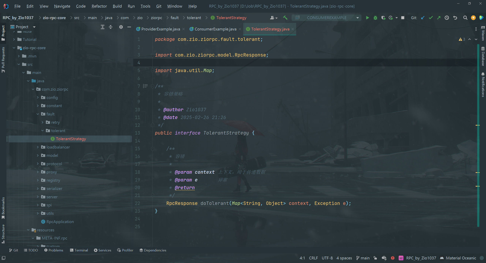

2.   实现快速失败容错策略`FailFastTolerantStrategy`，遇到异常后，将异常再次抛出，交给外层处理。

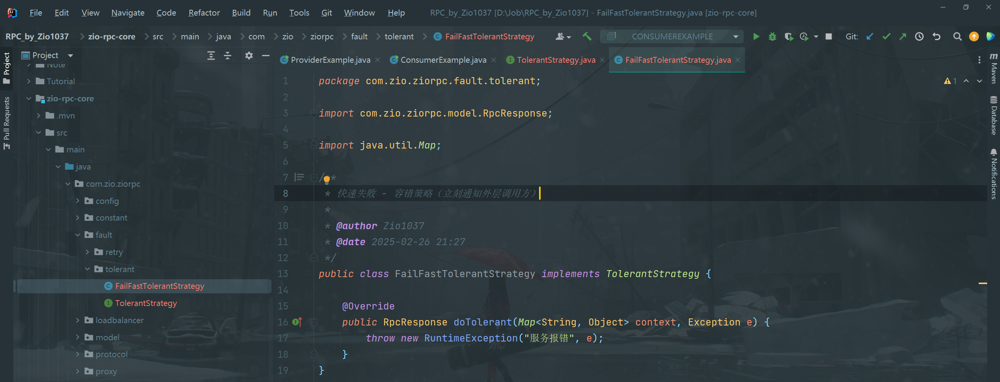3. 实现静默处理容错策略`FailSafeTolerantStrategy`，遇到异常后，记录一条日志，然后正常返回一个响应对象，就好像没有出现过报错。

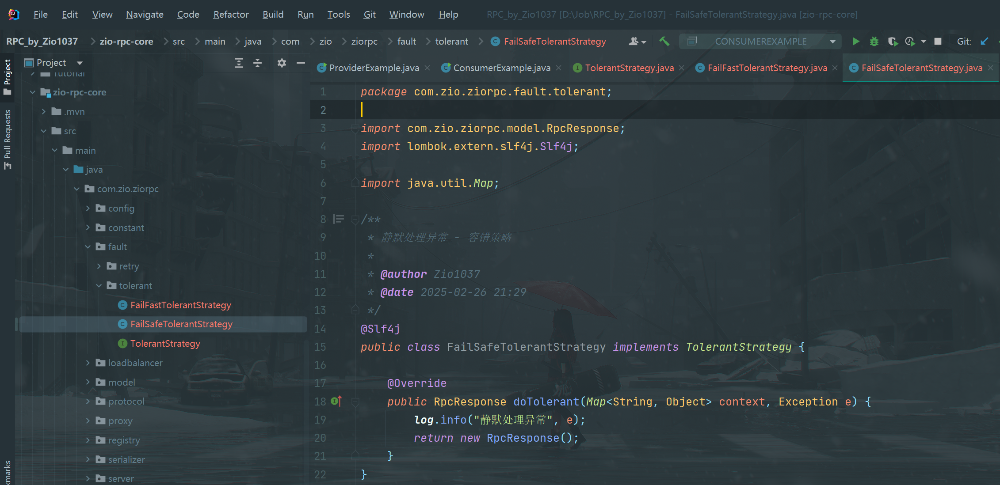

4.   实现故障转移容错策略`FailOverTolerantStrategy`，遇到异常后，移除异常节点，获取其它服务节点并调用。

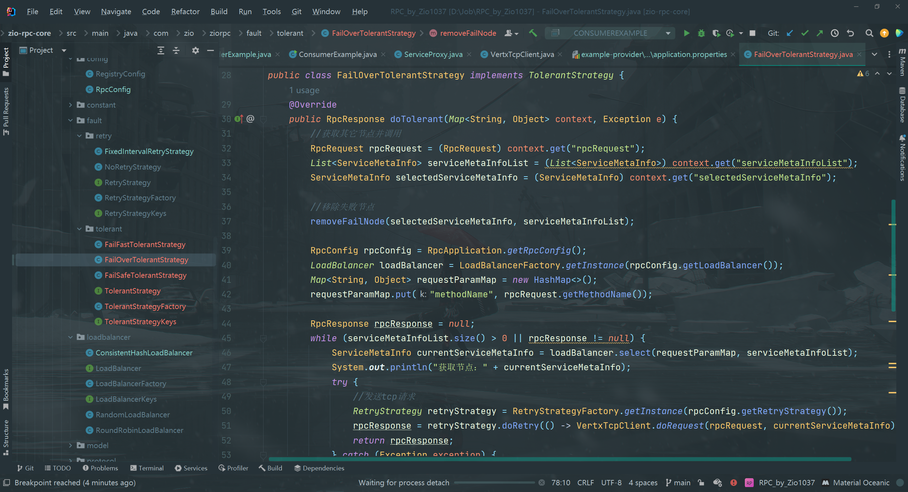

### 支持配置和扩展容错策略

一个成熟的RPC框架可能会支持多种不同的容错策略，像序列化器、注册中心、负载均衡器一样，我们的需求是，让开发者能够填写配置来指定使用的容错策略，并且支持自定义容错策略，让框架更易用、更利于扩展。

要实现这点，开发方式和序列化器、注册中心、负载均衡器都是一样的，都可以使用工厂创建对象、使用`SPI`动态动加载自定义的注册中心。

1.   容错策略常量。在`fault.tolerant`包下新建`TolerantStrategyKeys`类，列举所有支持的容错策略键名。

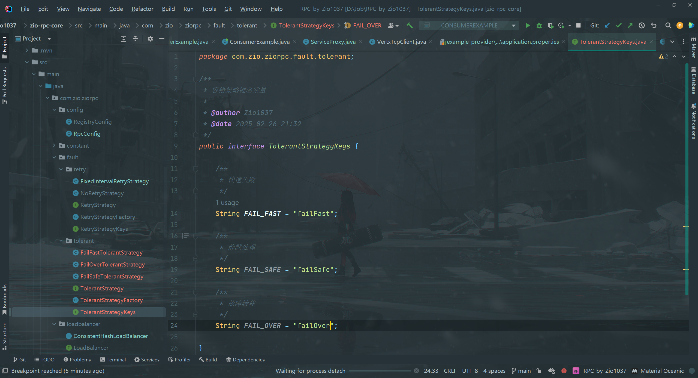

2.   使用工厂模式，支持根据key从SPI获取容错策略对象实例

在`fault.tolerant`包下新建`TolerantStrategyFactory`类，代码如下：

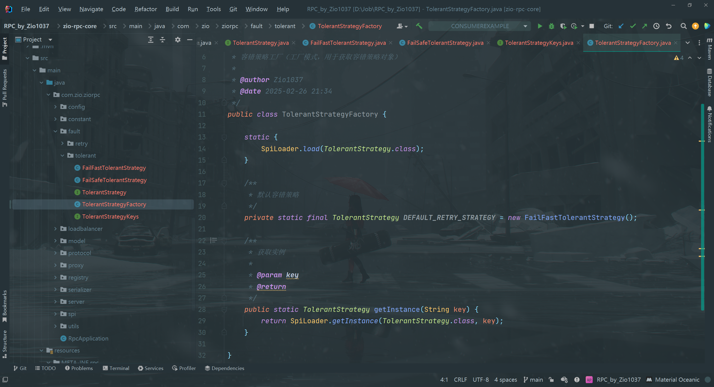

这个类可以直接复制之前的SerializerFactory，然后略做修改。可以发现，只要跑通了一次SPI机制，后续的开发就很简单了~ 

3.   在`META-INF`的`rpc/system`目录下编写容错策略接口的SPl配置文件，文件名称为`com.zio.ziorpc.fault.tolerant.Tolerantstrategy`

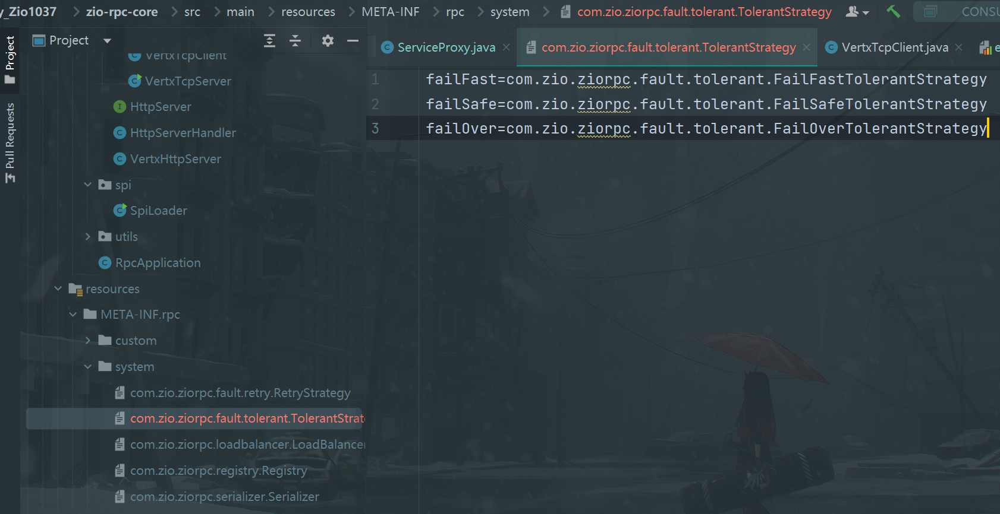

4.   为`RpcConfig`全局配置新增容错策略的配置，代码如下：

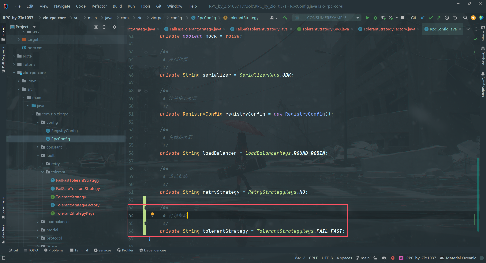

5.   在消费者的全局配置文件`application.properties`中新增容错策略的配置项，这里配置为故障转移策略。

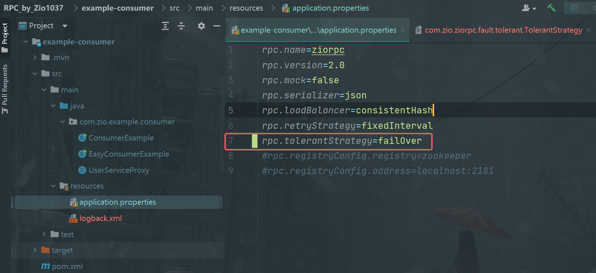

### 应用容错功能

容错功能的应用非常简单，我们只需要修改`ServiceProxy`的部分代码，在重试多次抛出异常时，从工厂中获取容错策略并执行即可。

修改部分的代码如下：

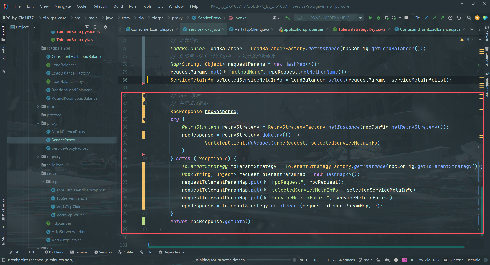

我们会发现，即使引入了容错机制，整段代码并没有变得更复杂，这就是可扩展性设计的巧妙之处。

**另**：需要fix一致性hash负载均衡器`ConsistentHashLoadBalancer`中的一个bug：

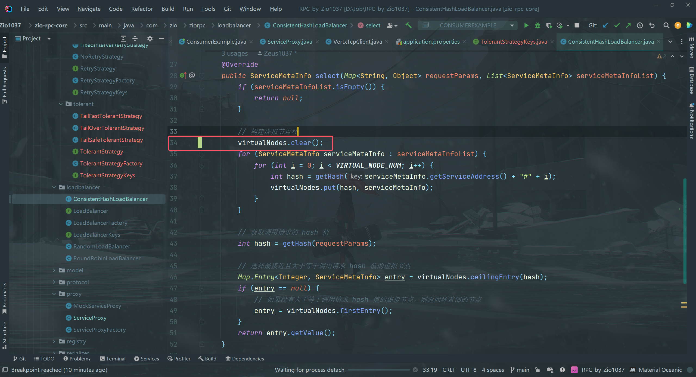

如果故障转移策略中的负载均衡器选择为一致性hash，则需要重新构建一致性hash的虚拟节点环。否则即使消费者访问的节点无法连接，重试3次后的容错策略选择的节点`loadBalancer.select`仍为原来的节点，因为该节点的信息仍存在虚拟节点环`VirtualNodes`中。

## 测试

1.   启动服务提供者`ProviderExample`，在8887、8888、8889端口分别启动服务

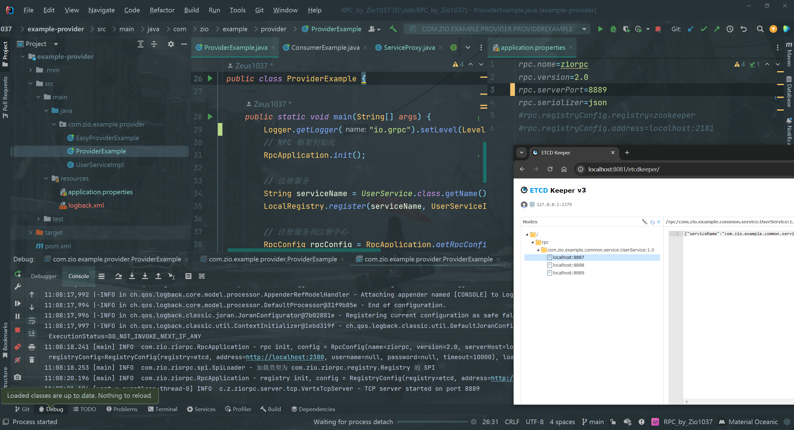

2.   在`VertxTcpClient`类中调用`netClient.connect`方法处打上断点，使用Debug模式启动服务消费者

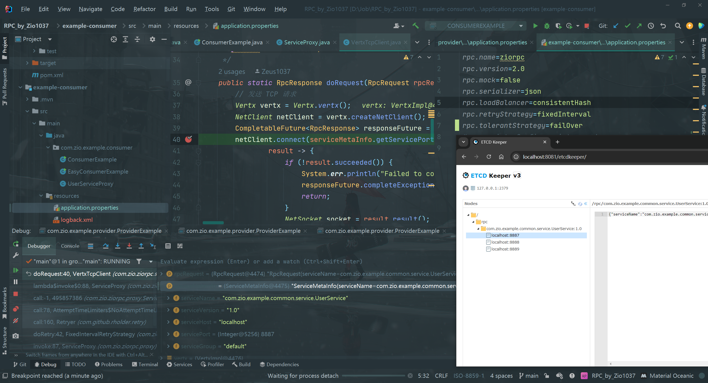

3.   当服务消费者发起调用（运行到`netClient.connect`）时，立刻停止相应端口的服务提供者，取消断点，恢复消费者的运行，等待多次重试后，就可以看到容错策略的执行。

**failOver故障转移策略**：

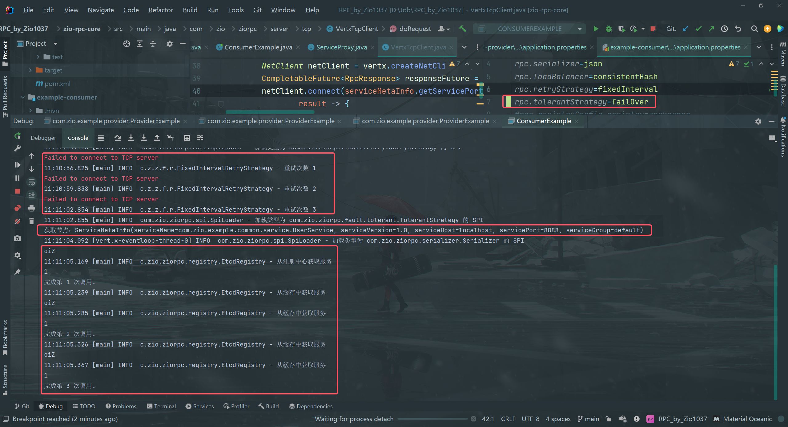

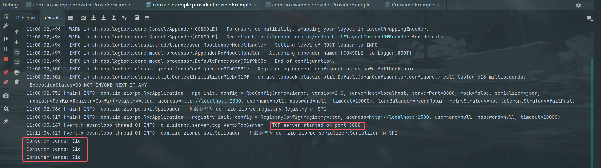

8887端口的服务提供者无法连接后，消费者转而调用其它服务提供者提供的服务（8888），最终完整进行了3次循环，并且每次循环中都成功调用了`getName`和`getNumber`方法。因此8888端口的服务提供者成功收到了3次消费者发送的信息。

**failFast快速失败**：

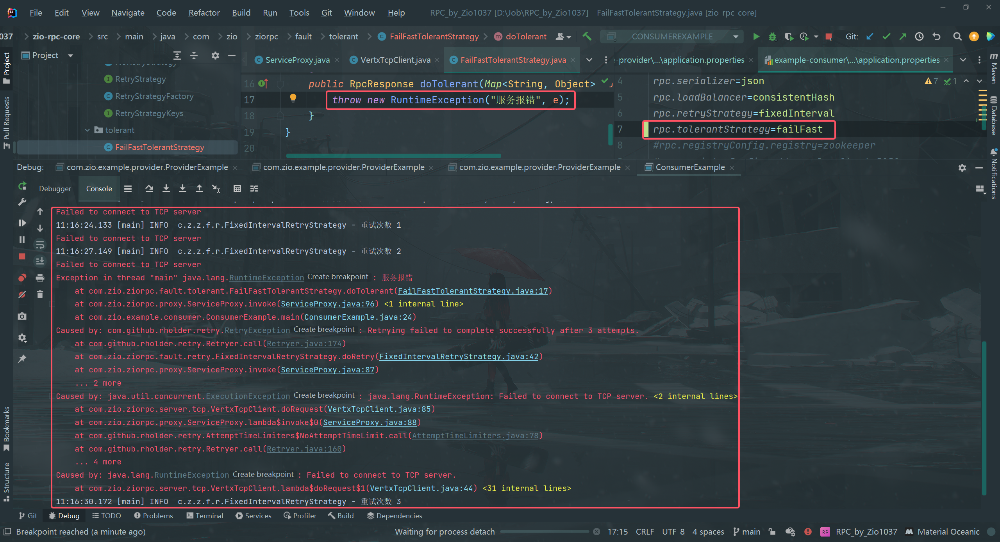

8887端口的服务提供者无法连接后，消费者直接抛出“服务报错”的异常，终止程序的运行。

**failSafe静默处理**：

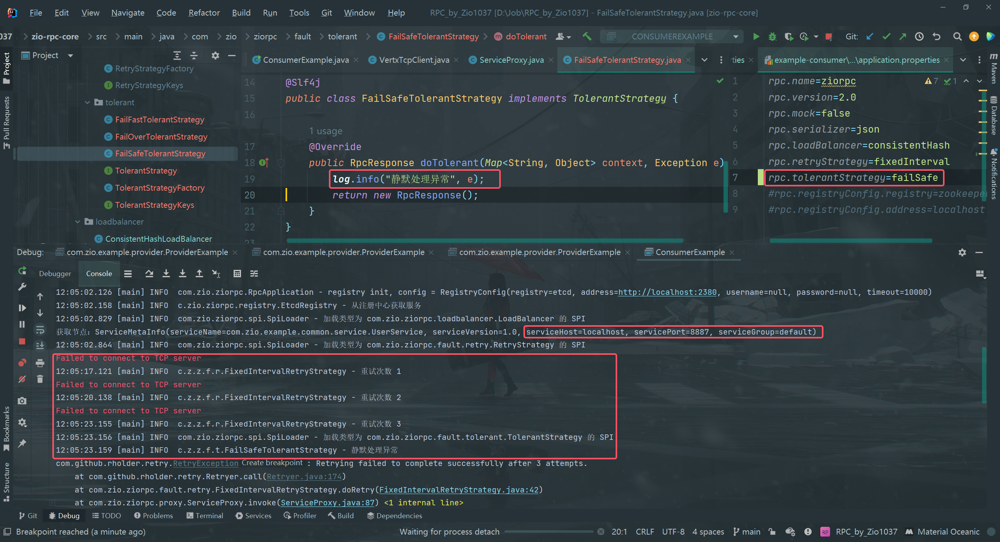

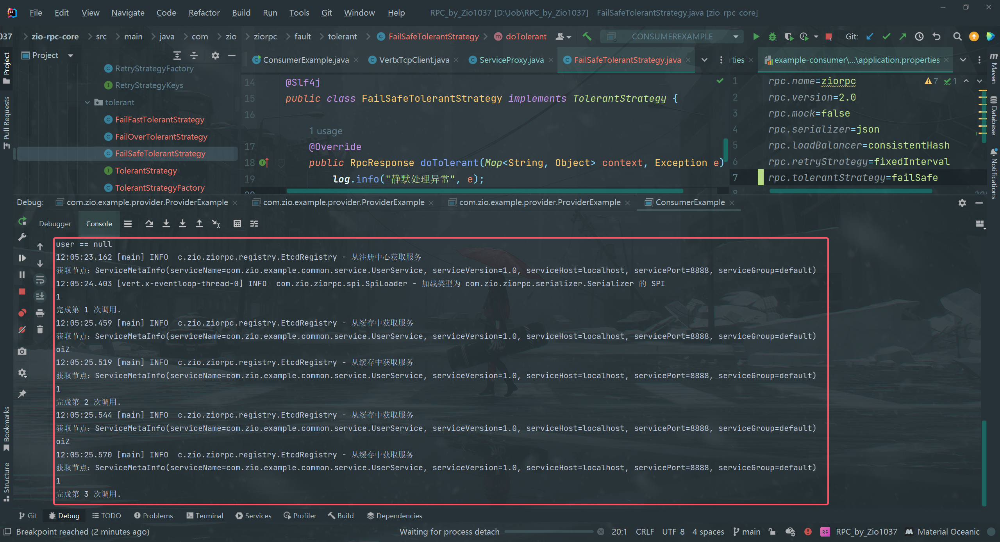

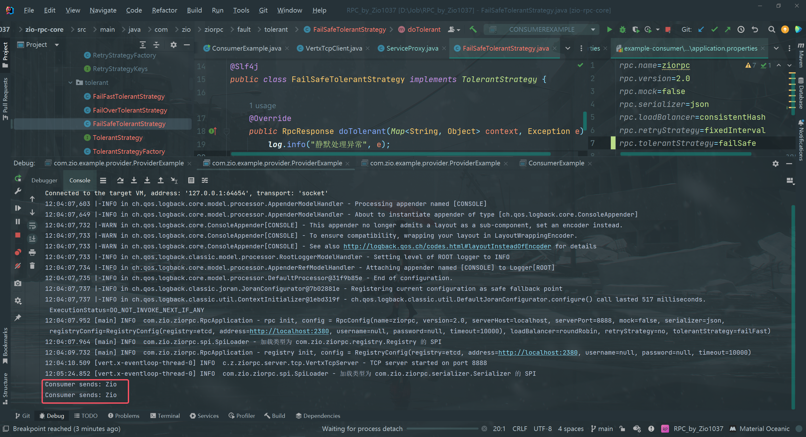

8887端口的服务提供者无法连接后，消费者报告“静默处理异常”，并返回一个默认的响应对象，因此该次方法(`getUser`)的调用结果为`user == null`。

但这里之后还发生一些别的事件：

**->** 当监听机制监听到8887端口的服务提供者下线后，更新了消费者的服务节点的本地缓存

**->** 随后，消费者在第1次循环调用`getNumber`方法时，本地缓存已经是更新后的状态，因此在invoke中获取服务节点时就会重新计算hash值，并在本地缓存的节点（此时节点均可用）中进行挑选，此处挑选的是8888端口。

**->** 因此第1次循环调用`getNumber`，包括之后的循环中都能够正常调用方法。

综上，8888端口只收到了两次`getUser`方法的调用命令，所以只会打印**两次**`Consumer sends`

## Todo List

-   [ ] 实现Fail-Back 容错机制
    -   可能方案：参考Dubbo的Mock能力，让消费端指定调用失败后要执行的本地服务和方法。
-   [ ] 实现更多容错方案，比如限流、熔断、超时控制等等，或者将重试机制作为容错机制的一种策略。