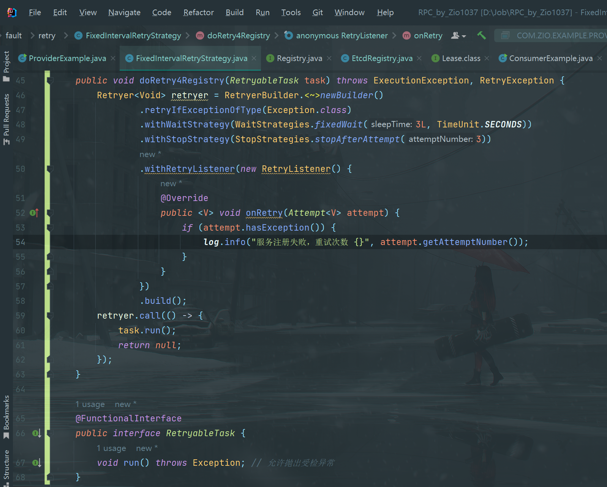
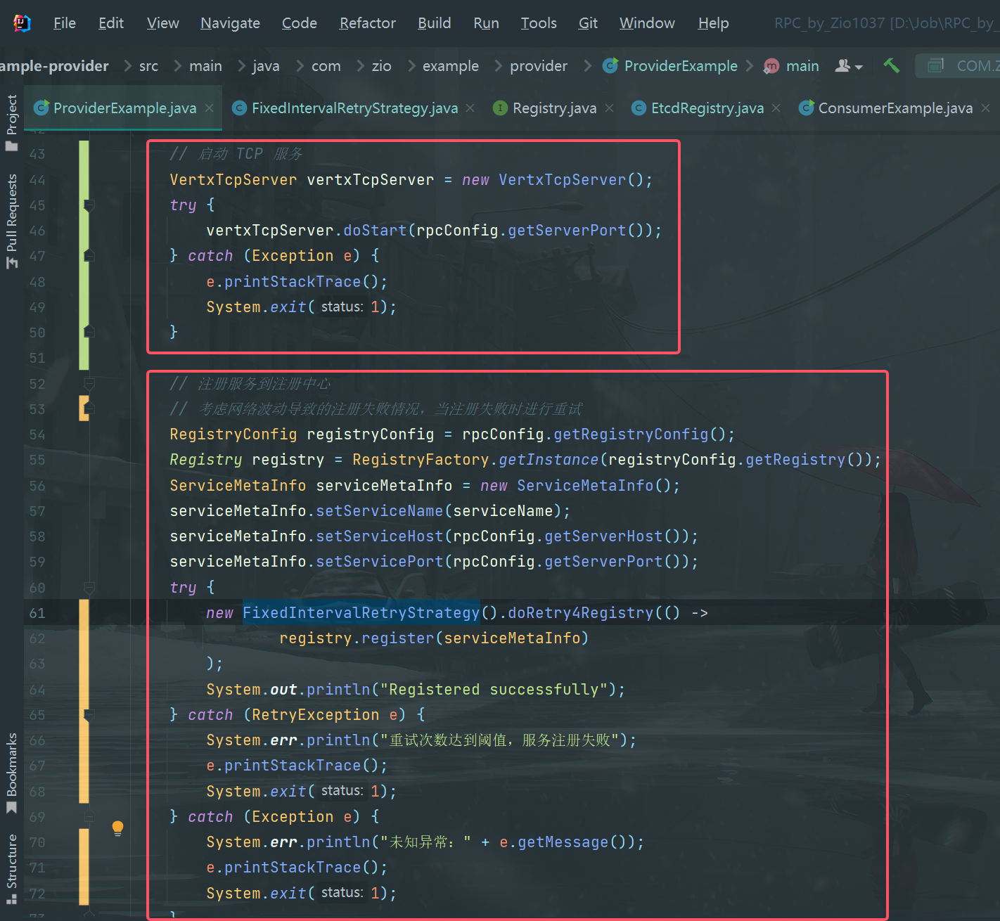
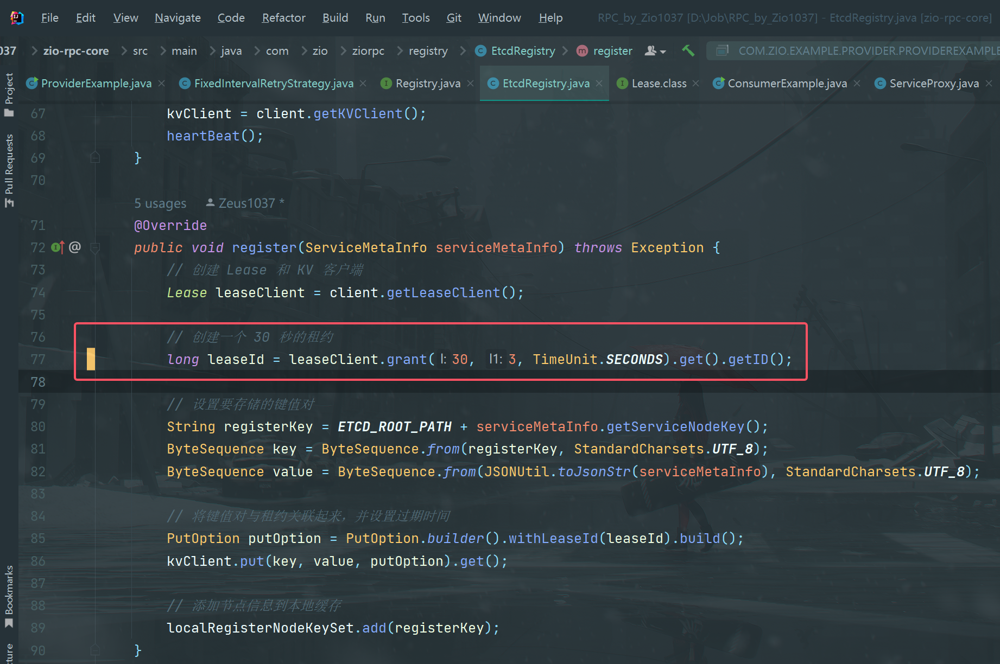
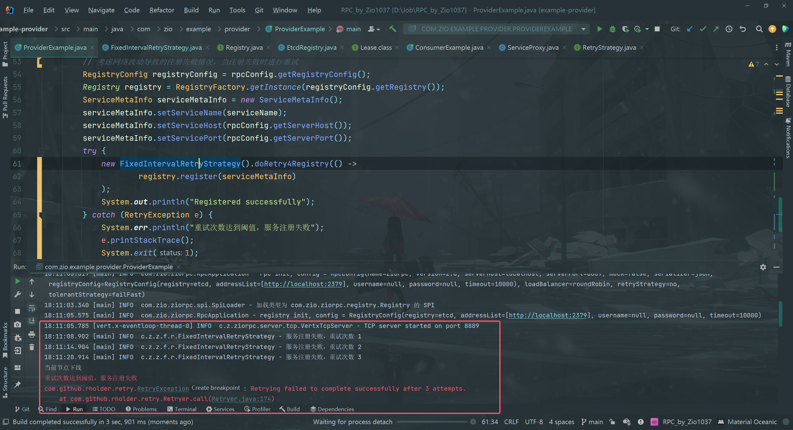
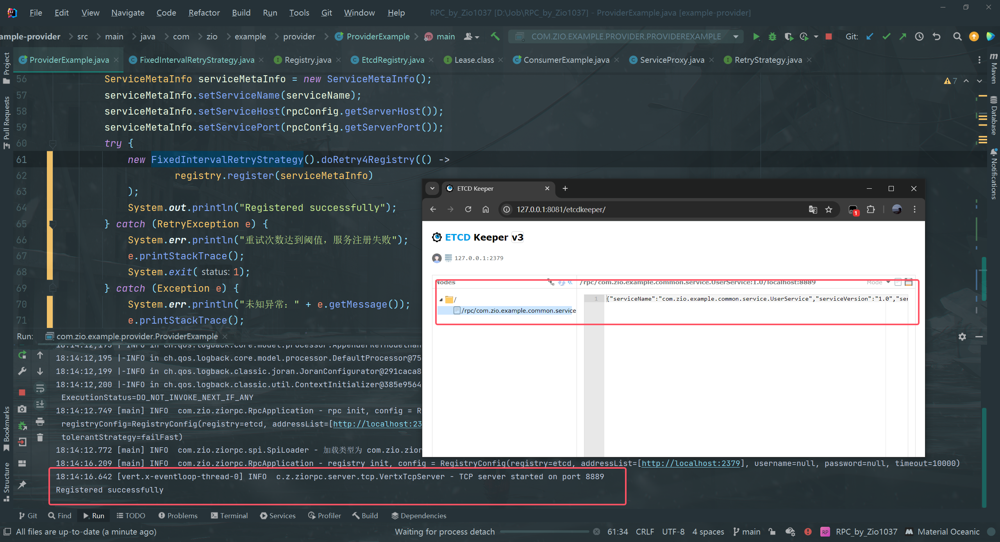

## 需求分析

对服务提供者上线后进行的服务注册过程进行优化：

1.   先启动服务提供者的 TCP 服务，再向注册中心进行服务注册。
2.   考虑网络波动导致的注册失败情况，当服务注册失败后，进行重试，重试次数达到阈值后抛出错误。

## 开发实现

1.   在 `FixedIntervalRetryStrategy`类中新增`doRetry4Registry`方法，旨在实现服务注册失败后的重试功能。

     **！注意**：由于 `Registry `接口中定义的`register`方法无返回值，且抛出`Exception`，因此需要自定义 `@FunctionalInterface`修饰的接口`RetryableTask`，并通过`retryer.call()`的方法实现重试，每次重试前等待 3 秒，重试 3 次后抛出错误。具体代码如下：

2.   修改`ProviderExample`类中的代码，先启动 TCP 服务，再注册服务到注册中心，并考虑注册失败，进行重试的情况。具体代码如下：

3.   在注册中心的实现类`EtcdRegistry`中修改创建租约`leaseId`时的逻辑。因为`grant`方法的返回类型是`CompletableFuture<>`，如果不添加等待时间，代码将被阻塞，也无法实现重试的效果。这里设置等待时间为 3 秒，修改内容如下：

## 测试

1.   不启动注册中心，启动服务提供者，模拟注册中心与服务提供者断开网络连接，导致服务注册失败的情况：

可以看到，TCP 服务启动成功后，服务提供者尝试进行服务注册，但无法连接注册中心，因此服务注册失败，重试三次后抛出错误。

2.   先启动注册中心，再启动服务提供者，观察服务注册是否成功

可以看到，服务成功注册，说明逻辑的优化并没有影响服务注册的正常实现。