## 需求分析

无论是请求或响应，都会涉及参数的传输。而java对象是存活在`JVM`虚拟机中的，如果想在其他位置存储并访问、或者在网络中进行传输，就需要进行序列化和反序列化。

我们还编写了通用的序列化器接口，并且已经实现了基于Java原生序列化的序列化器。但是对于一个完善的RPC框架，我们还要思考以下3个问题：

1. 有没有更好的序列化器实现方式？
2. 如何让使用框架的开发者指定使用的序列化器？
3. 如何让使用框架的开发者自己定制序列化器？


## 设计方案

### 序列化器实现方式

我们所追求的“更好的”序列化器，可以是具有高的性能、或者更小的序列化结果，这样就能够更快地完成RPC的请求和响应。

之前是为了方便，我们使用Java原生序列化实现序列化器，但这未必是最好的。市面上还有很多种主流的序列化方式，比如JSON、Hessian、Kryo、protobuf等。

#### 主流序列化方式对比

详见`Note/序列化器.md`


### 动态使用序列化器

之前我们是在代码中硬编码了序列化器，比如：

```java
Serializer serializer = new JdkSerializer();
```

如果开发者想要替换为别的序列化器，就必须修改所有的上述代码，太麻烦了！

理想情况下，应该可以通过配置文件来指定使用的序列化器。在使用序列化器时，根据配置来获取不同的序列化器实例即可。

参考[Dubbo替换序列化协议](https://cn.dubbo.apache.org/zh-cn/overview/mannual/java-sdk/reference-manual/serialization/hessian/)的方式，我们只需要定义一个`序列化器名称=>序列化器实现类对象`的Map，然后根据名称从Map中获取对象即可。


### 自定义序列化器

如果开发者不想使用我们框架内置的序列化器，想要自己定义一个新的序列化器实现，但不能修改我们写好的框架代码，应该怎么办呢？

思路很简单：只要我们的RPC框架能狗够读取到用户自定义的类路径，然后加载这个类，作为Serializer序列化器接口的实现即可。

但是如何实现这个操作呢？

==> 这就需要我们学习一个新的概念，也是Java中的重要特性一`SPI`机制。

#### 什么是SPI?

SPI(Service Provider Interface)服务提供接口是Java的机制，主要用于实现模块化开发和插件化扩展。

`SPI`机制允许服务提供者通过特定的配置文件将自己的实现注册到系统中，然后系统通过反射机制动态加载这些实现，而不需要修改原始框架的代码，从而实现了系统的解耦、提高了可扩展性。

一个典型的SPI应用场景是JDBC (Java数据库连接库)，不同的数据库驱动程序开发者可以使用JDBC库，然后定制自己的数据库驱动程序。

此外，我们使用的主流Java开发框架中，几乎都使用到了SPI机制，比如Servlet容器、日志框架、ORM框架、Spring框架。所以这是Java开发者必须掌握的一个重要特性！

#### 如何实现SPI?

分为系统实现和自定义实现。

##### 系统实现

其实Java内已经提供了SPI机制相关的API接口，可以直接使用，这种方式最简单。

1. 首先在`resources`资源目录下创建`META-INF/services`目录，并且创建一个名称为要实现的接口的空文件。
2. 在文件中填写自己定制的接口实现类的完整类路径
3. 直接使用系统内置的ServiceLoader动态加载指定接口的实现类。

##### 自定义实现

系统实现SPI虽然简单，但是如果我们想定制多个不同的接口实现类，就没办法在框架中指定使用哪一个了，也就无法实现我们“通过配置快速指定序列化器”的需求。

所以我们需要自己定义SPI机制的实现，只要能够根据配置加载到类即可。

比如读取如下配置文件，能够得到一个`序列化器名称=>序列化器实现类对象`的映射，之后就可以根据用户配置的序列化器名称动态加载指定实现类对象。

```java
jdk=com.zio.ziorpc.serializer.JdkSerializer
hessian=com.zio.ziorpc.serializer.HessianSerializer
json=com.zio.ziorpc.serializer.JsonSerializer
kryo=com.zio.ziorpc.serializer.KryoSerializer
```


## 开发实现

### 多种序列化器实现

我们要分别实现JSON、Kryo和Hessian这三种主流的序列化器。

1.   在`zio-rpc-core`的pom.xml中引入依赖：

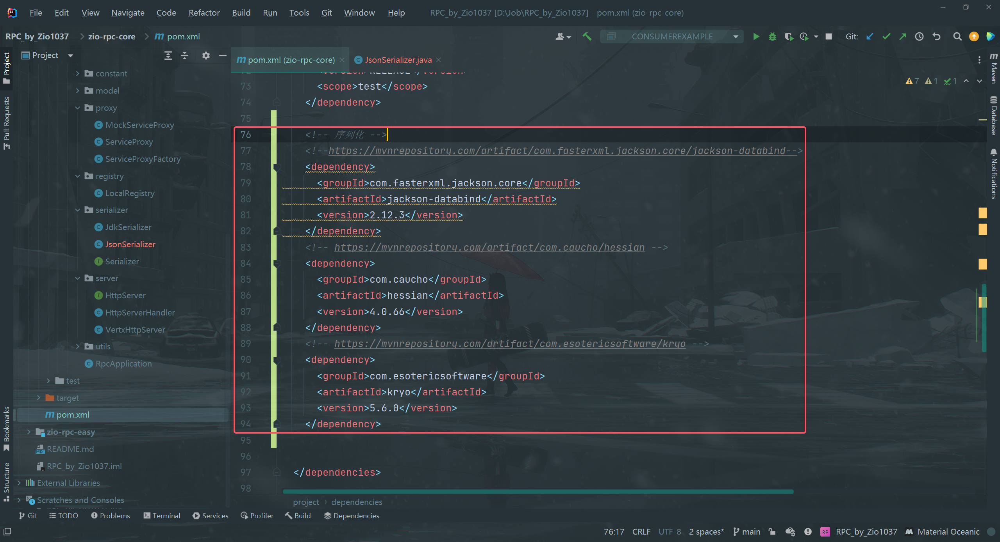

2.   在序列化器包`serializer`中分别实现这三种序列化器。

#### JSON序列化器

JSON序列化器的实现相对复杂，要考虑一些对象转换的兼容性问题，比如Object数组在序列化后会丢失类型。

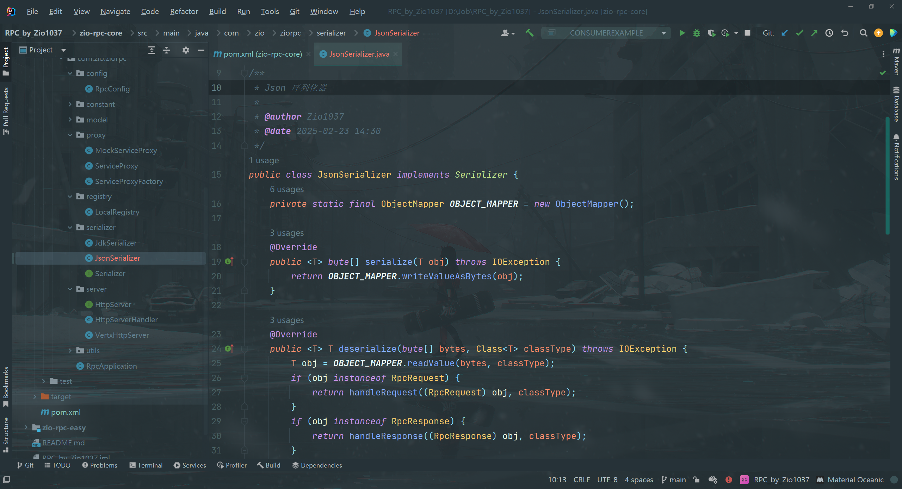

#### Kryo序列化器

Kryo本身是线程不安全的，所以需要使用ThreadLocal保证每个线程有一个单独的Kryo对象实例。

代码如下：

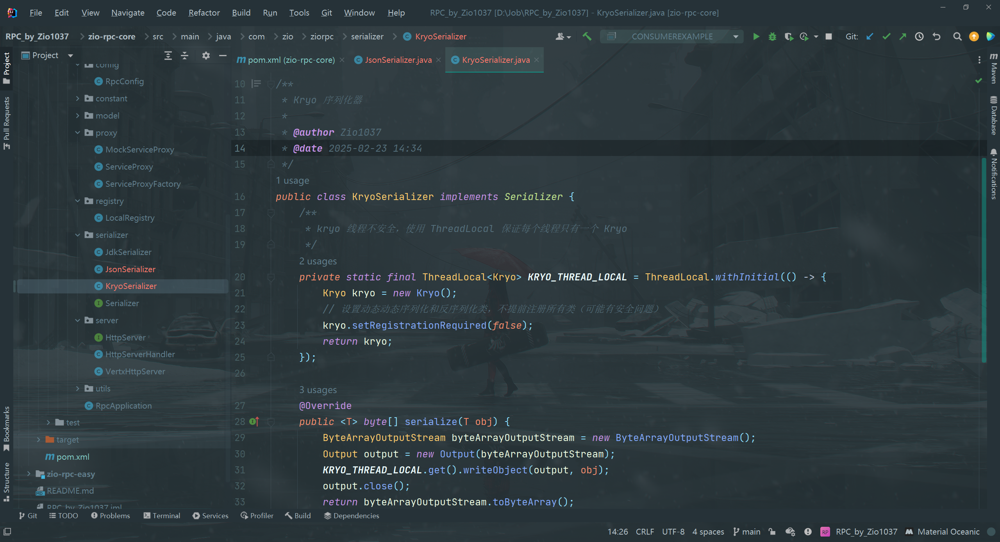

#### Hessian序列化器

实现比较简单，完整代码如下：

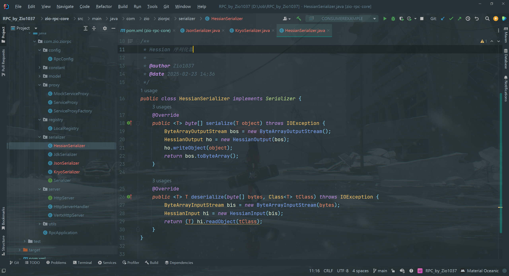

### 动态使用序列化器

1.   定义序列化器名称的常量，使用接口实现。

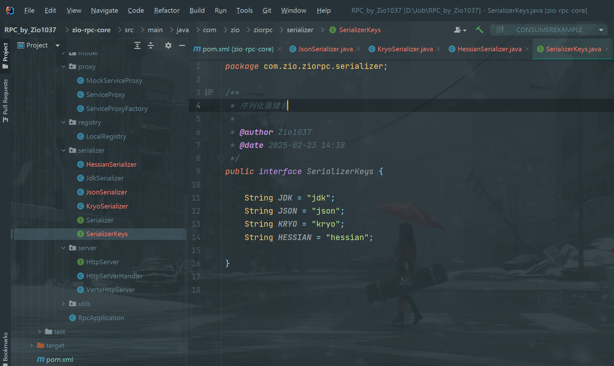

2.   定义序列化器工厂。

序列化器对象是可以复用的，没必要每次执行序列化操作前都创建一个新的对象。所以我们可以使用设计模式中的工厂模式+单例模式来简化创建和获取序列化器对象的操作。

序列化器工厂代码如下，使用Map来维护序列化器实例：

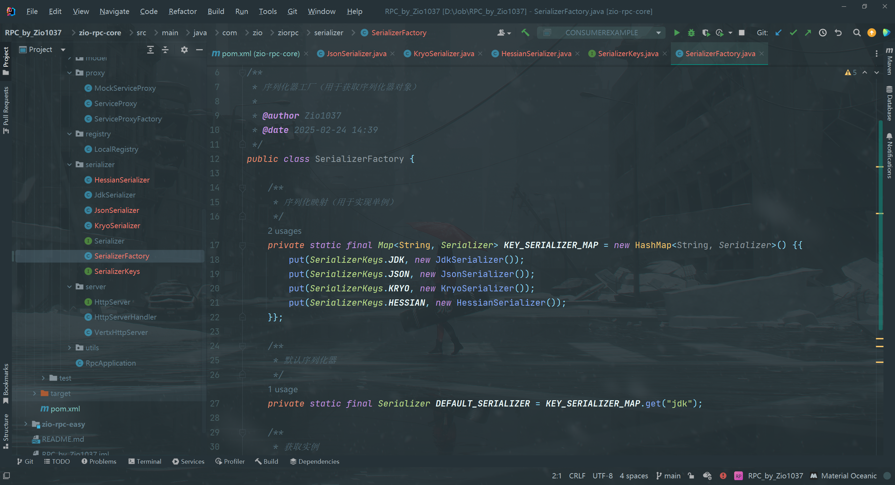

3.   在全局配置类RpcConfig中补充序列化器的配置，并在服务提供者和消费者的`application.properties`配置文件中添加相应的配置项：


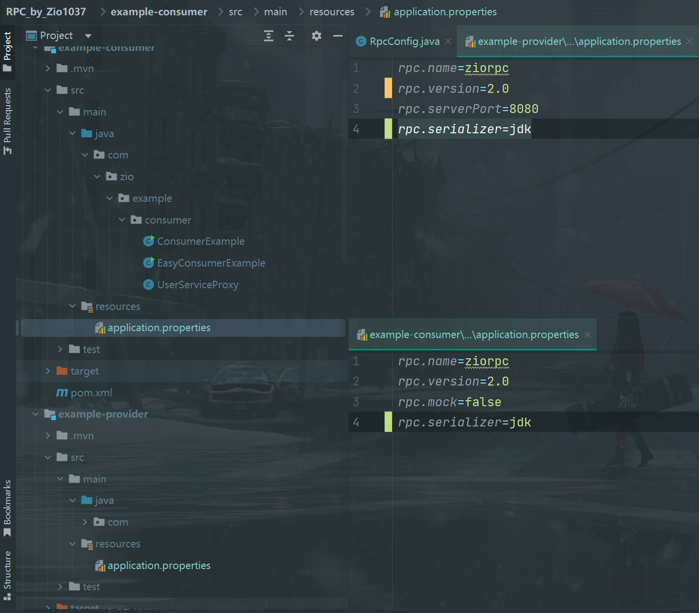

4.   动态获取序列化器。

将之前代码中所有用到序列化器的位置更改为“使用工厂+读取配置”来获取实现类。

要更改的类：

- ServiceProxy
- HttpServerHandler

更改代码如下：

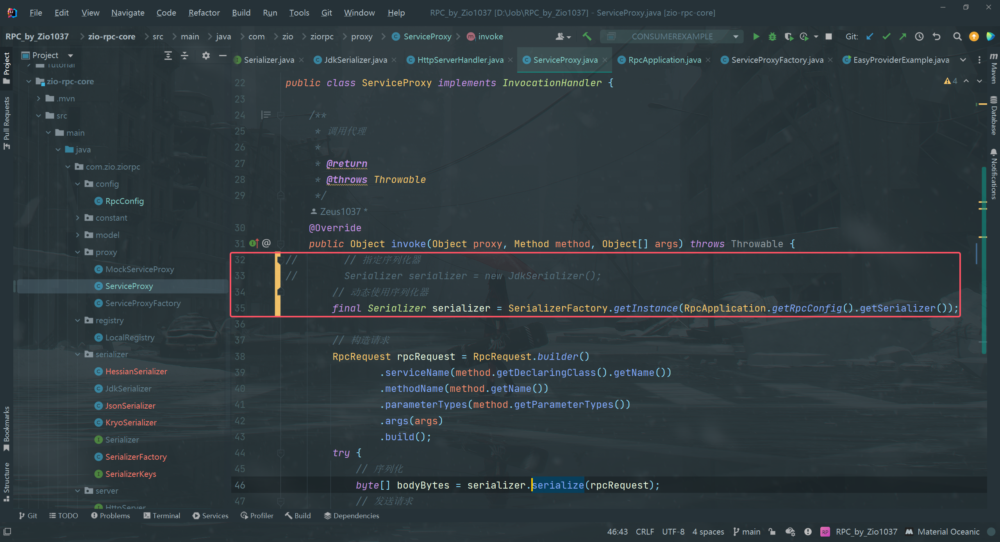

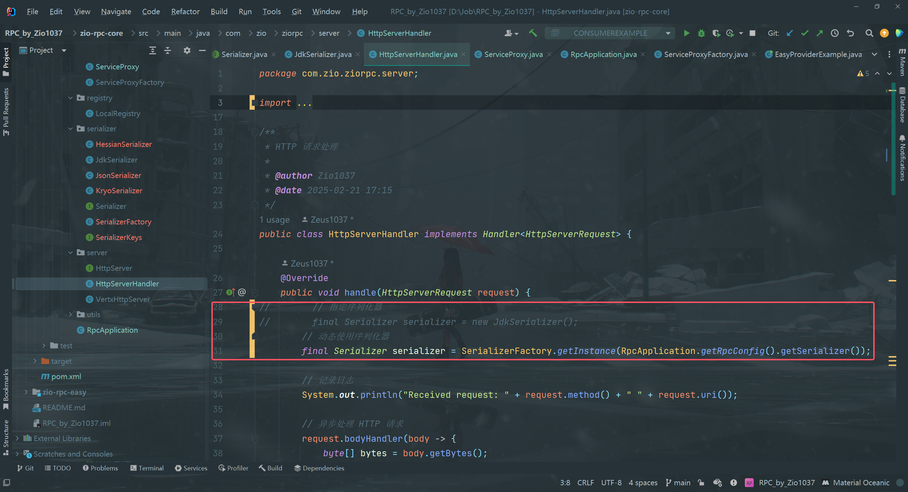

### 自定义序列化器

我们使用自定义的`SPI`机制实现，支持用户自定义序列化器并指定键名。

1.   指定SPI配置目录。

系统内置的SPI机制会加载`resources`资源目录下的`META-INF/services`目录，那我们自定义的序列化器可以如法炮制，改为读取`META-INF/rpc`目录。

我们还可以将`SPI`配置再分为系统内置SPI和用户自定义SPI，即目录如下：

- 用户自定义`SPI`: `META-INF/rpc/custom`。用户可以在该目录下新建配置，加载自定义的实现类。
- 系统内置`SPI`: `META-INF/rpc/system`。RPC框架自带的实现类，比如我们之前开发好的`JdkSerializer`。

这样一来，所有接口的实现类都可以通过`SPI`动态加载，不用在代码中硬编码Map来维护实现类了。

在系统内置路径下编写一个系统扩展配置文件，内容为我们之前写好的序列化器，文件名称为`com.zio.ziorpc.serializer.Serializer`：

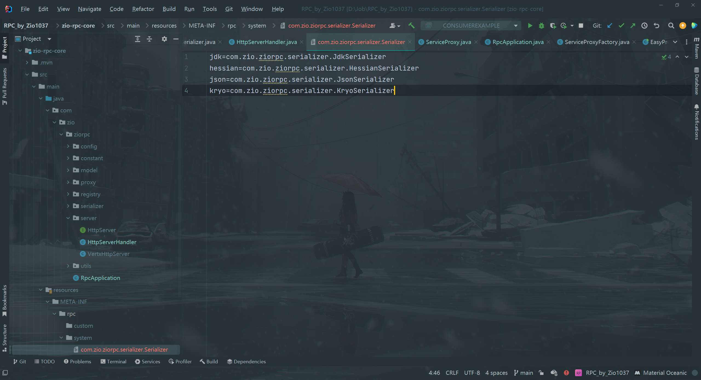

2.    在`com.zio.ziorpc`包下新建`spi`包，并在该包下编写SpiLoader加载器。

SpiLoader相当于一个工具类，提供了读取配置并加载实现类的方法。

关键实现如下：

1. 用Map来存储已加载的配置信息键名=>实现类。
2. 扫描指定路径，读取每个配置文件，获取到键名=>实现类信息并存储在Map中。
3. 定义获取实例方法，根据用户传入的接口和键名，从Map中找到对应的实现类，然后通过反射获取到实现类对象。可以维护一个对象实例缓存，创建过一次的对象从缓存中读取即可。

完整代码如下：

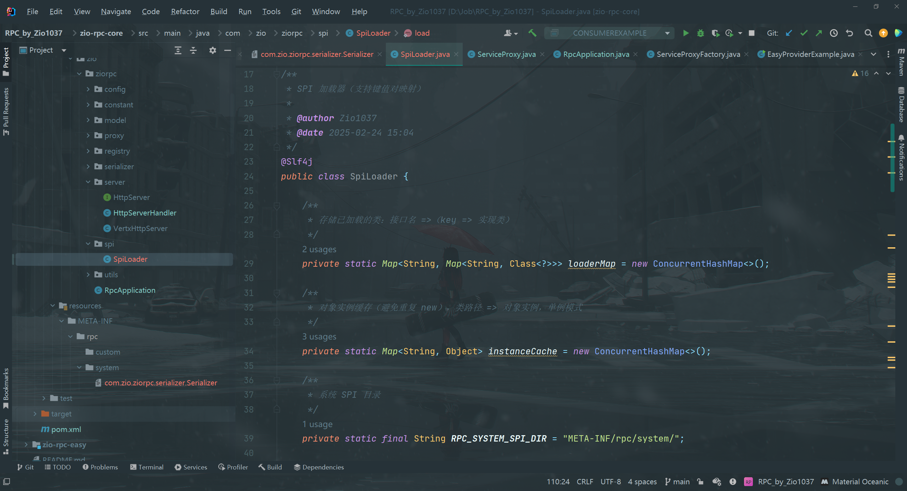

上述代码中，虽然提供了loadAll方法，扫描所有路径下的文件进行加载，但其实没必要使用。更推荐使用Ioad方法，按需加载指定的类。

注意，上述代码中获取配置文件是使用了`ResourceUtil.getResources`，而不是通过文件路径获取。因为如果框架作为依赖被引入，是无法得到正确文件路径的。

3.   重构序列化器工厂

之前，我们是通过在工厂中硬编码HashMap来存储序列化器和实现类的，有了SPI后，就可以改为从SPI加载指定的序列化器对象。

完整代码如下：

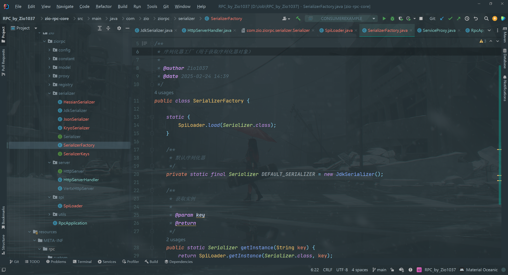

使用静态代码块，在工厂首次加载时，就会调用SpiLoader的Ioad方法加载序列化器接口的所有实现类，之后就可以通过调用getlnstance方法获取指定的实现类对象了。

之后，我们如果要实现自定义的序列化器，只需要进行以下步骤：

1. 写一个类实现Serializer接口
2. 在custom目录下编写`SPI`配置文件，加载自己写的实现类


## 测试

### SPI加载测试

1.   在SpiLoader类中测试loadAll方法能否成功加载全部序列化器

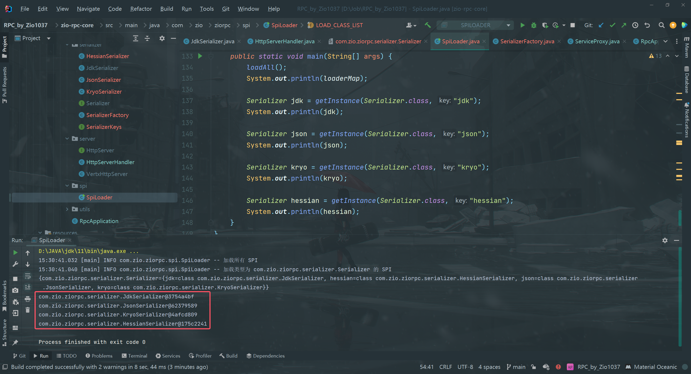

成功打印所有序列化器，说明loadAll方法逻辑是正确的。

2.   修改框架custom和system下的SPI配置文件，任意指定键名和实现类路径，验证能否正常加载。

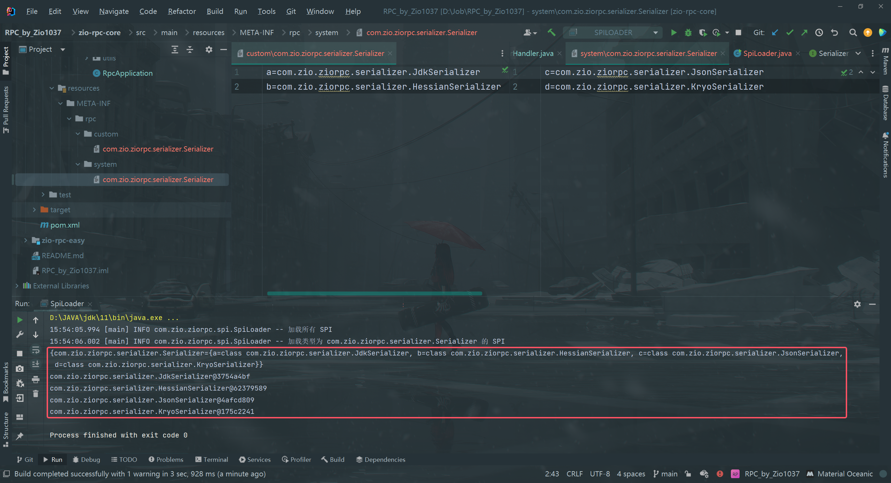

如果key 不存在

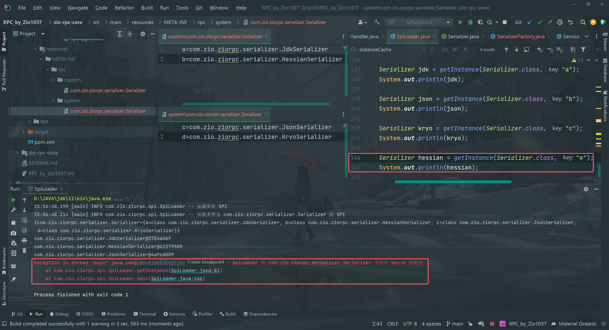

当custom和system中存在相同的key时

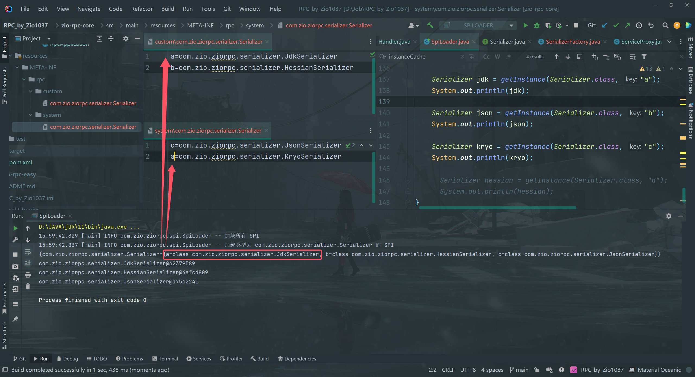

key 相同时，自定义配置覆盖系统配置

### 完整测试

1.   修改消费者和生产者示例项目中的配置文件，指定不同的序列化器，比如服务提供者是json，消费者是hessian

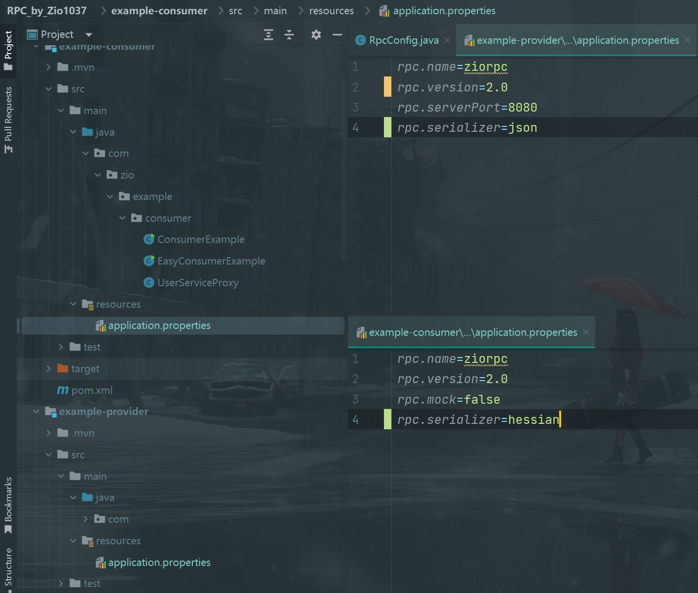

2.   运行服务提供者`EasyProviderExample`：

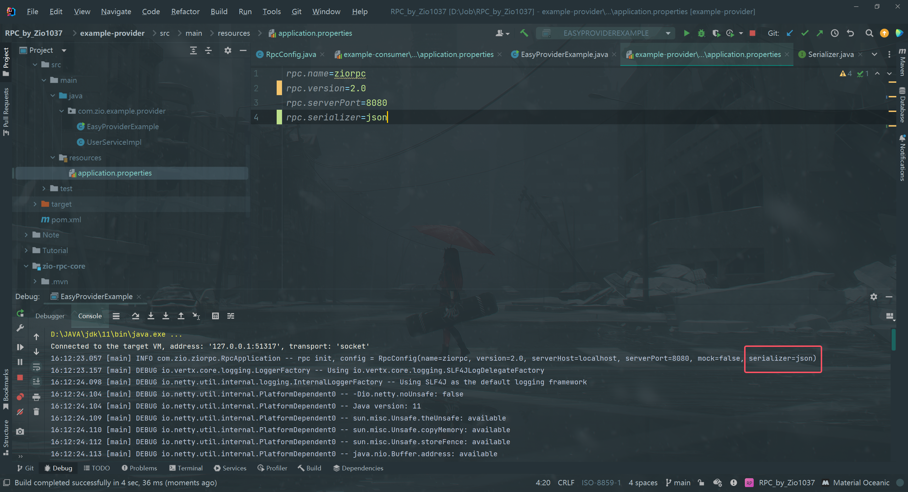

3.   运行服务消费者`ConsumerExample`

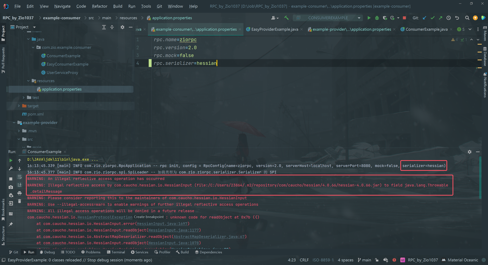

直接报错了，说明服务提供者和消费者之间需采用相同的序列化器。

4.   将消费者的序列化器修改为json，重新测试

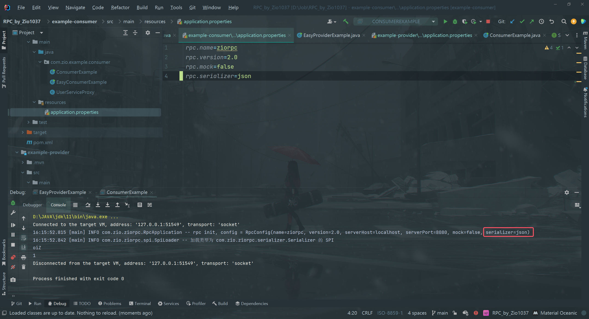

成功调用了服务提供者的服务。


## Todo List

-   [ ] 实现更多不同协议的序列化器，比如protobuf
-   [ ] 序列化器工厂可以使用懒加载的方式创建序列化器实例
    -   [ ] 可能方案：静态内部类，双检锁

-   [ ] `SPI Loader`支持懒加载，获取实例时才加载对应的类。

