## 需求分析

我们基于Etcd完成了基础的注册中心，够注册和获取服务和节点信息。

但目前系统仅仅是处于可用的程度，还有很多需要解决的问题和可优化点：

1. 数据一致性：服务提供者如果下线了，注册中心需要即时更新，剔除下线节点。否测消费者可能会调用到已经下线的节点。
2. 性能优化：服务消费者每次都需要从注册中心获取服务，可以使用缓存进行优化。
3. 高可用性：保证注册中心本身不会宕机。
4. 可扩展性：实现更多其他种类的注册中心。

## 注册中心优化

### 心跳检测和续期机制

#### 心跳检测介绍

心跳检测（俗称heartBeat）是一种用于监测系统是否正常工作的机制。它通过定期发送**心跳信号**（请求）来检测目标系统的状态。

如果接收方在一定时间内没有收到心跳信号或者未正常响应请求，就会认为目标系统故障或不可用，从而触发相应的处理或告警机制。

心跳检测的应用场景非常广泛，尤其是在分布式、微服务系统中，比如集群管理、服务健康检查等。

>  我们怎么检测自己做的web后端是否正常运行呢？一个最简单的方法，就是写一个心跳检测接口。然后我们只需要执行一个脚本，定期调用这个接口，如果调用失败，就知道系统故障了。

#### 方案设计

1.   从心跳检测的概念来看，实现心跳检测一般需要2个关键：定时、网络请求。

但是使用Etcd实现心跳检测会更简单一些，因为Etcd自带了key过期机制，我们不妨换个思路：给节点注册信息一个"生命倒计时”，让节点定期续期，重置自己的倒计时。如果节点已宕机，一直不续期，Etcd就会对key进行过期删除。

**一句话总结：到时间还不续期就是寄了**。

在Etcd中，我们要实现心跳检测和续期机制，可以遵循如下步骤：

Ⅰ. 服务提供者向Etcd注册自己的服务信息，并在注册时设置TTL(生存时间)。

Ⅱ. Etcd在接收到服务提供者的注册信息后，会自动维护服务信息的TTL,并在TTL过期时删除该服务信息。

Ⅲ. 服务提供者定期请求Etcd续签自己的注册信息，重写TTL。

需要注意的是，续期时间一定要小于过期时间，允许一次容错的机会。

2.   每个服务提供者都需要找到自己注册的节点、续期自己的节点，但问题是，怎么找到当前服务提供者项目自己的节点呢？

那就充分利用本地的特性，在服务提供者本地维护一个已注册节点集合，注册时添加节点key到集合中，只需要续期集合内的key即可。

#### 开发实现

1.   给注册中心`Registry`接口补充心跳检测方法，代码如下：

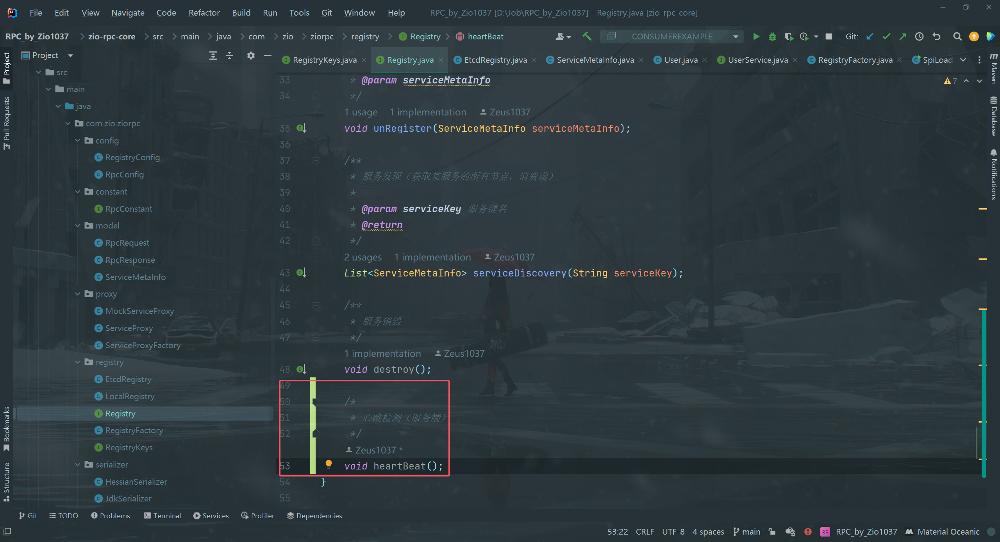

2.   维护续期节点集合。

在`EtcdRegistry`类中定义一个本机注册的节点key集合`localRegistryNodeKeySet`，用于维护续期：

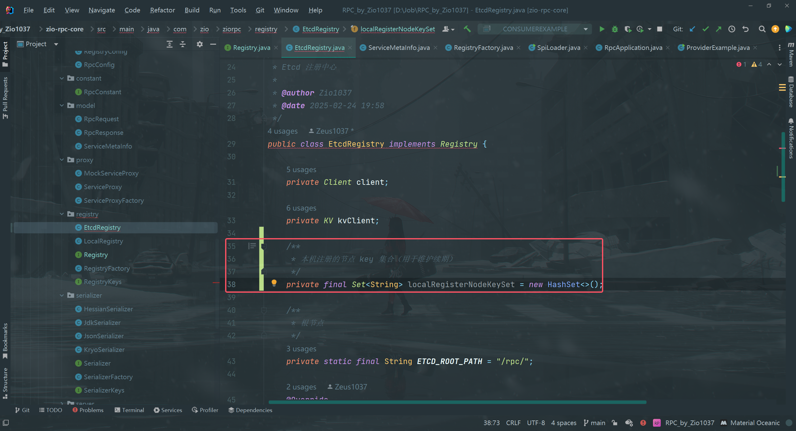

在服务注册时，需要将节点添加到集合中，修改`registry`方法：

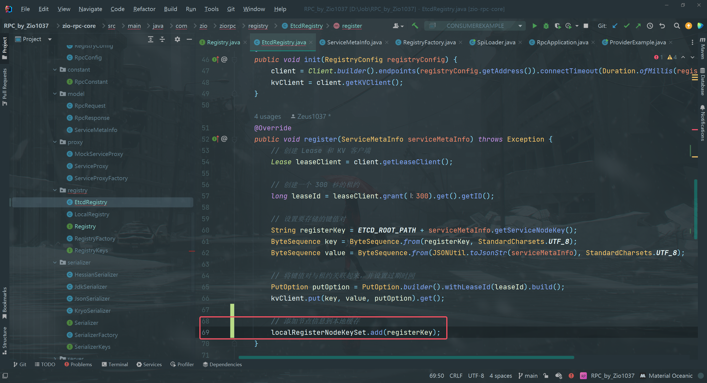

同理，在服务注销时，也要从集合中移除对应节点，修改`unRegistry`方法：

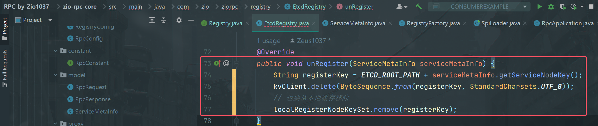

3. 在`EtcdRegistry`中实现`heartBeat`方法。

可以使用`Hutool`工具类的`CronUtil`实现定时任务，对所有集合中的节点执行**重新注册**操作，这是一个小trick，相当于续签了。

心跳检测方法的代码如下：

采用这种实现方案的好处是，即使Etcd注册中心的数据出现了丢失，通过心跳检测机制也会重新注册节点信息。

4.   开启`heartBeat`：在注册中心初始化的`init`方法中，调用`heartBeat`方法即可。

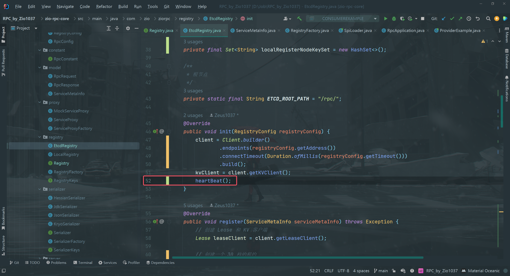

#### 测试

完善之前的`RegistryTest`单元测试代码，增加对`heartBeat`方法的测试

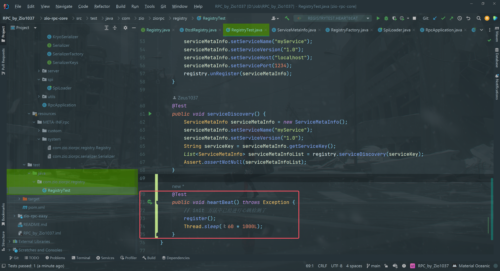

运行heartBeat的测试方法，使用可视化工具观察节点底部的过期时间

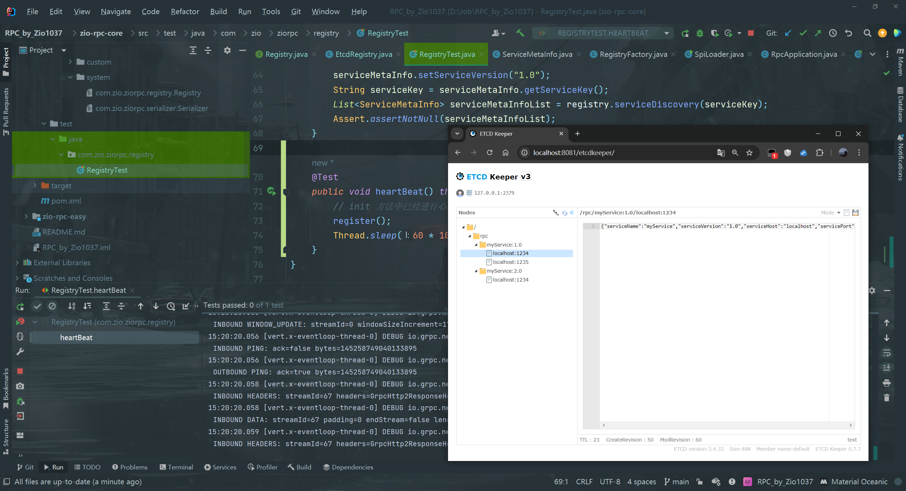

当TTL到20左右的时候，又会重置为30，说明心跳检测和续期机制正常执行。

### 服务节点下线机制

当服务提供者节点宕机时，应该从注册中心移除掉已注册的节点，否则会影响消费端调用。所以我们需要设计一套服务节点下线机制。

#### 方案设计

服务节点下线又分为：

- 主动下线：服务提供者项目正常退出时，主动从注册中心移除注册信息。
- 被动下线：服务提供者项目异常推出时，利用Etcd的key过期机制自动移除。

被动下线已经可以利用Etcd的机制实现了，我们主要开发主动下线。
问题是，怎么在Java项目正常退出时，执行某个操作呢？
其实，非常简单，利用VM的ShutdownHook就能实现。
JVM的ShutdownHook是Java虚拟机提供的一种机制，允许开发者在JVM即将关闭，之前执行一些清理工作或其他必要的操作，例如关闭数据库连接、释放资源、保存临时数据等。

Spring Boot也提供了类似的优雅停机能力。

#### 开发实现

1.   完善Etcd注册中心的`destroy`方法，补充下线节点的逻辑。

2.   在`RpcApplication`的init方法中，注册`Shutdown Hook`,当程序正常退出时会执行注册中心的destroy方法。

#### 测试

测试方法很简单：

1. 启动服务提供者，然后观察服务是否成功被注册

    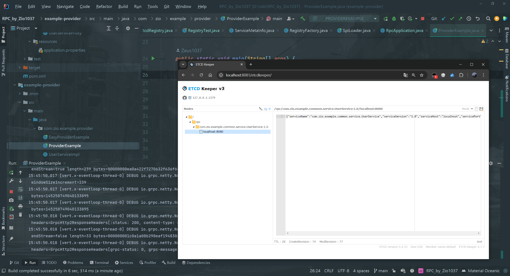

    注册成功，心跳检测也在执行

2. 正常停止服务提供者，然后观察服务信息是否被删除

    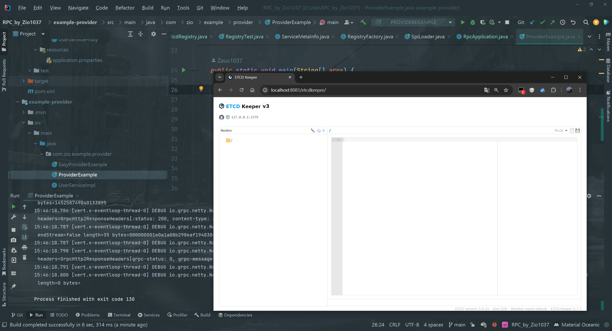

    成功删除。

### 消费端服务缓存

正常情况下，服务节点信息列表的更新频率是不高的，所以在服务消费者从注册中心获取到服务节点信息列表后，完全可以**缓存在本地**，下次就不用再请求注册中心获取了，能够提高性能。

#### 增加本地缓存

本地缓存的实现很简单，用一个列表来存储服务信息即可，提供操作列表的基本方法，包括：写缓存、读缓存、清空缓存。

在`registry`包下新增缓存类`RegistryServiceCache`，代码如下：

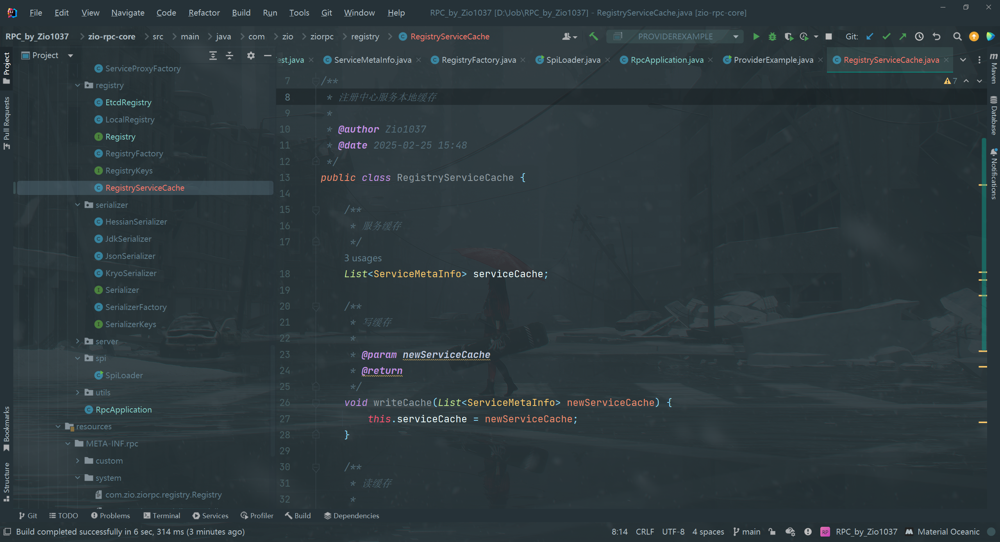

#### 使用本地缓存

1.   修改`EtcdRegisty`的代码，使用本地缓存对象：

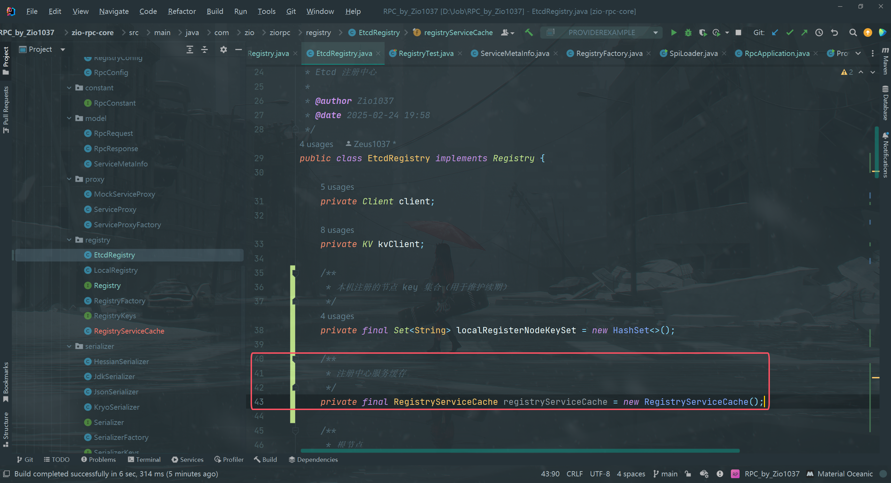

2.   修改服务发现逻辑，优先从缓存获取服务；如果没有缓存，再从注册中心获取，并且设置到缓存中。

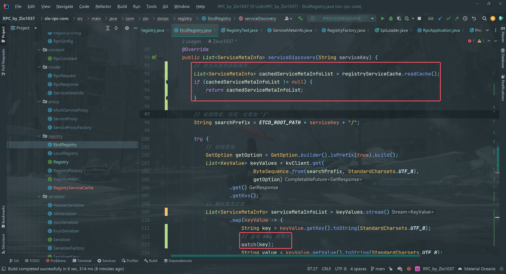

#### 服务缓存更新 - 监听机制

当服务注册信息发生变更（比如节点下线）时，需要即时更新消费端缓存。

问题是，**怎么知道服务注册信息什么时候发生变更呢？**

这就需要我们使用Etcd的watch监听机制，当监听的某个key发生修改或删除时，就会触发事件来通知监听者。

**那什么时候去创建watch监听器呢？**

我们首先要明确watch监听是服务消费者还是服务提供者执行的。由于我们的目标是更新缓存，缓存是在服务消费端维护和使用的，所以也应该是服务消费端去watch。

也就是说，只有服务消费者执行的方法中，可以创建watch监听器，那么比较合适的位置就是服务发现方法(serviceDiscovery)。可以对本次获取到的所有服务节点key进行监听。

还需要防止重复监听同一个key，可以通过定义一个已监听key的集合来实现。

下面我们来进行实现。

1.   Registry注册中心接口补充监听key的方法，代码如下：

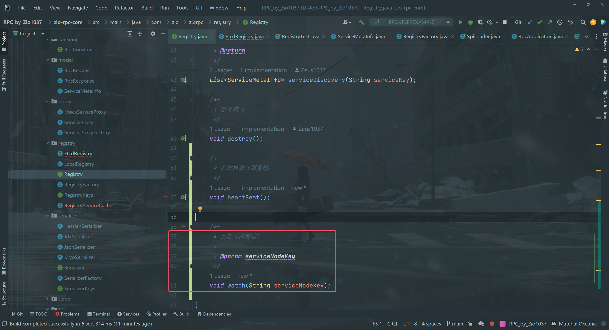

2.   `EtcdRegistry`类中，新增监听key的集合。

可以使用`ConcurrentHashSet`防止并发冲突，代码如下：

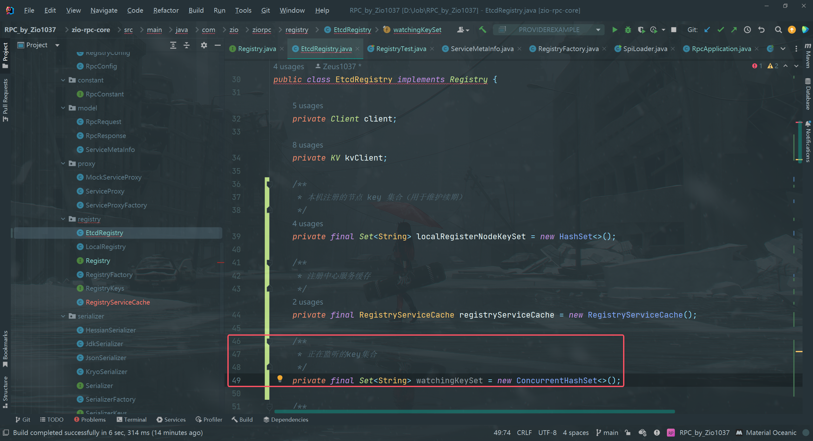

3.   在`EtcdRegistry`类中实现监听key的方法。

通过调用Etcd的`Watchclient`实现监听，如果出现了`DELETE key`删除事件，则清理服务注册缓存。

注意，即使key在注册中心被删除后再重新设置，之前的监听依旧生效。所以我们只监听首次加入到监听集合的key，防止重复。

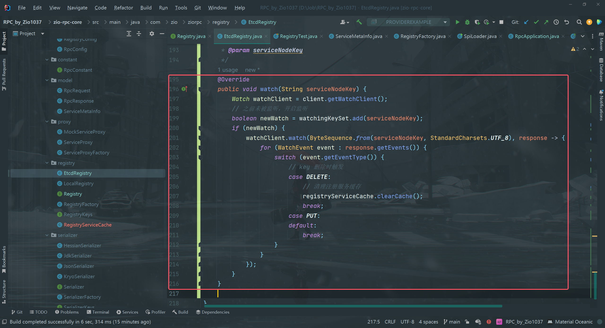

4.   在消费端获取服务时调用watch方法，对获取到的服务节点key进行监听。

修改服务发现方法的代码如下：

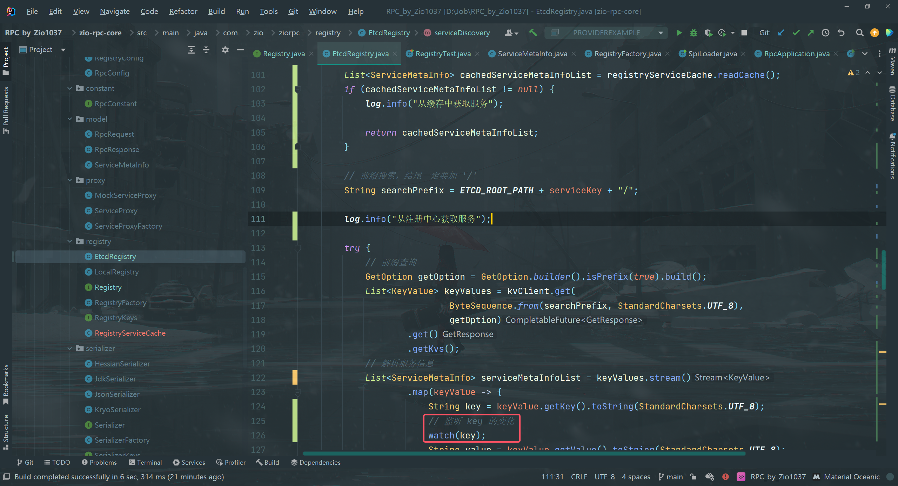

#### 测试

可以使用如下步骤，通过debug进行测试：

1. 先启动服务提供者

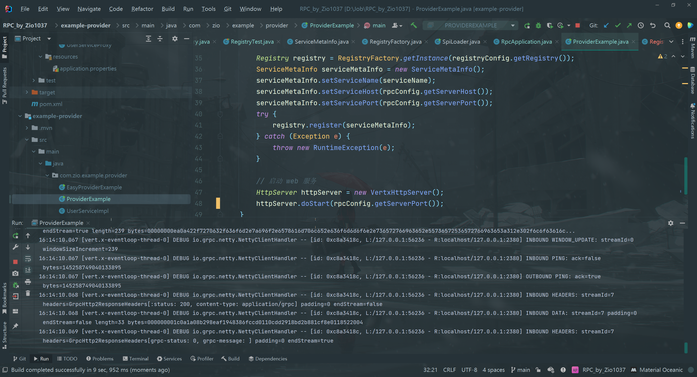

2.   修改服务消费者项目，连续调用服务3次，每次调用完后令线程睡眠10秒

3.   观察运行结果

第一次调用：

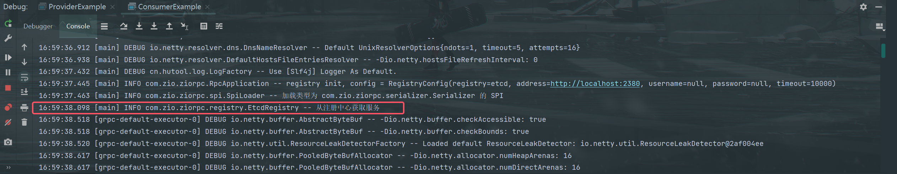

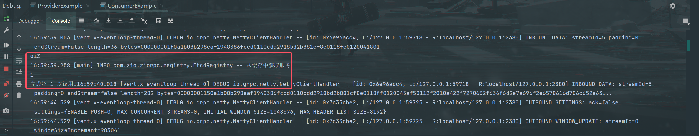

第二次调用：

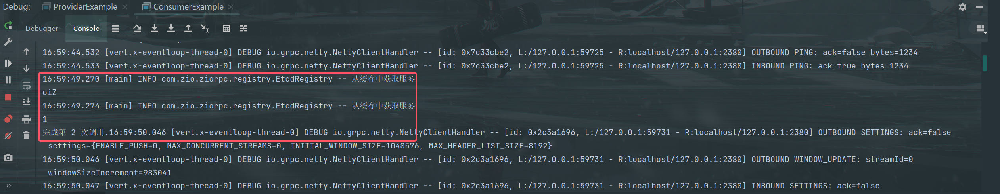

我们在`ConsumerExample`类中先后调用了服务提供者提供的`UserService`服务中的`getName`和`getNumber`方法。

在第一次调用的`getUser`方法中，消费者是从注册中心获取服务的，同时消费者将该次服务的地址存在本地缓存中，而在该次调用的后续getNumber方法中，就是直接从本地缓存中获取的服务，同样第二、三次的`getUser`和`getNumber`也是从本地缓存中获取服务的。与预期一致。

4.   在消费者即将调用第三次服务时，下线服务提供者，可以在注册中心看到节点的注册key已被删除。

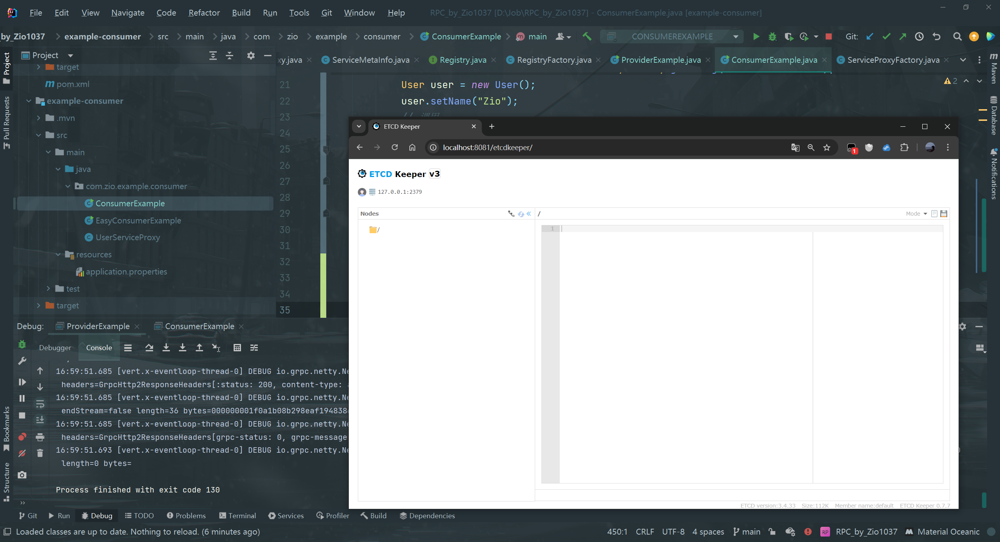

5.   观察消费者进行第三次调用的结果：

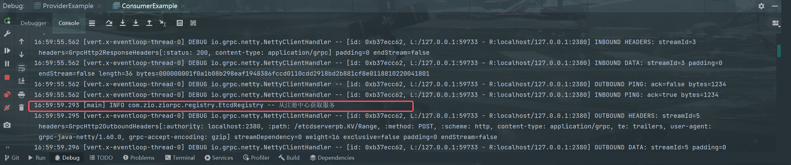

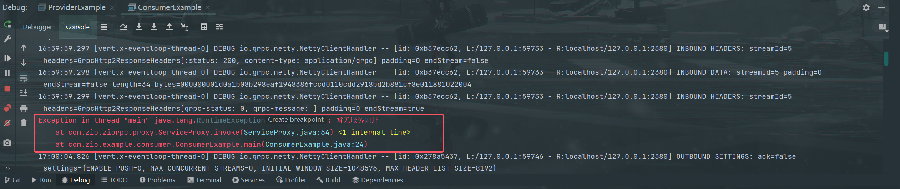

可以看到，在服务提供者下线后，watch发现了节点的变化，进而通知服务消费者更新（删除）本地缓存的节点；在第三次调用服务时，服务消费者重新从注册中心查询，但此时注册中心已无服务的地址，所以抛出异常”暂无服务地址“。

## Zookeeper注册中心实现

其实和 Etcd 注册中心的实现方式极其相似，步骤如下：

1.   本地下载并启动ZooKeeper，这里使用3.8.4版本

下载链接：https://dlcdn.apache.org/zookeeper/zookeeper-3.8.4/apache-zookeeper-3.8.4-bin.tar.gz

正常启动ZooKeeper后，默认会占用几个端口号，比如2181（客户端）、8080（管理端）等。

下载并解压后，在安装目录下新建一个空的data文件夹和log文件夹。

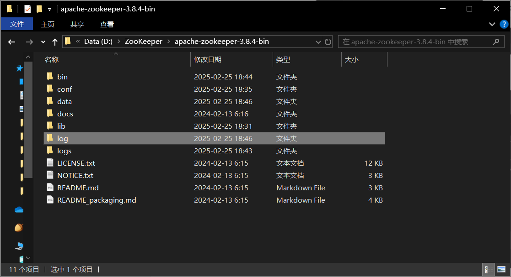

修改conf目录下的`zoo_sample.cfg`配置文件，将dataDir修改成zookeeper安装目录所在的data文件夹，再添加一条添加数据日志的配置

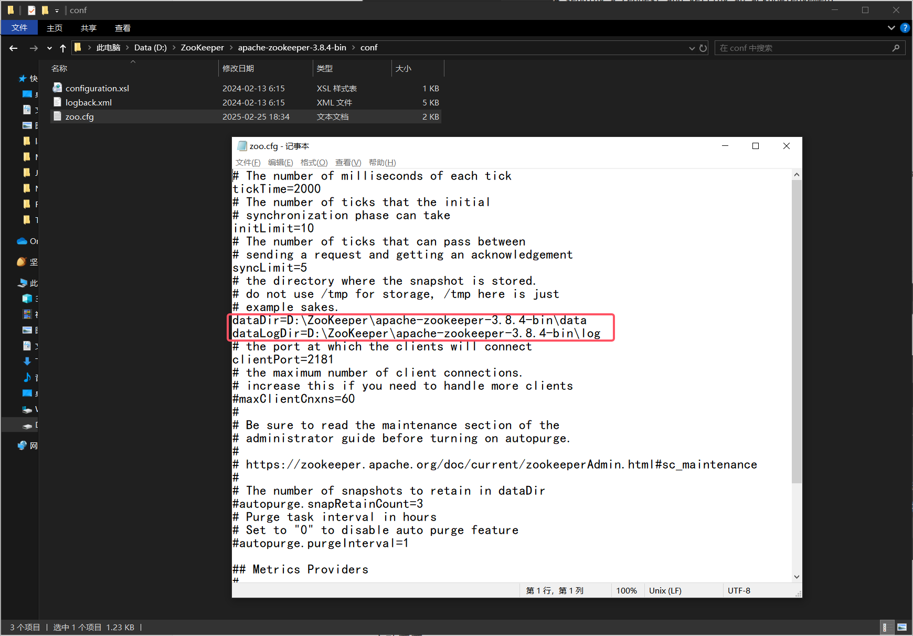

将`zoo_sample.cfg`文件名修改为`zoo.cfg`

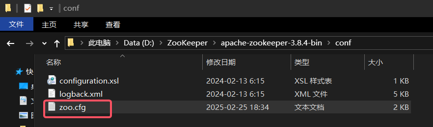

进入bin目录，双击`zkServer.cmd`启动程序

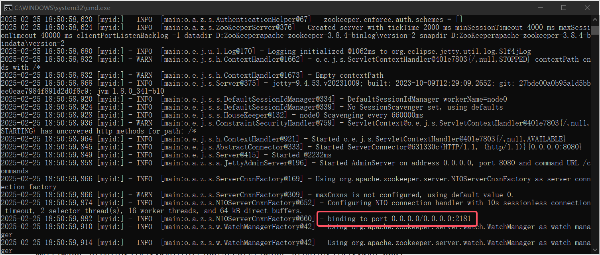

控制台显示 **bind to port 0.0.0.0/0.0.0.0:2181**，表示服务端启动成功!

双击`zkCli.cmd`，启动客户端

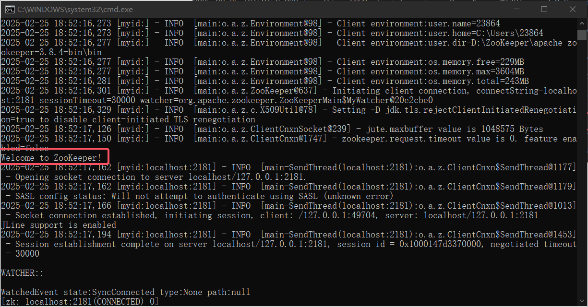

出现 Welcome to Zookeeper，表示我们成功启动了客户端。

2.   引入客户端依赖

一般我们会使用Apache Curator来操作ZooKeeper，可以参考官方文档：https://curator.apache.org/docs/getting-started/

引入的依赖代码如下：

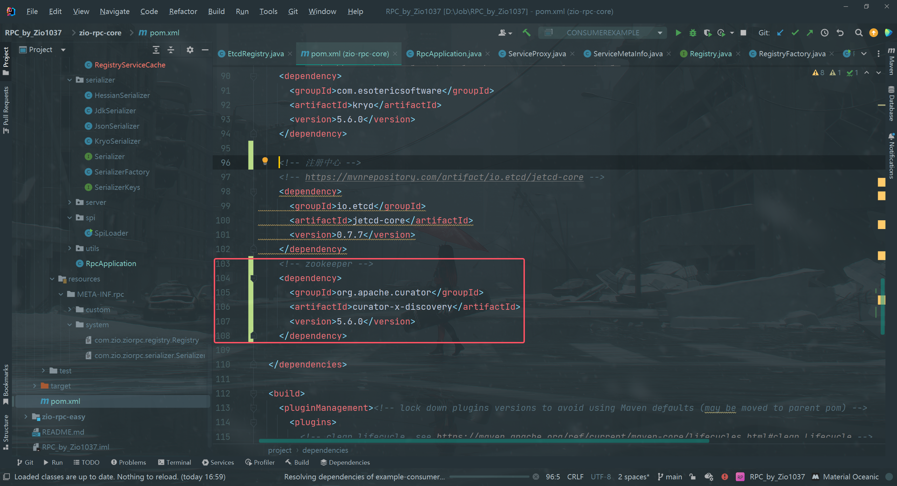

3.    ZooKeeper注册中心实现，这里不再赘述

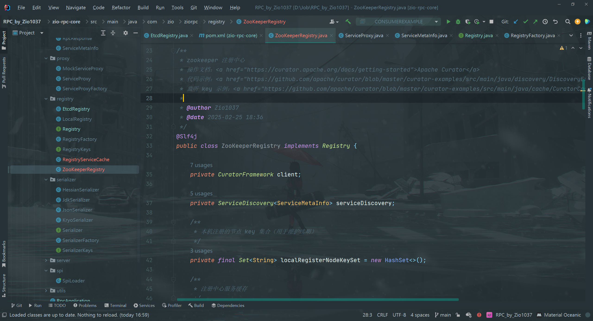

4.   SPl增加对ZooKeeper的支持：

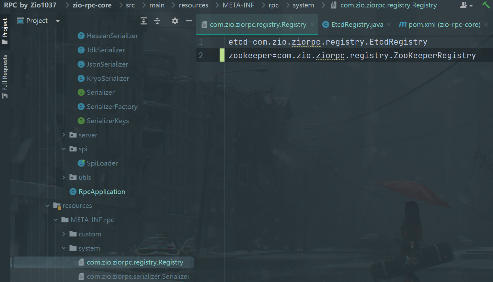

5.   最后，可以更改服务提供者和消费者的注册中心配置来测试。

需要修改的配置如下：

-   修改服务提供者提供服务的端口，因为此时zookeeper已经占用了8080端口，这里我修改为9999
-   在服务提供者和消费者的配置文件中新增zookeeper相关的配置项，比如`rpc.registryConfig.registry`和`rpc.registryConfig.address`

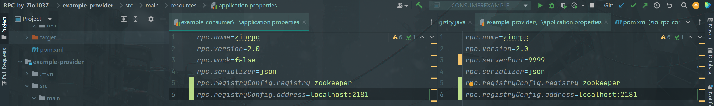

先后debug模式启动`ProviderExample`和`ConsumerExample`

服务提供者`ProviderExample`：

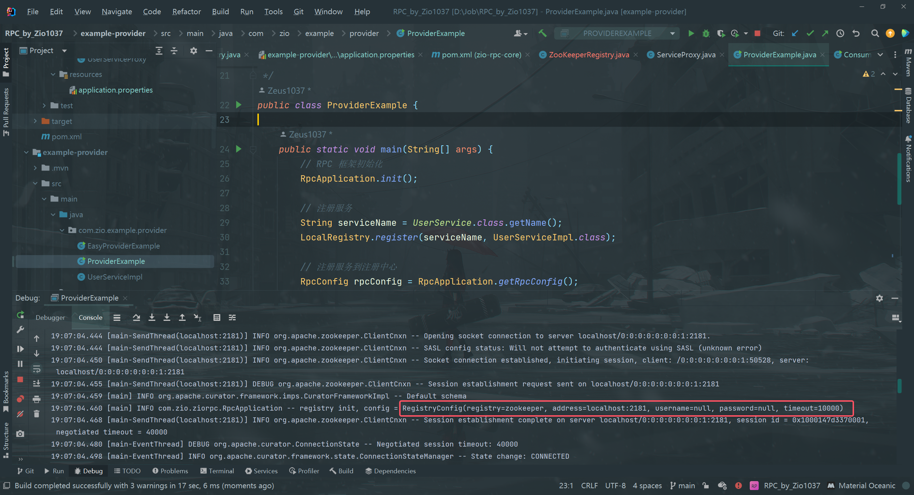

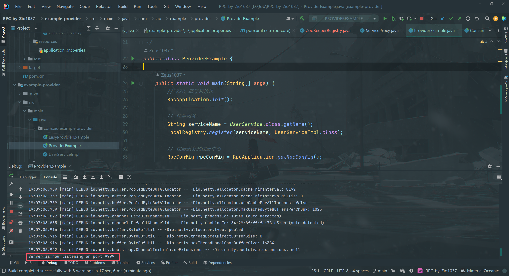

服务消费者调用：

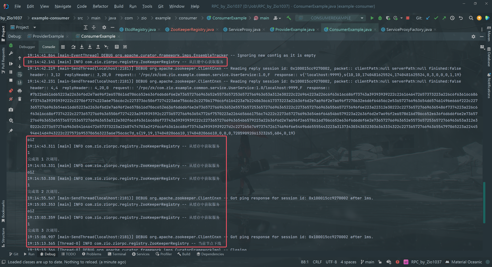

可以看到服务调用成功，并且这次用的是zookeeper 。

【之后还是用 etcd】

## Todo List

-   [ ] 完善服务注册信息，比如增加节点注册时间
-   [ ] 实现更多注册中心，比如Redis
-   [ ] 保证注册中心的高可用，比如Etcd的集群机制
-   [ ] 服务注册信息失效的兜底策略，比如如果消费端调用节点时发现节点失效，可以考虑在注册中心更新服务注册信息，或者强制更新本地缓存。
-   [ ] 注册中心key 监听时，采用观察者模式实现处理
    -   [ ] 可能方案：定义一个Listener接口，根据watch key的变更类型去调用Listener的不同方法

