## 需求分析

目前的RPC框架，我们使用`Vert.x`的`HttpServer`作为服务提供者的服务器，代码实现比较简单，其底层网络传输使用的是HTTP协议。但要注意，HTTP只是RPC框架网络传输的一种可选方式罢了。

问题来了，**使用HTTP协议会有什么问题么？**或者说，**有没有更好的选择？**

一般情况下，RPC框架会比较注重性能，而HTTP协议中的头部信息、请求响应格式较"“重”，会影响网络传输性能。

所以，我们可以自己自定义一套RPC协议，比如利用TCP等传输层协议、自己定义请求响应结构，来实现性能更高、更灵活、更安全的RPC框架。


## 设计方案

自定义RPC协议可以分为2大核心部分：

- 自定义网络传输
- 自定义消息结构

### 网络传输设计

>   网络传输设计的目标是：选择一个够高性通信的网络协议和传输方式。

需求分析中已经提到了，HTTP协议的头信息是比较大的，会影响传输性能。但其实除了这点外，HTTP本身属于无状态协议，这意味着每个HTTP请求都是独立的，每次请求/响应都要重新建立和关闭连接，也会影响性能。

考虑到这点，在HTTP/1.1中引入了持久连接(Keep-Alive)，允许在单个TCP连接上发送多个HTTP请求和响应，避免了每次请求都要重新建立和关闭连接的开销。

虽然如此，HTTP本身是应用层协议，我们现在设计的RPC协议也是应用层协议，性能肯定是不如底层（传输层）的TCP协议要高的。所以我们想要追求更高的性能，还是选择使用TCP协议完成网络传输，有更多的自主设计空间。

### 消息结构设计

>   消息结构设计的目标是：用最少的空间传递需要的信息。

**Q: 如何使用最少的空间呢？**

大家之前接触到的数据类型可者都是整型、长整型、浮点数类型等等，这些类型其实都比较“重”，占用的字节数较多。比如整型要占用4个字节、32个bit位。

我们在自定义消息结构时，想要节省空间，就要尽可能使用更轻量的类型，比如byte字节类型，只占用1个字节、8个bit位。
需要注意的是，Java中实现bit位运算拼接相对比较麻烦，所以权衡开发成本，我们设计消息结构时，尽量给每个数据凑到整个字节。

**Q: 消息内需要哪些信息呢？**

目标肯定是能够完成请求。分析HTTP请求结构并参考Dubbo的协议设计，我们能够得到RPC消息所需的信息：

- 魔数：作用是安全校验，防止服务器处理了非框架发来的乱七八槽的消息（类似HTTPS的安全证书）
- 版本号：保证请求和响应的一致性（类以HTTP协议有1.0/2.0等版本）
- 序列化方式：来告诉服务端和客户端如何解析数据（类似HTTP的Content-Type内容类型）
- 类型：标识是请求还是响应？或者是心跳检测等其他用途。（类似HTTP有请求头和响应头）
- 状态：如果是响应，记录响应的结果（类似HTTP的200状态代码）

此外，还需要有请求id，唯一标识某个请求，因为TCP是双向通信的，需要有个唯一标识来追踪每个请求。

最后，也是最重要的，要发送body内容数据。我们暂时称它为**请求体**，类似于我们之前HTTP请求中发送的`RpcRequest`。

如果是HTTP这种协议，有专门的key/value结构，很容易找到完整的body数据。但基于TCP协议，想要获取到完整的body内容数据，就需要一些"小心思”了，因为TCP协议本身会存在**半包**和**粘包**问题，每次传输的数据可能是不完整的，具体的后面会讲。

所以我们需要在消息头中新增一个字段`请求体数据长度`，保证能够完整地获取body内容信息。

基于以上的思考，我们可以得到最终的消息结构设计，如下图：

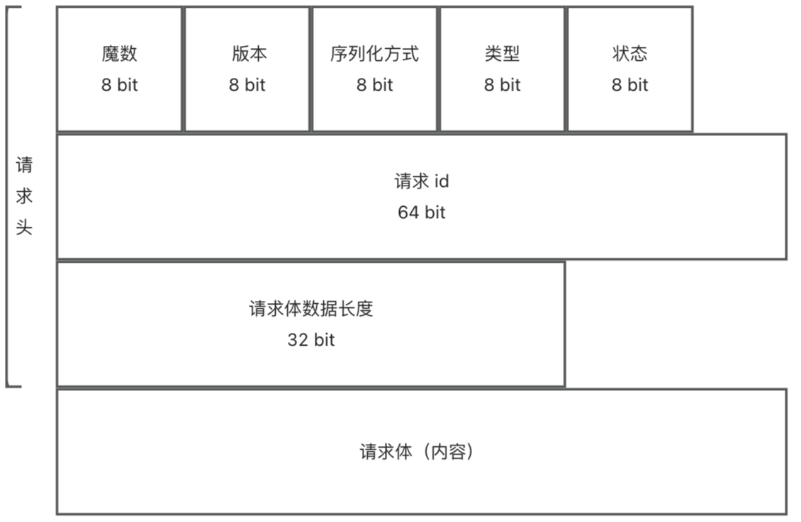

实际上，这些数据应该是紧凑的，请求头信息总长17个字节。也就是说，上述消息结构，本质上就是拼接在一起的一个字节数组。我们后续实现时，需要有**消息编码器**和**消息解码器**，编码器先new一个空的Buffer缓冲区，然后按照顺序向缓冲区依次写入这些数据，解码器在读取时也按照顺序依次读取，就还原出编码前的数据。

通过这种约定的方式，我们就不用记录头信息了。比如magic魔数，不用存储"magic”这个字符串，而是读取第一个字节（前8bit)就能获取到。

## 开发实现

### 消息结构

在`zio-rpc-core`包下新建`com.zio.ziorpc.protocol`包，将所有和自定义协议有关的代码都放到该包下。

1.   新建协议消息类`ProtocolMessage`。

将消息头单独封装为一个内部类，消息体可以使用泛型类型：

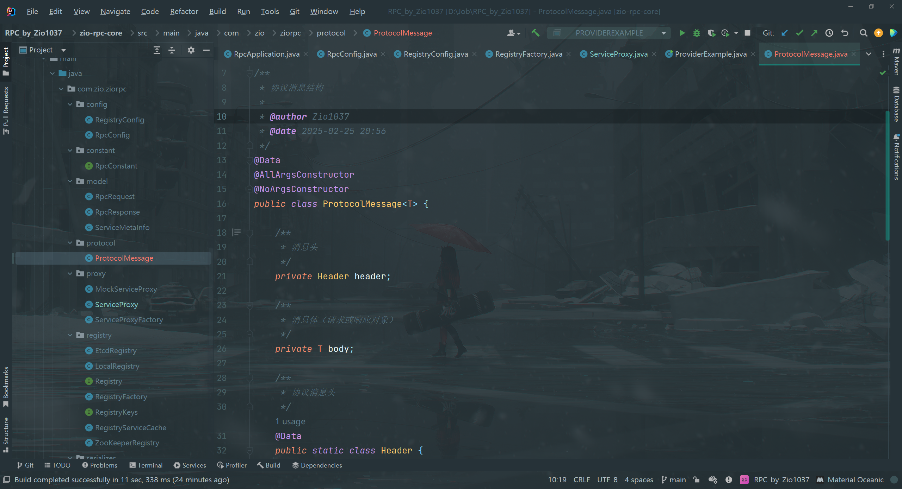

2.   新建协议常量类`ProtocolConstant`。

记录了和自定义协议有关的关键信息，比如消息头长度、魔数、版本号。

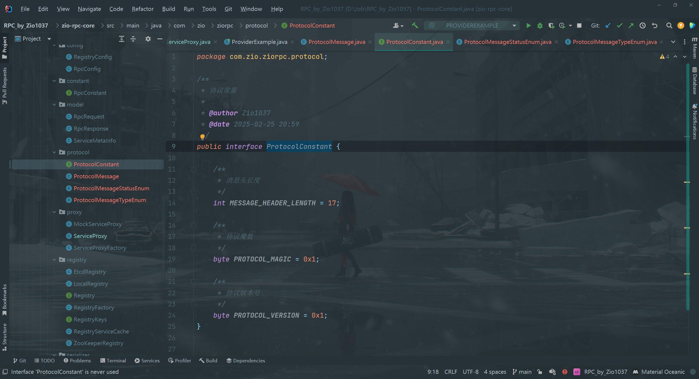

3.   新建消息字段的枚举类`ProtocolMessageStatusEnum`，比如：

协议状态枚举，暂时只定义成功、请求失败、响应失败三种枚举值：

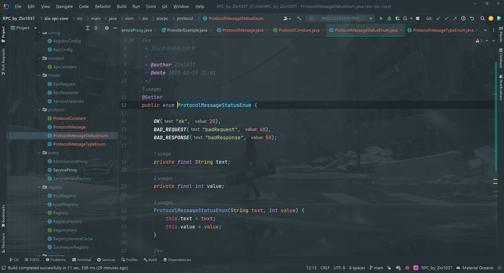

4.   新增协议消息类型枚举`ProtocolMessageTypeEnum`，包括请求、响应、心跳、其他。代码如下：

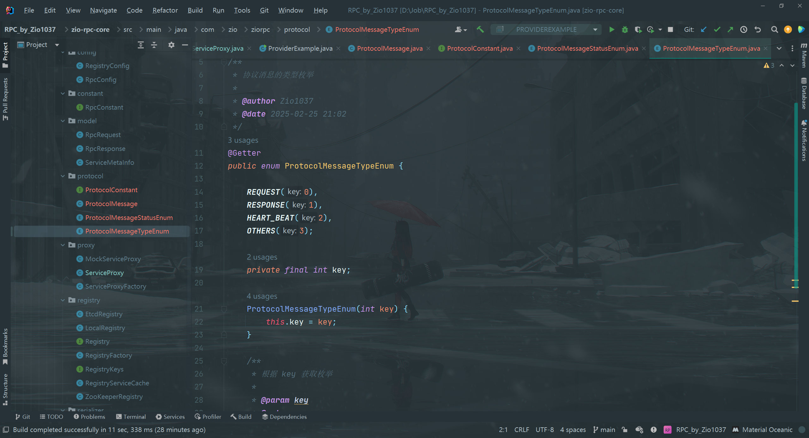

5.   新增协议消息的序列化器枚举`ProtocolMessageSerializerEnum`，跟我们RPC框架已支持的序列化器对应。代码如下：

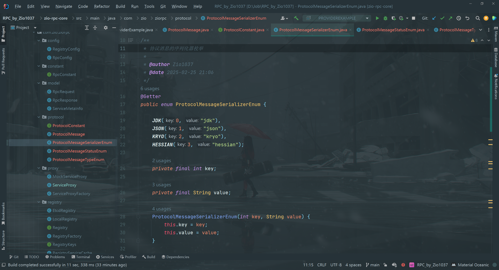

### 网络传输

我们的RPC框架使用了高性能的`Vert.x`作为网络传输服务器，之前用的是HttpServer。同样，Vert.x也支持TCP服务器，相比于Netty或者自己写Socket代码，更加简单易用。

首先在`com.zio.ziorpc`中新建`server.tcp`包，将所有TCP服务相关的代码放到该包中。

1.   TCP服务器实现。

新建`VertxTcpServer`类，跟之前写的`VertxHttpServer`类似，先创建`Vert.x`的服务器实例，然后定义处理请求的方法，比如回复"Hello, client!"，最后启动服务器。

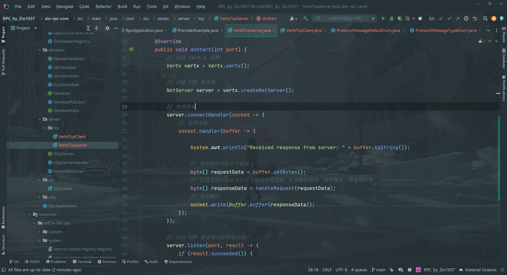

上述代码中的`socket.write`方法，就是在向连接到服务器的客户瑞发送数据。注意发送的数据格式为Buffer，这是`Vert.x`为我们提供的字节数组缓冲区实现。

2.   TCP 客户端实现

新建`VertxTcpclient`类，先创建`Vert.x`的客户端实例，然后定义处理请求的方法，比如回复"Hello, server!!”，并建立连接。

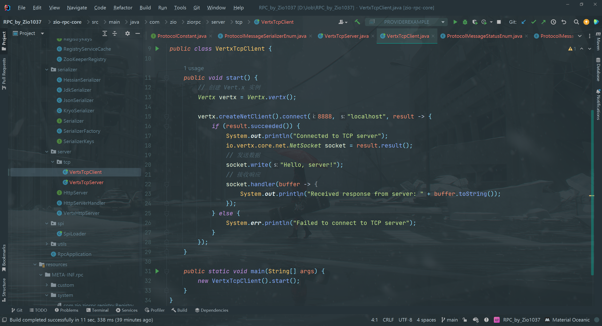

3.   先进行简单的测试，先启动服务器，再启动客户端，够在控制台看到它们互相打招呼的输出。

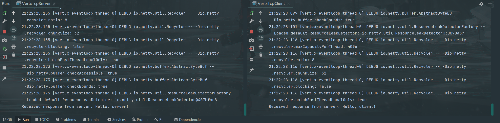

### 编码 / 解码器

在上一步中，我们会发现Vert.x的TCP服务器收发的消息是Buffer类型，不能直接写入一个对象。因此，我们需要编码器和解码器，将Java的消息对象和Buffer进行相互转换。

下图演示了整个请求和响应的过程，相信能够带大家了解编码器和解码器的作用。

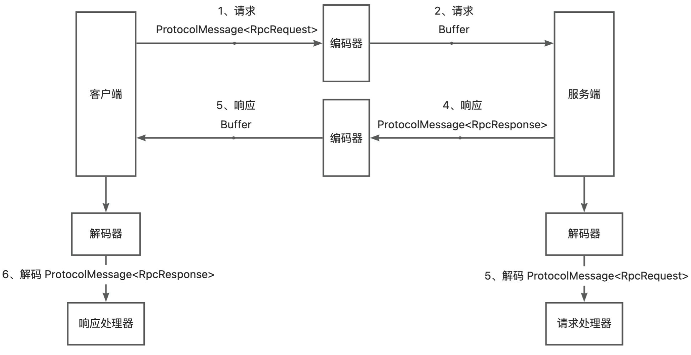

之前HTTP请求和响应时，直接从请求body处理器中获取到body字节数组，再通过序列化（反序列化）得到`RpcRequest`或`RpcResponse`对象。使用TCP服务器后，只不过改为从Buffer中获取字节数组，然后编解码为`RpcRequest`或`RpcResponse`对象。其他的后续处理流程都是可复用的。

1.   首先实现消息编码器。

在protocol包下新建`ProtocolMessageEncoder`，核心流程是依次向Buffer缓冲区写入消息对象里的字段。

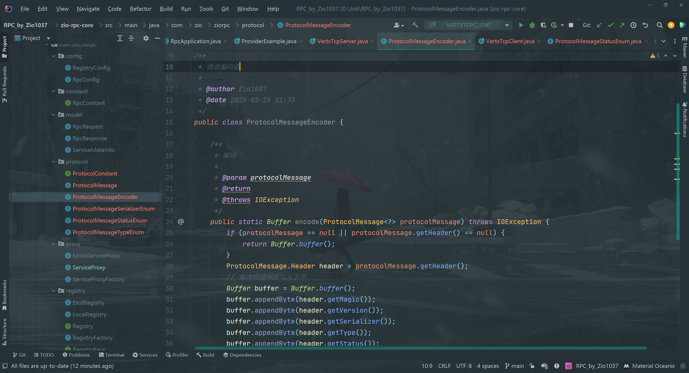

2.   实现消息解码器。

在protocol包下新建`ProtocolMessageDecoder`，核心流程是依次从Buffer缓冲区的指定位置读取字段，构造出完整的消息对象，

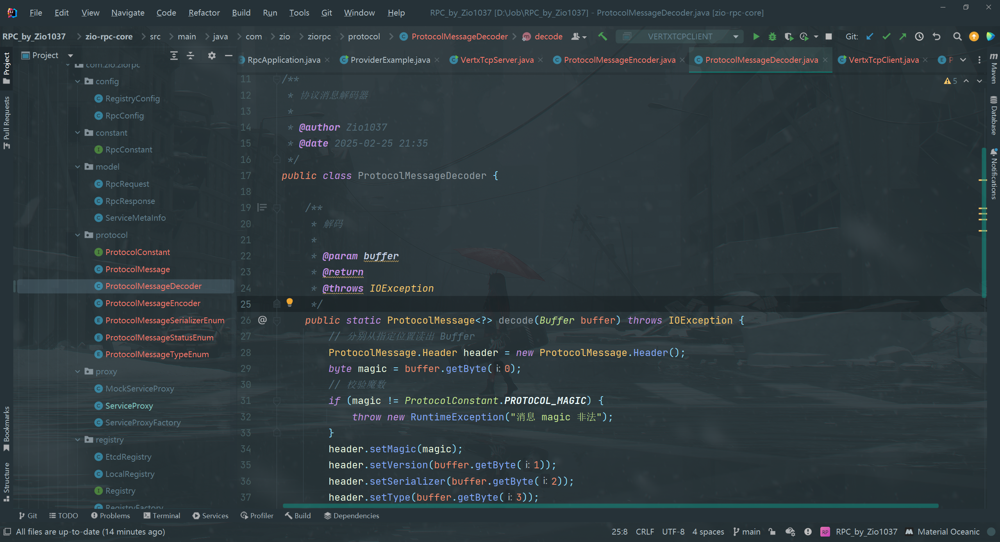

3.   编写单元测试类`ProtocolMessageTest`，先编码再解码，以测试编码器和解码器的正确性。

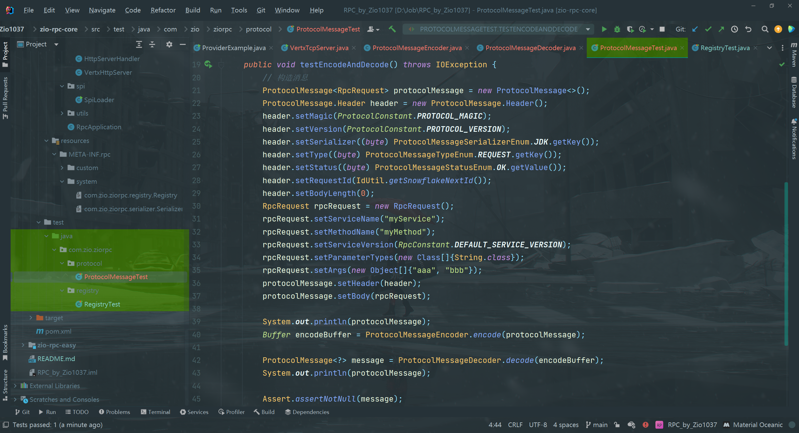

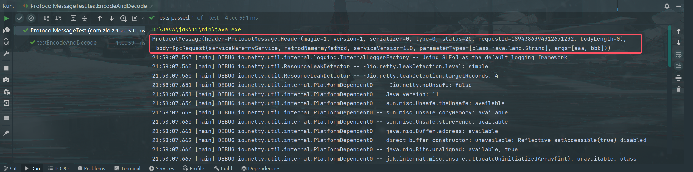

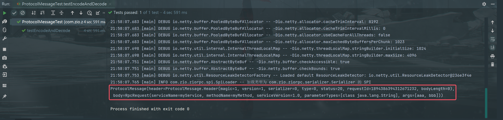

可以看到编解码前后的数据一致。

### 请求处理器（服务提供者）

可以使用 netty 的 pipeline 组合多个 handler (比如编码 => 解码 => 请求/响应处理)

请求处理器的作用是接受请求，然后通过反射调用服务实现类。

类似之前的`HttpServerHandler`，我们需要开发一个`TcpServerHandler`，用于处理请求。和`HttpServerHandler`的区别只是在获取请求、写入响应的方式上，需要调用上面开发好的编码器和解码器。

通过实现`Vert.x`提供的`Handler<NetSocket>`接口，可以定义TCP请求处理器。

完整代码如下，大部分代码都是从之前写好的`HttpServerHandler`复制来的：

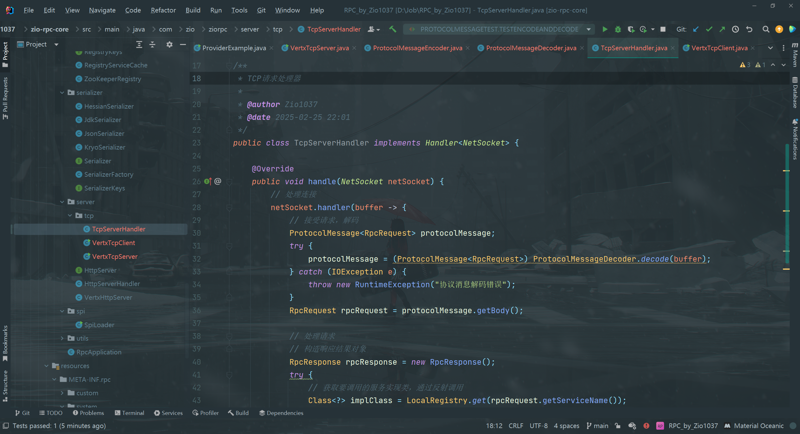

### 请求发送（服务消费者）

调整服务消费者的动态代理发送请求的代码，改HTTP请求为TCP请求。

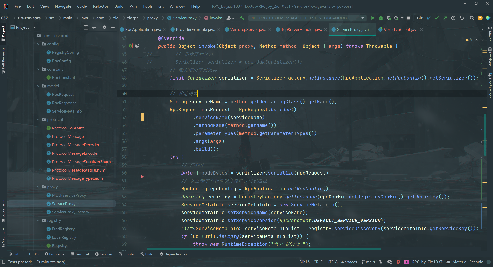

这里的代码看着比较复杂，但只需要关注上述代码中注释了“发送TCP请求”的部分即可。由于`Vert.x`提供的请求处理器是异步、反应式的，我们为了更方便地获取结果，可以使用`CompletableFuture`转异步为同步，参考代码如下：

```java
CompletableFuture<RpcResponse> responseFuture = new CompletableFuture<>();
netClient.connect(xxx,
    result -> {
        // 完成了响应
        responseFuture.complete(rpcResponseProtocolMessage.getBody());
    });
);
// 阻塞，直到响应完成，才会继续向下执行
RpcResponse rpcResponse = responseFuture.get();
```


## 测试

编写好上述代码后，我们就可以先测试请求响应流程是否跑通了。

1.   将`VertxTcpServer`类的`doStart`方法中`NetServer.connectHandler()`方法的入参改为`TcpServerHandler`类的实例

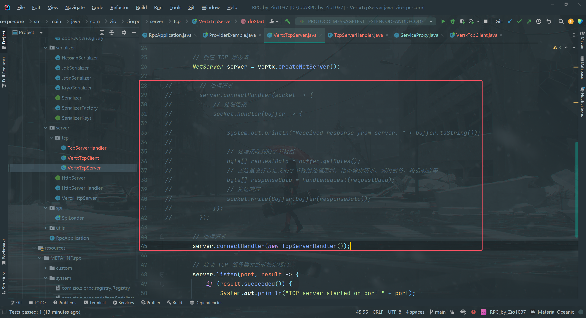

2.   检查服务提供者与消费者的配置文件，确保开启了相应注册中心的服务 (Etcd or Zookeeper)

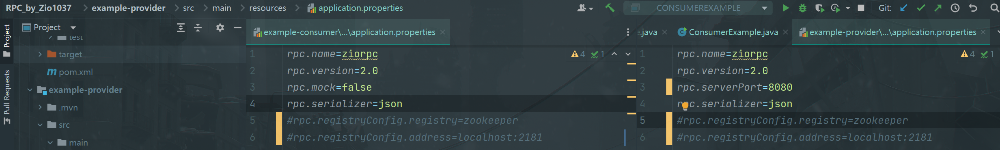

3.   修改服务提供者`ProviderExample`代码，改为启动TCP服务器。完整代码如下：

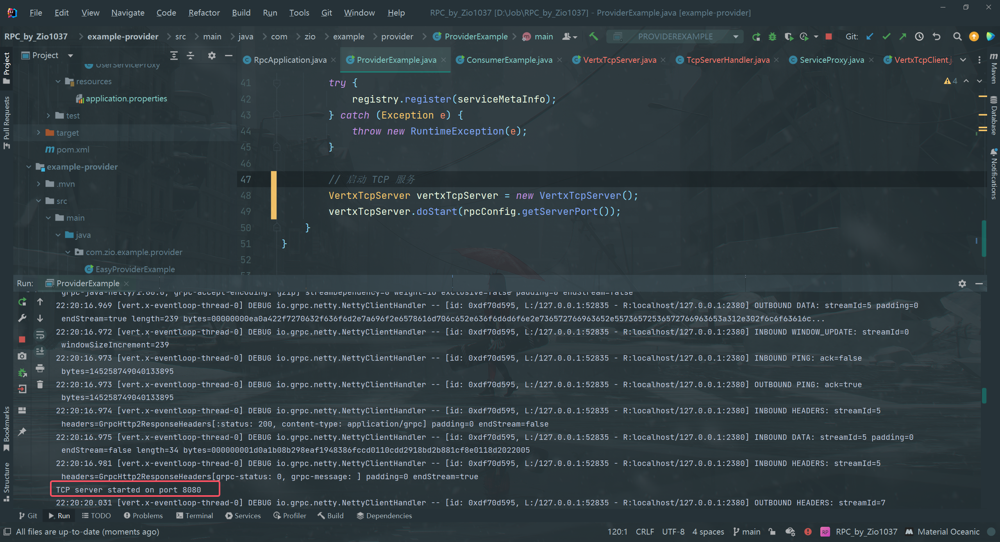

4.   启动服务消费者`ConsumerExample`，调用3次服务

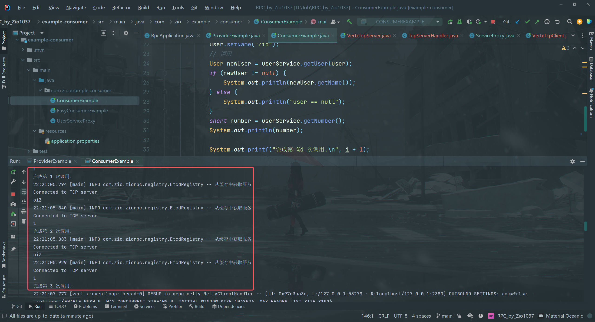

可以看到成功调用了3次服务。


## 粘包半包问题解决

### 什么是粘包和半包？

使用TCP协议网络通讯时，可能会出现半包和粘包问题。

举个例子，理想情况下，假如我们客户端连续2次要发送的消息是：

```java
// 第一次
Hello, server!Hello, server!Hello, server!Hello, server!
// 第二次
Hello, server!Hello, server!Hello, server!Hello, server!
```

但服务端收到的消息情况可能是：

① 每次收到的数据**更少**了，这种情况叫做**半包**：

```java
// 第一次
Hello, server!Hello, server!
// 第二次
Hello, server!Hello, server!Hello, server!
```

② 每次收到的数据**更多**了，这种情况叫做**粘包**：

```java
// 第三次
Hello, server!Hello, server!Hello, server!Hello, server!Hello, server!
```

### 半包粘包问题演示

为了更好地理解半包和粘包，我们可以编写代码来测试。

1.   修改TCP客户端`VertxTcpClient`的代码，连续发送1000次消息：

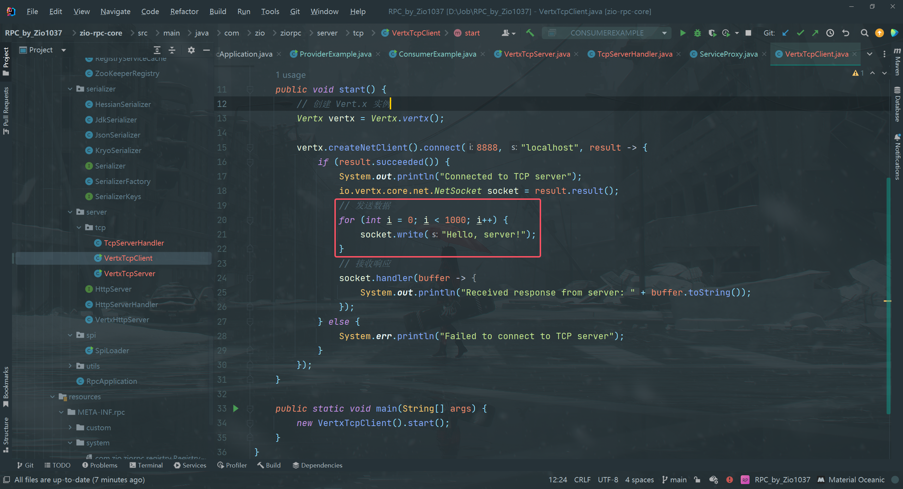

2.   修改TCP服务端`VertxTcpServer`代码，打印出每次收到的消息：

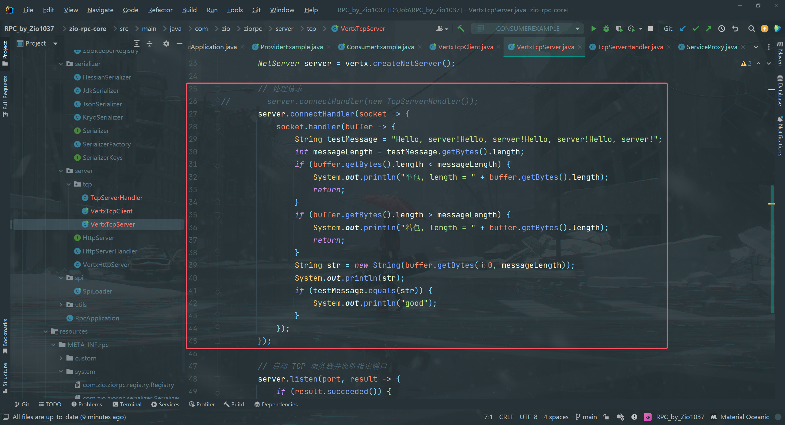

3.   测试运行，查看服务端控制台，发现服务端接受消息时，出现了半包和粘包：

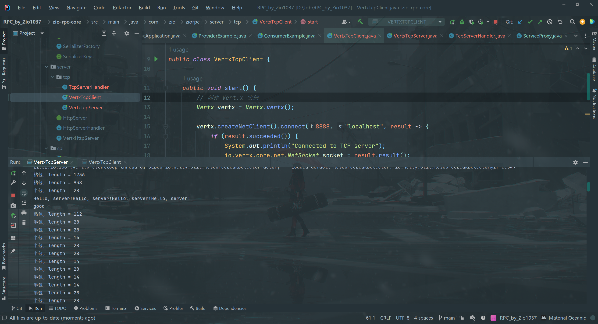

### 如何解决半包？

解决半包的核心思路是：在消息头中设置请求体的长度，服务端接收时，判断每次消息的长度是否符合预期，不完整就不读，留到下一次接收到消息时再读取。

示例代码如下：

```java
if (buffer == null || buffer.length() == 0) {
    throw new RuntimeException("消息 buffer 为空");
}
if (buffer.getBytes().length < ProtocolConstant.MESSAGE_HEADER_LENGTH) {
    throw new RuntimeException("出现了半包问题");
}
```

### 如何解决粘包？

解决粘包的核心思路也是类似的：每次只读取指定长度的数据，超过长度的留着下一次接收到消息时再读取。

示例代码如下：

```java
// 解决粘包问题，只读指定长度的数据
byte[] bodyBytes = buffer.getBytes(17, 17 + header.getBodyLength());
```

听上去简单，但自己实现起来还是比较麻烦的，要记录每次接收到的消息位置，维护字节数组缓存。

### Vert.x解决半包和粘包

在`Vert.x`框架中，可以使用内置的`RecordParser`完美解决半包粘包，它的作用是：保证下次读取到特定长度的字符。

#### 基础代码

1.   先小试牛刀，使用`RecordParser`来读取固定长度的消息，示例代码如下：

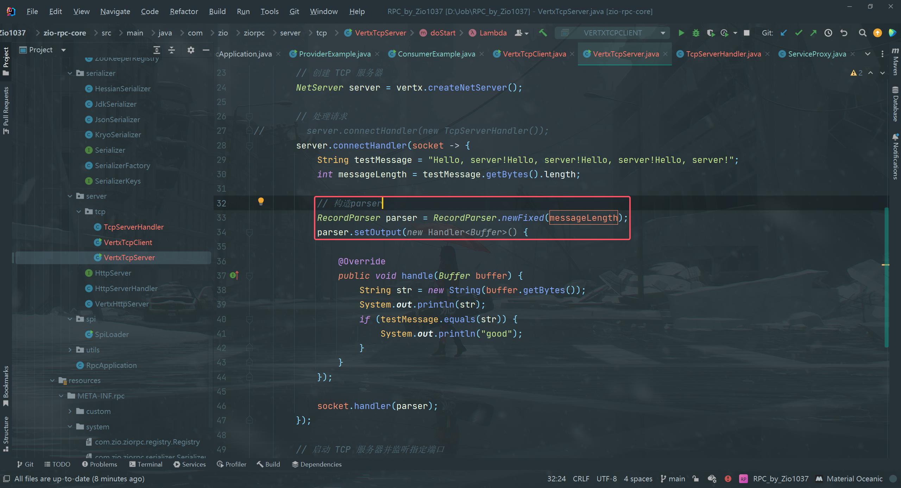

上述代码的核心是`RecordParser.newFixed(messageLength`)，为Parser指定每次读取固定值长度的内容。

2.   测试，会发现这次的输出结果非常整齐，解决了半包和粘包：

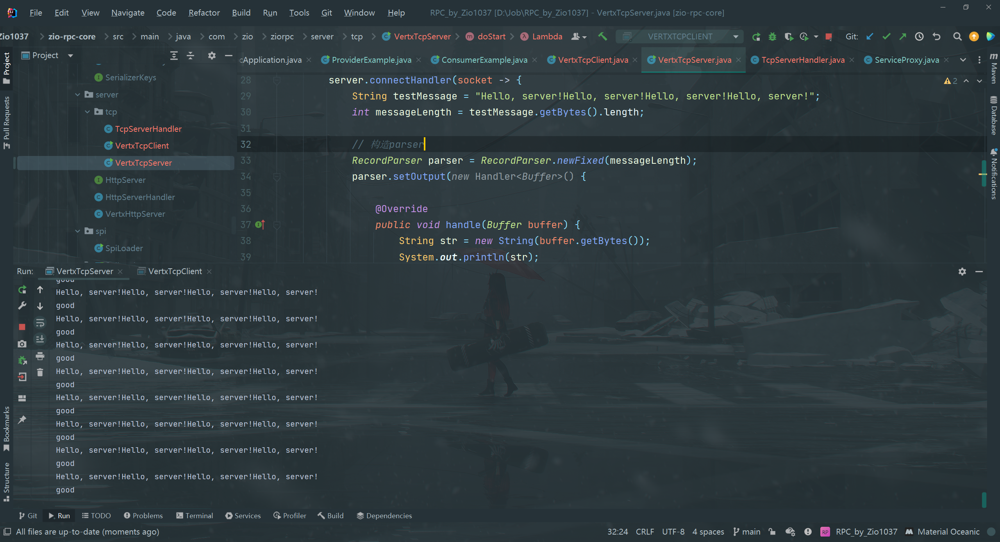

3.   实际运用中，消息体的长度是不固定的，所以要通过调整`RecordParser`的固定长度（变长）来解决。

常规的思路是将读取完整的消息拆分为2次：

Ⅰ.先完整读取请求头信息，由于请求头信息长度是固定的，可以使用RecordParser保证每次都完整读取。

Ⅱ. 再根据请求头长度信息更改RecordParser的固定长度，保证完整获取到请求体。


修改测试TCP Server代码如下：

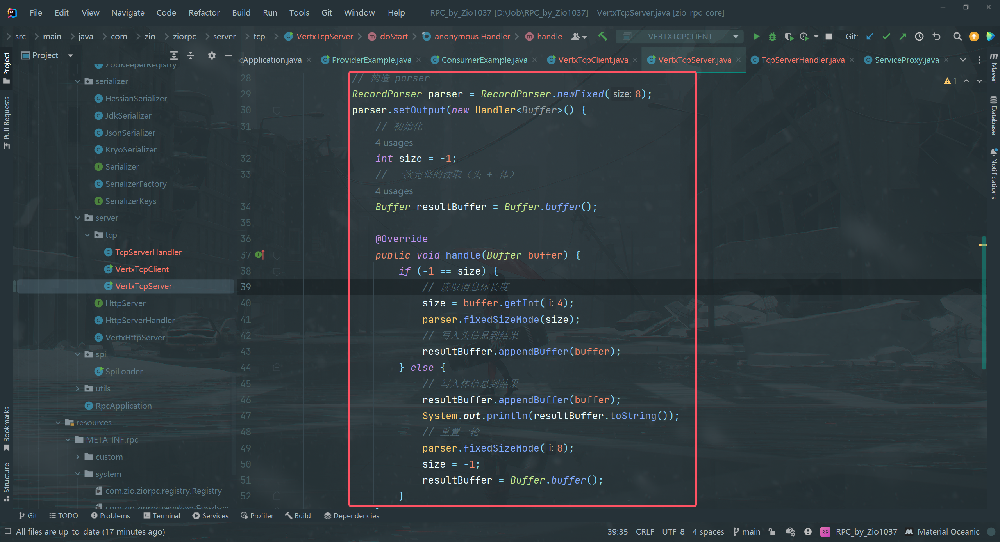

4.   修改测试TCP client代码如下，自己构造了一个变长、长度信息不在Buffer最开头（而是有一定偏移量）的消息：

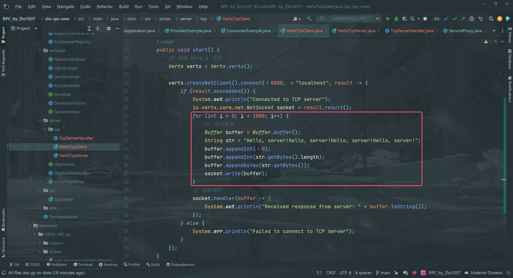

5.   测试

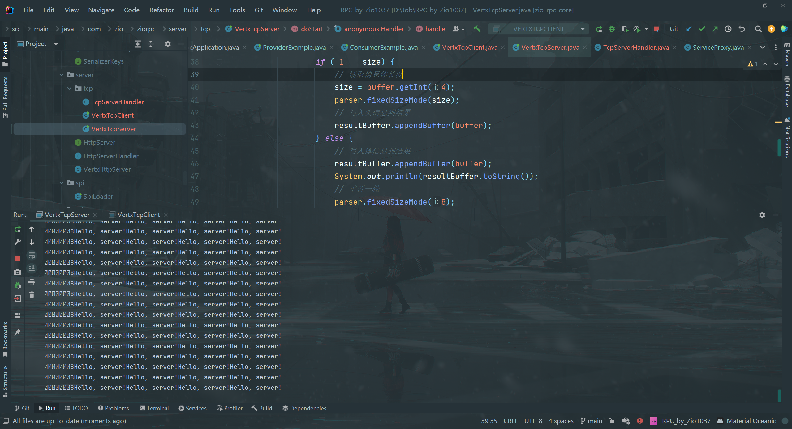

#### 封装半包粘包处理器

我们会发现，解决半包粘包，问题还是有一定的代码量的，而且由于`ServiceProxy`(消费者)和请求`Handler`(服务提供者)都需要接受Buffer，所以都需要半包粘包问题处理。

那我们就应该要想到：需要对代码进行封装复用了。

这里我们可以使用设计模式中的**装饰者模式**，使用`RecordParser`对原有的Buffer处理器的能力进行增强。

>   装饰者模式可以简单理解为给对象穿装备，增强对象的能力。

在`server.tcp`包下新建`TcpBufferHandlerWrapper`类，实现并增强`Handler<Buffer>`接口。完整代码如下：

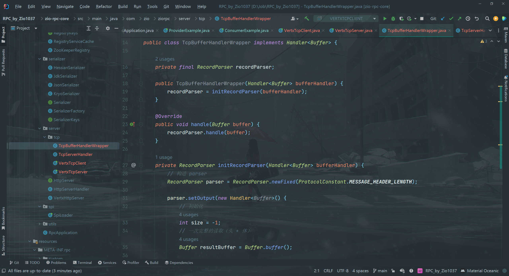

其实就是把`RecordParser`的代码粘了过来，当调用处理器的`handle`方法时，改为调用`recordParser.handle`。

### 优化客户端调用代码

有了半包粘包处理器，我们就可以很轻松地在业务代码中运用它了。

1.   修改TCP请求处理器。

使用`TcpBufferHandlerWrapper`来封装之前处理请求的代码，请求逻辑不用变，要修改的部分代码如下：

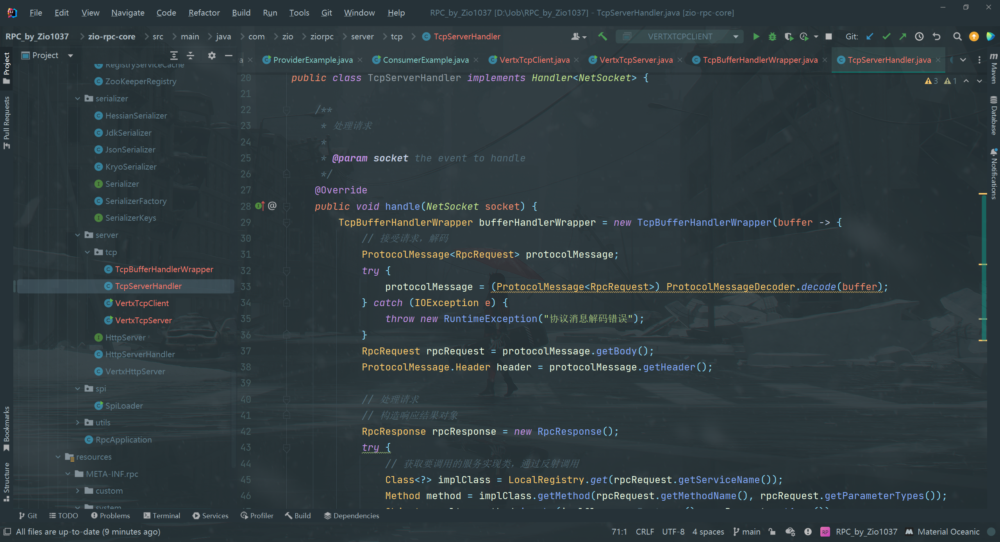

其实就是使用一个Wrapper对象包装了之前的代码，就解决了半包粘包。是不是很简单？这就是装饰者模式的妙用！

2.   修改TCP服务器`VertxTcpServer`的代码，使用`TcpServerHandler`处理请求。

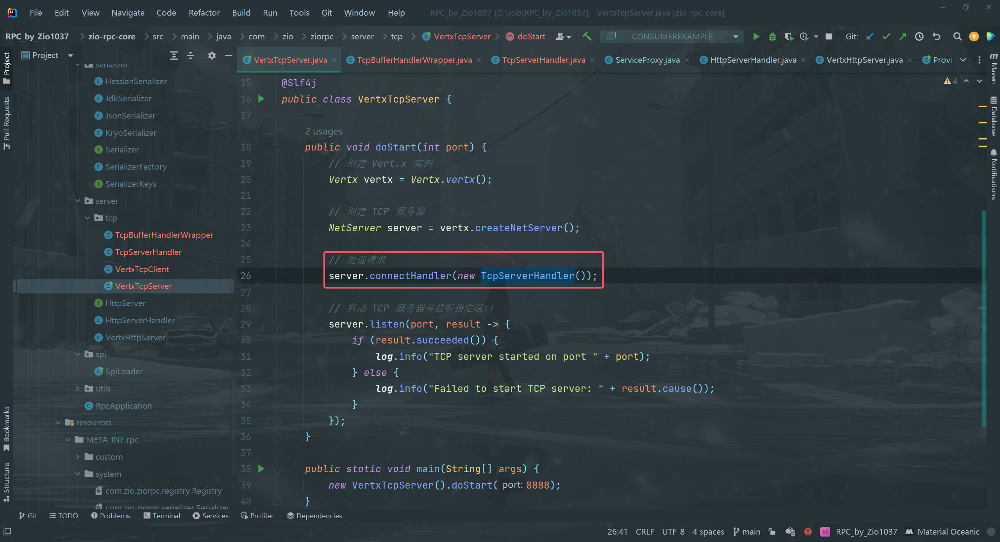

3.   修改客户端处理响应的代码。

之前我们是把所有发送请求、处理响应的代码都写到了`ServiceProxy`中，使得这个类的代码“臃肿不堪”。

我们干脆做个优化，把所有的请求响应逻辑提取出来，封装为单独的`VertxTcpClient`类，放在`server.tcp`包下。

VertxTcpClient的完整代码如下：

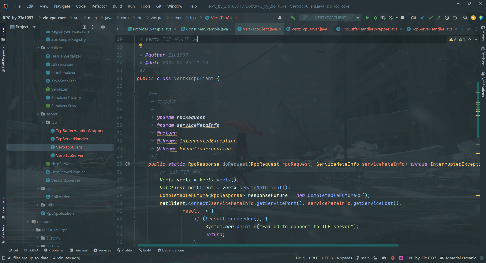

注意，上述代码中，也使用了`TcpBufferHandlerWrapper`对处理响应的代码进行了封装。

4.   修改`ServiceProxy`代码，调用`VertxTcpClient`，修改后的代码如下：

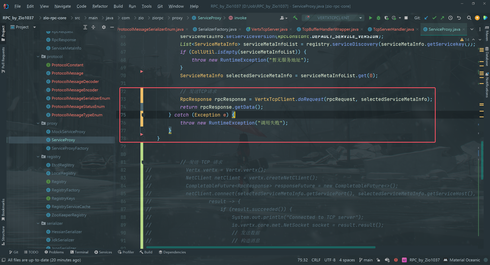

5.   测试

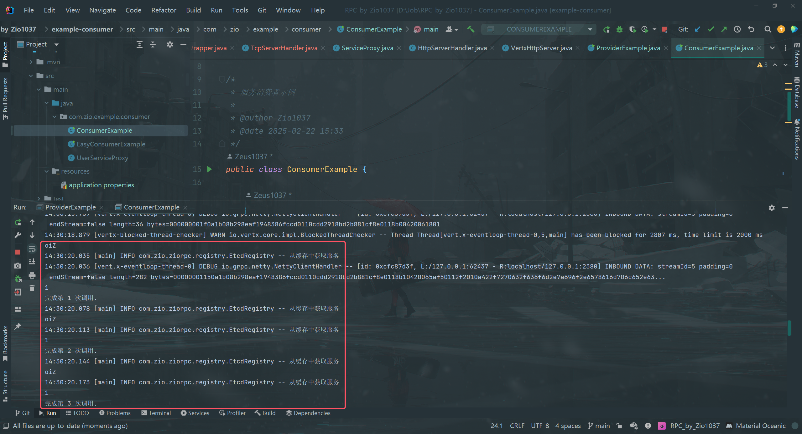

成功调用三次服务，说明整体代码逻辑没有受到影响


这里可以想想**为什么tcpServer不提供个server接口，或者和httpServer共用接口？**

==> 其实是因为替换这两个服务器（协议实现）涉及的改动点非常多，比如RPC协议、请求处理器等，不是直接通过配置就替换的，而且RPC框架一般也不需要替换底层的协议，只使用TCP会更好。


## Todo List

-   [ ] 定义一个占用空间更少的RPC 协议的消息结构
    -   [ ] 可能方案：序列化方式字段目前占用了8 bit，但其实就集中序列化方式，能否只占用4 bit？

