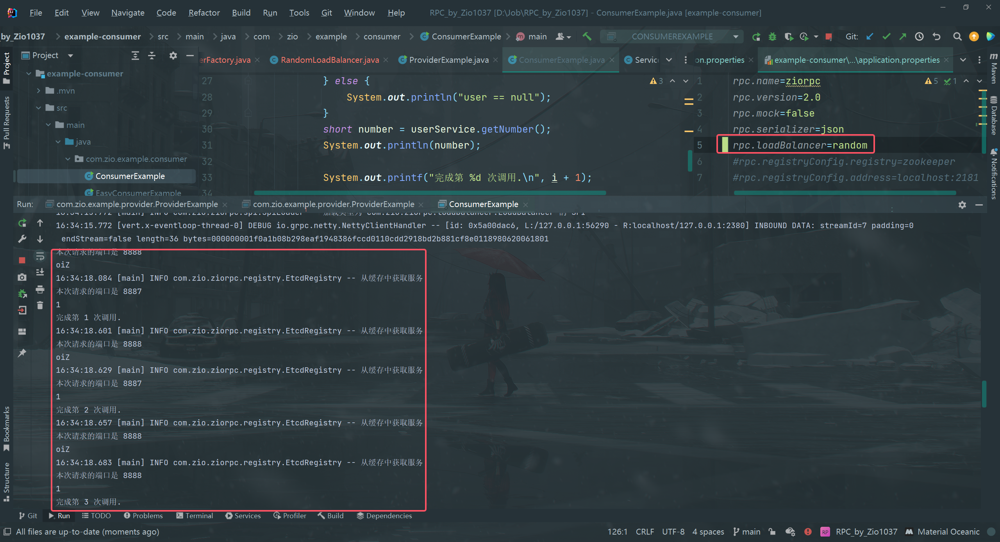

## 需求分析

现在我们的RPC框架已经可以从注册中心获取到服务提供者的注册信息了，同一个服务可能会有多个服务提供者，但是目前我们消费者始终读取了第一个服务提供者节点发起调用，不仅会增大单个节点的压力而且没有利用好其他节点的资源。

我们完全可以从服务提供者节点中，选择一个服务提供者发起请求，而不是每次都请求同一个服务提供者，这个操作就叫做**负载均衡**。

## 负载均衡

### 什么是负载均衡

让我们把这个词拆开来看：

- 何为负载？可以把负载理解为要处理的工作和压力，比如网络请求、事务、数据处理任务等。
- 何为均衡？把工作和压力平均地分配给多个工作者，从而分难每个工作者的压力，保证大家正常工作。

用个比喻，假设餐厅里只有一个服务员，如果顾客非常多，他可能会忙不过来，没法及时上菜、忙中生乱；而且他的压力会越来越大，最严重的情况下就累倒了无法继续工作。而如果有多个服务员，大家能够服务更多的顾客，即使有一个服务员生病了，其他服务员也能帮忙顶上。

所以，负载均衡是一种用来分配网络或计算负载到多个资源上的技术。它的目的是确保每个资源都够有效地处理负载、增加系统的并发量、避免某些资源过载而导致性能下降或服务不可用的情况。

回归到我们的RPC框架，负载均衡的作用是从一组可用的服务提供者中选择一个进行调用。

常用的负载均衡实现技术有Nginx（七层负载均衡）、LVS(四层负载均衡)等。

### 常见负载均衡算法

负载均衡学习的重点就是它的算法一按照什么策略选择资源。

不同的负载均衡算法，适用的场景也不同，一定要根据实际情况选取，主流的负载均衡算法如下：

- 轮询 (Round Robin)：按照循环的顺序将请求分配给每个服务器，适用于各服务器性能相近的情况。
- 随机 (Random)：随机选择一个服务器来处理请求，适用于服务器性能相近且负载均匀的情况。
- 加权轮询 (Weighted Round Robin)：根据服务器的性能或权重分配请求，性能更好的服务器会获得更多的请求，适用于服务器性能不均的情况。
- 加权随机 (Weighted Random)：根据服务器的权重随机选择一个服务器处理请求，适用于服务器性能不均的情况。
- 最小连接数 (Least Connections)：选择当前连接数最少的服务器来处理请求，适用于长连接场景。
- IP Hash：根据客户端IP地址的哈希值选怿服务器处理请求，确保同一客户瑞的请求始终被分配到同一台服务器上，适用于需要保特会话一致性的场景。

### 一致性Hash

一致性哈希 (Consistent Hashing)是一种经典的哈希算法，用于将请求分配到多个节点或服务器上，所以非常适用于负载均衡。

它的核心思想是将整个哈希值空间划分成一个环状结构，每个节点或服务器在环上占据一个位置，每个请求根据其哈希值映射到环上的一个点，然后顺时针寻找第一个大于或等于该哈希值的节点，将请求路由到该节点上。

一致性哈希环结构如图：

上图中，请求A会交给服务器C来处理。好像也没什么特别的啊？还整个环？

其实，一致性哈希还解决了节点下线和倾斜问题。

1.   节点下线：当某个节点下线时，其负载会被平均分傩到其他节点上，而不会影响到整个系统的稳定性，因为只有部分请求会受到影响。

如下图，服务器C下线后，请求A会交给服务器A来处理（顺时针寻找第一个大于或等于该哈希值的节点），而服务器B接收到的请求保特不变。

如果是轮询取模算法，只要节点数变了，很有可能大多数服务器处理的请求者都要发生变化，对系统的影响巨大。

2.   倾斜问题：通过虚拟节点的引入，将每个物理节点映射到多个虚拟节点上，使得节点在哈希环上的分布更加均匀，减少了节点间的负载差异。

举个例子，节点很少的情况下，环的情况可如下图：

这样就会导致绝大多数的请求都会发给服务器C,而服务器A的“领地”非常少，几乎不会有请求。

引入虚拟节点后，环的情况变为：

这样一来，每个服务器接受到的请求会更容易平均。

## 开发实现

### 多种负载均衡器实现

在`zio-rpc-core`项目中新建`loadbalancer`包，将所有负载均衡器相关的代码放到该包下。

1.   编写负载均衡器通用接口`LoadBalancer`。提供一个选择服务方法，接受请求参数和可用服务列表，可以根据这些信息进行选择。

2.   实现轮询负载均衡器`RoundRobinLoadBalancer`。

使用`JUC`包的`AtomicInteger`实现原子计数器，防止并发冲突问题。

3.   实现随机负载均衡器`RandomLoadBalancer`。

使用Java自带的`Random`类实现随机选取即可，代码如下：

4.   实现一致性Hash负载均衡器`ConsistentHashLoadBalancer`。

可以使用TreeMap实现一致性Hash环，该数据结构提供了`ceilingEntry`和`firstEntry`两个方法，便于获取符合算法要求的节点。

上述代码中，注意两点：

1. 根据requestParams对象计算Hash值，这里只是简单地调用了对象的hashCode方法，大家也可以根据需求实现自己的Hash算法。
2. 每次调用负载均衡器时，都会重新构造Hash环，这是为了能够即时处理节点的变化。

### 支持配置和扩展负载均衡器

一个成熟的RPC框架可能会支持多个负载均衡器，像序列化器和注册中心一样，我们的需求是，让开发者能够填写配置来指定使用的负载均衡器，并且支持自定义负载均衡器，让框架更易用、更利于扩展。

要实现这点，开发方式和序列化器、注册中心都是一样的，都可以使用工厂创建对象、使用`SPI`动态加载自定义的注册中心。

1.   负载均衡器常量。在`loadbalancer`包下新建`LoadBalancerKeys`类，列举所有支持的负载均衡器键名。

2.   使用工厂模式，支持根据key从SPI获取负载均衡器对象实例。

在`loadbalancer`包下新建`LoadBalancerFactory`类，代码如下：

这个类可以直接复制之前的`SerializerFactory`，然后略做修改。可以发现，只要跑通了一次SPI机制，后续的开发就很简单了~

3.   在`META-INF`的`rpc/system`目录下编写负载均衡器接口的SPI配置文件，文件名称为`com.dingjiaxiong.xiongrpc.loadbalancer.LoadBalancer`

4.   在`RpcConfig`全局配置中新增负载均衡器的配置，代码如下：

### 应用负载均衡器

现在，我们就能够愉快地使用负载均衡器了。修改ServiceProxy的代码，将“固定调用第一个服务节点”改为“**调用负载均衡器获取一个服务节点**”。修改部分的代码如下：

上述代码中，我们给负载均衡器传入了一个requestParams HashMap，并且将请求方法名作为参数放到了Map中。如果使用的是一致性Hash算法，那么会根据requestParams计算Hash值，调用相同方法的请求Hash值肯定相同，所以总会请求到同一个服务器节点上。

## 测试

### 测试负载均衡算法

1.   编写单元测试类`LoadBalancerTest`，自定义三个服务，连续调用10次：

2.   替换loadBalancer对象为不同的负载均衡器实现类，观察结果。

轮询负载均衡器：

随机负载均衡器

一致性Hash负载均衡器

可以看到，轮询负载均衡器依次调用服务，随机负载均衡器随机调用服务，一致性Hash负载均衡器会根据计算出的哈希值调用服务，由于传入的requestParams不变，因此调用的服务也不变。

### 测试负载均衡调用

1.   在消费者的配置文件`application.properties`中增加对`loadBalancer`的配置

2.   在不同的端口启动2个服务提供者，然后启动服务消费者项目，通过Debug或者控制台输出来观察每次请求的节点地址。

这里分别在8887和8888端口启动服务提供者：

在etcdkeeper中查看服务是否注册成功：

3.   启动服务消费者，进行3次调用

随机负载均衡器：

轮询负载均衡器：

一致性Hash负载均衡器

与测试结果基本一致，说明了逻辑的正确性。

## Todo List

-   [ ] 实现更多不同算法的负载均衡器，比如最少活跃数负载均衡器，选择当前正在处理请求的数量最少的服务提供者
-   [ ] 自定义一致性Hash算法中的Hash算法，比如根据请求客户端的IP地址来计算Hash值，保证同一IP的请求发送给相同的服务提供者。

