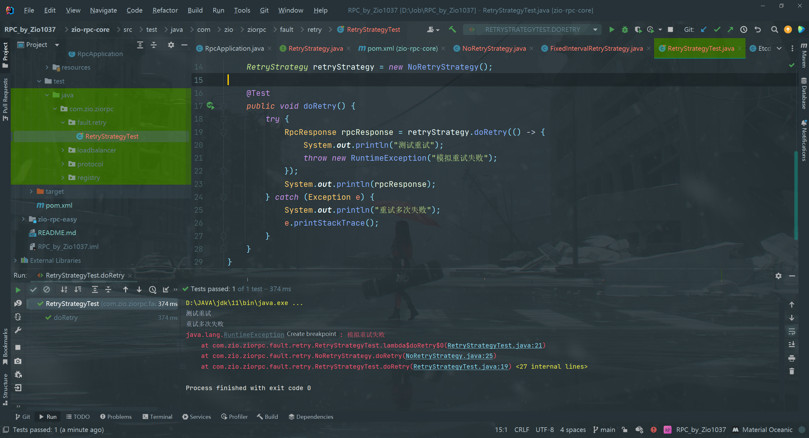

## 需求分析

目前，如果使用RPC框架的服务消费者调用接口失败，就会直接报错。

调用接口失败可能有很多原因，有时可能是服务提供者返回了错误，但有时可能只是网络不稳定或服务提供者重启等临时性问题。这种情况下，我们可能更希望服务消费者拥有自动重试的能力，提高系统的可用性。


## 设计方案

### 重试机制

重试机制的核心是**重试策略**，一般来说，包含以下几个考虑点：

1. 什么时候、什么条件下重试？
2. 重试时间（确定下一次的重试时间）
3. 什么时候、什么条件下停止重试？
4. 重试后要做什么？

### 重试条件

首先是什么时候、什么条件下重试？

这个比较好思考，如果我们希望提高系统的可用性，当由于网络等异常情况发生时，触发重试。

### 重试时间

重试时间（也叫重试等待）的策略就比较丰富了，可能会用到一些算法，主流的重试时间算法有：

- 固定重试间隔 (Fiⅸed Retry Interval)：在每次重试，之间使用固定的时间间隔
- 指数退避重试 (Exponential Backoff Retry)：在每次失败后，重试的时间间隔会以指数级增加，以避免请求过于密集。
- 随机延迟重试 (Random Delay Retry)：在每次重试，之间使用随机的时间间隔，以避免请求的同时发生。
- 可变延迟重试 (Variable Delay Retry)：这种策咯更“高级”了，根据先前重试的成功或失败情况，动态调整下一次重试的延迟时间。比如，根据前一次的响应时间调整下一次重试的等待时间。

值得一提的是，以上的策略是可以组合使用的，一定要根据具体情况和需求灵活调整。比如可以先使用指数退避重试策略，如果连续多次重试失败，则切换到固定重试间隔策略。

### 停止重试

一般来说，重试次数是有上限的，否则随着报错的增多，系统同时发生的重试也会越来越多，造成雪崩。

主流的停止重试策略有：

- 最大尝试次数：一般重试当达到最大次数时不再重试。
- 超时停止：重试达到最大时间的时候，停止重试。

### 重试工作

最后一点是重试后要做什么事情？一般来说就是重复执行原本要做的操作，比如发送请求失败了，那就再发一次请求。

需要注意的是，当重试次数超过上限时，往往还要进行其他的操作，比如：

1. 通知告警：让开发者人工介入
2. 降级容错：改为调用其他接口、或者执行其他操作

### 重试方案设计

回归到我们的RPC框架，消费者发起调用的代码如下：

```java
try {
    ...
    // rpc 请求
    RpcResponse rpcResponse = VertxTcpClient.doRequest(rpcRequest, selectedServiceMetaInfo);
    return rpcResponse.getData();
    ...
} catch (Exception e) {
    throw new RuntimeException("调用失败");
}
```

我们完全可以将`VertxTcpClient.doRequest`封装为一个可重试的任务，如果请求失败（重试条件），系统就会自动按照重试策咯再次发起请求，不用开发者关心.

和序列化器、注册中心、负载均衡器一样，重试策略本身也可以使用`SPI`+工厂的方式，允许开发者动态配置和扩展自己的重试策略。

最后，如果重试超过一定次数，我们就停止重试，并且抛出异常。


## 开发实现

### 多种重试策略实现

在`zio-rpc-core`模块中新建`fault.retry`包，将所有重试相关的代码放到该包下。

1.   编写重试策略通用接口`RetryStrategy`。提供一个重试方法，接受一个具体的任务参数，可以使用Callable类代表一个任务。


2.   引入Guava-Retrying重试库，依赖如下：

```java
<!-- https://github.com/rholder/guava-retrying -->
<dependency>
    <groupId>com.github.rholder</groupId>
    <artifactId>guava-retrying</artifactId>
    <version>2.0.0</version>
</dependency>
```

3.   不重试策略实现。

就是直接执行一次任务，代码如下：


4.   固定重试间隔策略实现。

使用Guava-Retrying提供的`RetryerBuilder `能够很方便地指定重试条件、重试等待策略、重试停止策略、重试工作等。


上述代码中，重试策略如下：

- 重试条件：使用retrylfExceptionOfType方法指定当出现Exception异常时重试。
- 重试等待策略：使用withWaitStrategy方法指定策略，选择fixedWait固定时间间隔策略。
- 重试停止策略：使用withStopStrategy方法指定策略，选择stopAfterAttempt超过最大重试次数停止。
- 重试工作：使用withRetryListener监听重试，每次重试时，除了再次执行任务外，还能够打印当前的重试次数。

5.   可以简单编写一个单元测试，来验证不同的重试策略。


6.   测试

不重试策略：



固定重试间隔：


### 支持配置和扩展重试策略

一个成熟的RPC框架可会支持多种不同的重试策略，像序列化器、注册中心、负载均衡器一样，我们的需求是，让开发者能够填写配置来指定使用的重试策略，并且支持自定义重试策略，让框架更易用、更利于扩展。

要实现这点，开发方式和序列化器、注册中心、负载均衡器都是一样的，都可以使用工厂创建对象、使用`SPI`动态加载自定义的注册中心。

1.   重试策略常量。

在`fault.retry`包下新建`RetryStrategyKeys`类，列举所有支持的重试策略键名。


2.   使用工厂模式，支持根据key从`SPI`获取重试策略对象实例。

在`fault.retry`包下新建`RetryStrategyFactory`类，代码如下：


这个类可以直接复制之前的`SerializerFactory`，然后略做修改。可以发现，只要跑通了一次SPI机制，后续的开发就很简单了~

3.   在`META-INF`的`rpc/system`目录下编写重试策略接口的SPl配置文件，文件名称为`com.zio.ziorpc.fault.retry.RetryStrategy`


4.   在`RpcConfig`全局配置中新增重试策略的配置，默认是不重试，代码如下：


5.   在消费者的全局配置文件`application.properties`中新增对重试策略的配置


### 应用重试功能

1.   修改`ServiceProxy`的代码，从工厂中获取重试器，并且将请求代码封装为一个`Callable`接口，作为重试器的参数，调用重试器即可。修改部分的代码如下：


上述代码中，使用Lambda表达式将`VertxTcpClient.doRequest`封装为了一个匿名函数，简化了代码。

2.   由于重试策略依赖于捕获异常来触发重试，因此在连接失败时需要抛出异常，让重试策略捕获到它并触发重试。修改`VertxTcpClient`中的代码，使其完成上述功能。


我们会发现，即使引入了重试机制，整段代码并没有变得更复杂，这就是可扩展性设计的巧妙之处。现在，我们就能够愉快地使用重试功能了。


## 测试

1.   启动服务提供者`ProviderExample`
2.   修改消费者的全局配置文件中的重试策略为`fixedInterval`；在`VertxTcpClient`类中调用`netClient.connect`方法处打上断点，使用Debug模式启动服务消费者


3.   当服务消费者发起调用（运行到`netClient.connect`）时，立刻停止服务提供者，取消断点，恢复消费者的运行，就会看到调用失败后固定间隔重试的情况。


## Todo List

-   [ ] 实现更多不同类型的重试器，比如指数退避算法的重试器