## 需求分析

在RPC框架运行的过程中，会涉及到很多的配置信息，比如注册中心的地址、序列化方式、网络服务器端口号等等。

之前的简易版RPC项目中，我们是在程序里硬编码了这些配置，不利于维护。而且RPC框架是需要被其他项目作为服务提供者或者服务消费者引入的，我们应当允许引入框架的项目通过编写配置文件来自定义配置。并且一般情况下，服务提供者和服务消费者需要编写相同的RPC配置。

因此，我们需要实现全局配置加载功能，让RPC框架轻松地从配置文件中读取配置，并且维护一个全局配置对象，便于框架快速获取到一致的配置。

  

## 设计方案

#### 配置项

首先我们梳理需要的配置项，刚开始就一切从简，只提供以下几个配置项即可：

- name名称
- version版本号
- serverHost服务器主机名
- serverPort服务器端口号


以下是一些常见的RPC框架配置项，仅做了解即可：

1. 注册中心地址：服务提供者和服务消费者都需要指定注册中心的地址，以便进行服务的注册和发现。
2. 服务接口：服务提供者需要指定提供的服务接口，而服务消费者需要指定要调用的服务接口。
3. 序列化方式：服务提供者和服务消费者都需要指定序列化方式，以便在网络中传输数据时进行序列化和反序列化。
4. 网络通信协议：服务提供者和服务消费者都需要选择合适的网络通信协议，比如TCP、HTTP等。
5. 超时设置：服务提供者和服务消费者都需要设置超时时间，以便在调用服务时进行超时处理。
6. 负载均衡策略：服务消费者需要指定负载均衡策略，以决定调用哪个服务提供者实例。
7. 服务端线程模型：服务提供者需要指定服务端线程模型，以决定如何处理客户端请求。

  

#### 读取配置文件

如何读取配置文件呢？这里可以使用Java的`Properties`类自行编写，但是更推荐使用一些第三方工具库，比如Hutool的Setting模块，可以直接读取指定名称的配置文件中的部分配置信息，并且转换成`Java`对象，非常方便。

参考官方文档：https://doc.hutool.cn/pages/Props/。

一般情况下，我们读取的配置文件名称为`application.properties`，还可以通过指定文件名称后缀的方式来区分多环境，比如`application-prod.properties`表示生产环境、`application-test.properties`表示测试环境。


## 开发实现

#### 项目初始化

1.   新建`zio-rpc-core`模块，后面的RPC项目开发及扩展均在该模块中进行。可以直接复制`zio-rpc-easy`

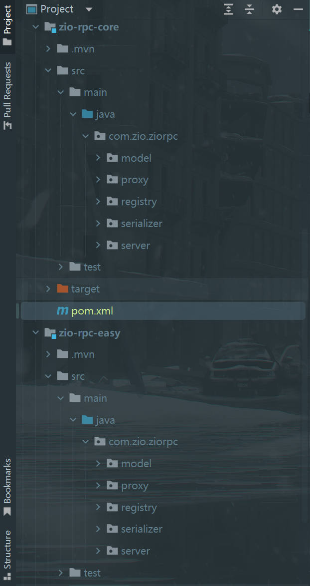

2.   引入日志库和单元测试依赖，便于后续开发：

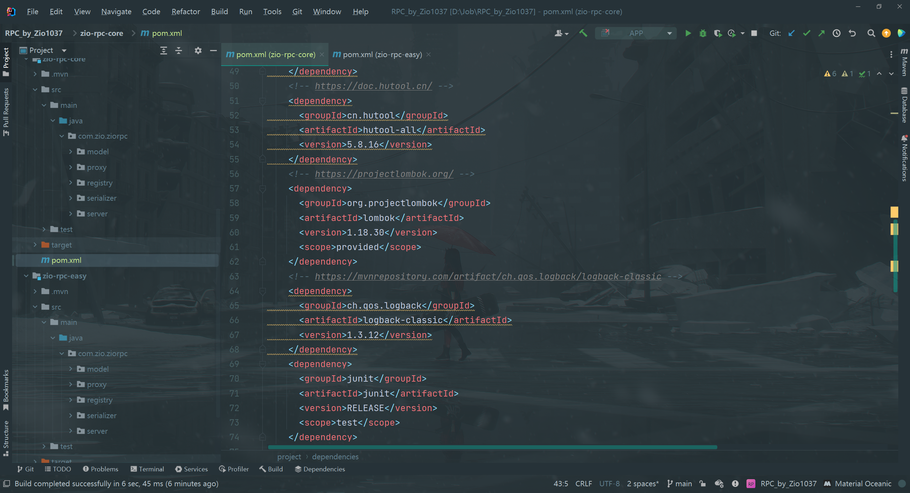

3.   将`example-consumer`和`example-provider`模块引入的`RPC`依赖都替换成`zio-rpc-core`：

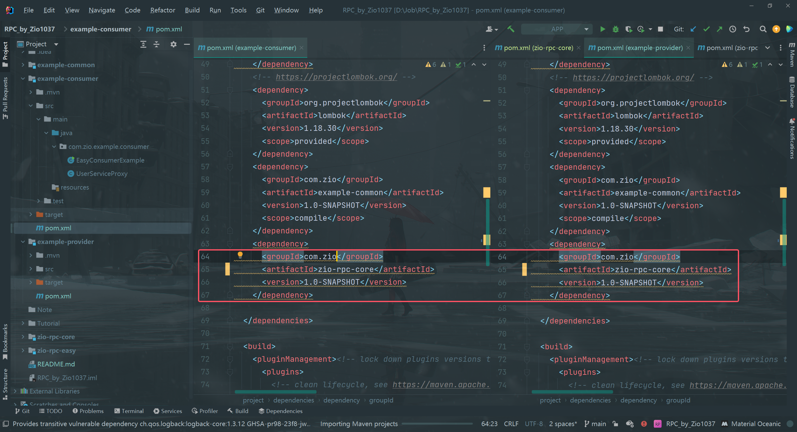

#### 配置加载

1.   在`com.zio.ziorpc`包下新建`config`包，并在该包下新建配置类`RpcConfig`，用于保存配置信息。

可以给属性指定一些默认值，完整代码如下：

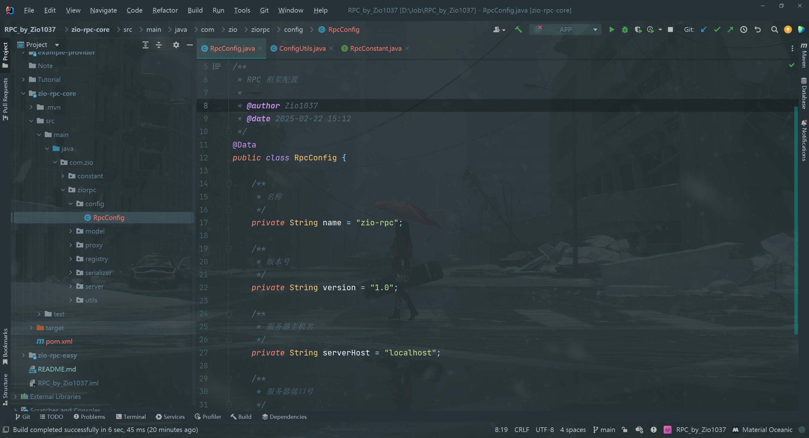

2.   在`com.zio.ziorpc`包下新建`utils`包，并在该包下新建工具类`ConfigUtils`，作用是读取配置文件并返回配置对象，可以简化调用。

工具类应当尽量通用，和业务不强绑定，提高使用的灵活性。比如支持外层传入要读取的配置内容前缀、支持传入环境等。

完整代码如下：

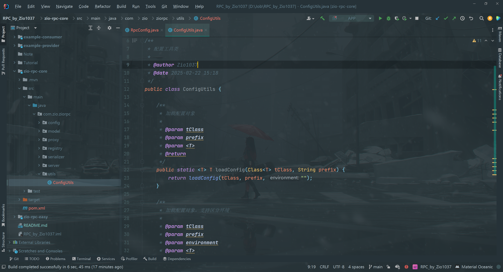

之后，调用`Configutils`的静态方法就能读取配置了。

3.   在`com.zio.ziorpc`包下新建`constant`包，并在该包中新建`RpcConstant`接口，用于存储RPC框架相关的常量，

比如默认配置文件的加载前缀为`rpc`：

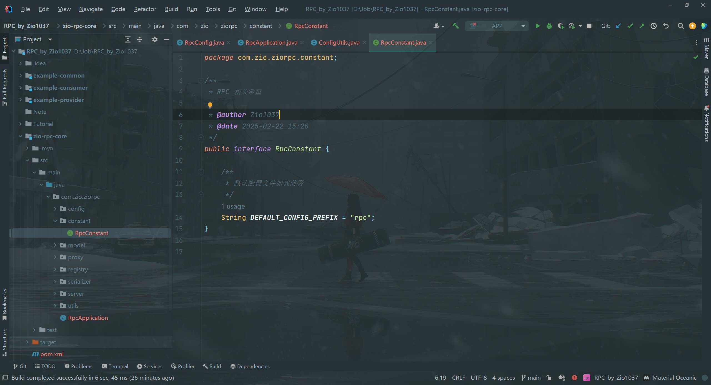

#### 维护全局配置对象

RPC框架中需要维护一个全局的配置对象。在引入RPC框架的项目启动时，从配置文件中读取配置并创建对象实例，之后就可以集中地从这个对象中获取配置信息，而不用每次加载配置时再重新读取配置、并创建新的对象，减少了性能开销。

使用设计模式中的单例模式，就能够很轻松地实现这个需求了。

一般情况下，我们会使用`holder`来维护全局配置对象实例。在本项目中，可以换一个更优雅的命名，使用`RpcApplication`类作为`RPC`项目的启动入口、并目维护项目全局用到的变量。

完整代码如下：

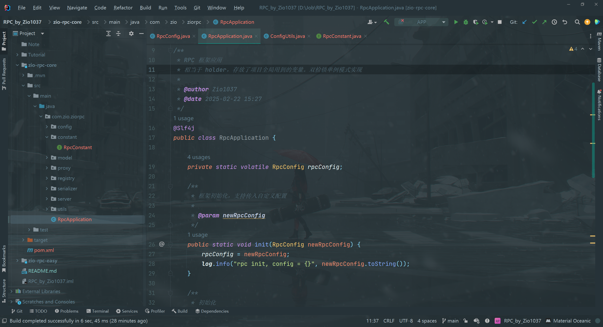

上述代码其实就是双检锁单例模式的经典实现，支持在获取配置时才调用init方法实现懒加载。

为了便于扩展，还支持自己传入配置对象；如果不传入，则默认调用前面写好的`ConfigUtils`来加载配置。

以后RPC框架内只需要写一行代码，就能正确加载到配置：

```java
RpcConfig rpc = RpcApplication.getRpcConfig();
```


## 测试

#### 测试配置文件读取

1.   在`example-consumer`模块的`resources`目录下编写配置文件` application.properties `：

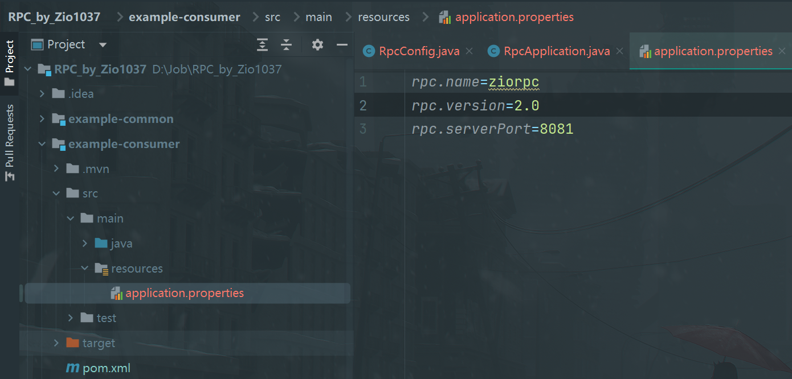

2.   创建`ConsumerExample`作为扩展后`RPC`项目的示例消费者类，测试配置文件读取。

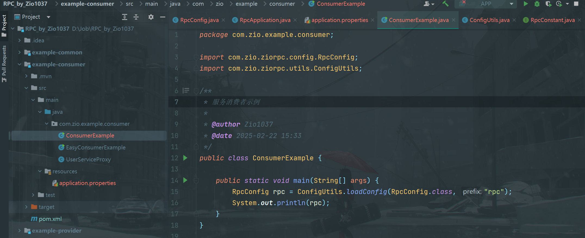

3.   运行`ConsumerExample`

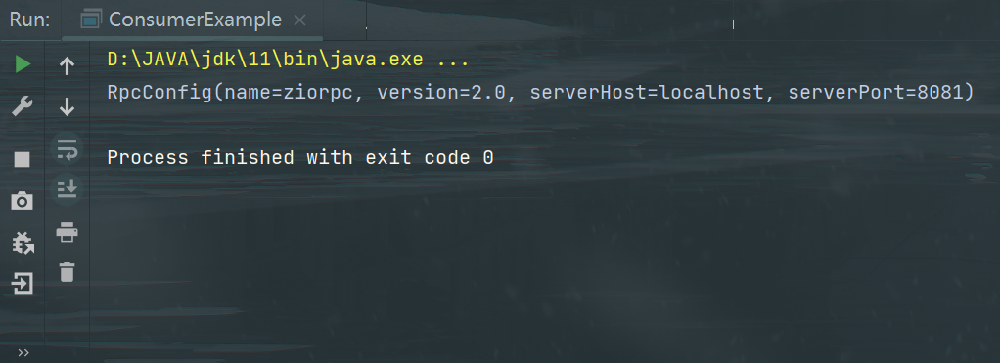

能够正确输出配置文件`application.properties`中的内容。

#### 测试全局配置对象加载

1.   在`example-provider`模块的`resources`目录下编写配置文件` application.properties `：

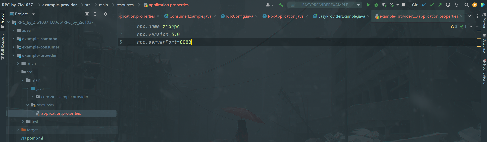

2.   修改`example-provider`项目中的`EasyProviderExample`简易服务提供者示例类，使其能够根据配置动态地在不同端口启动web服务 (line 26)。

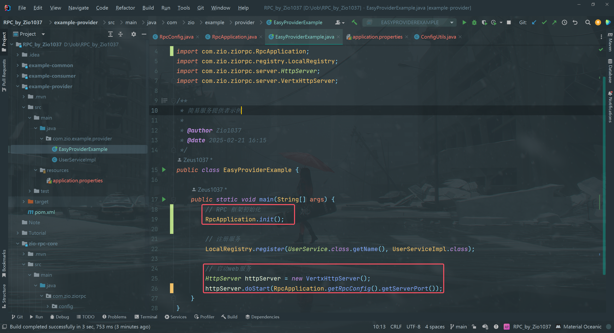

3.    运行`EasyProviderExample`：

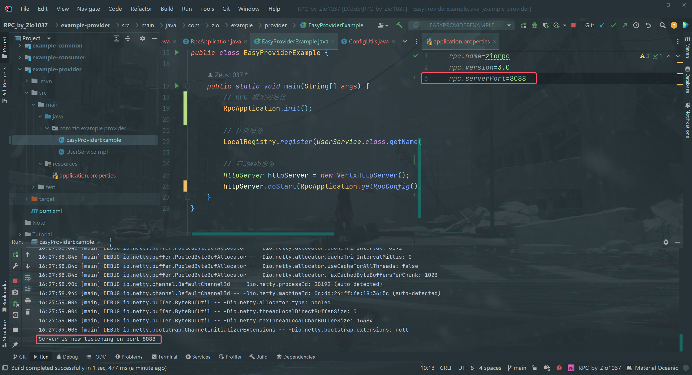

观察到服务提供者成功监听了配置文件中的端口，说明代码逻辑正确。


## Todo List

-   [ ] 支持不同格式配置文件，如`application.yml`，`application.yaml`
-   [ ] 支持监听配置文件更改，并自动更新配置对象
    -   [ ] 可能方案：使用Hutool工具类的`props.autoLoad()`可以实现配置文件变更的监听和自动加载
-   [ ] 配置文件支持中文
-   [ ] 配置分组
    -   [ ] 可能方案：嵌套配置
