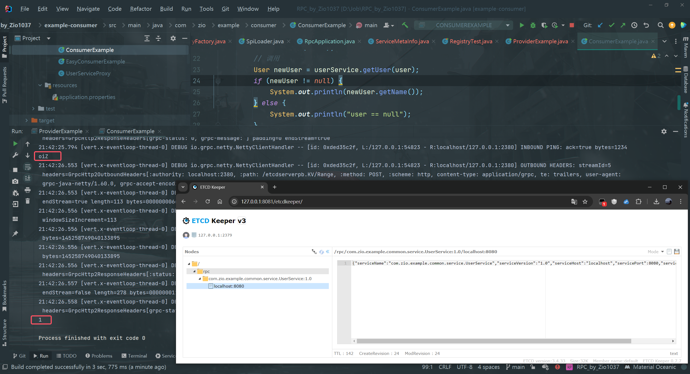

## 需求分析

RPC框架中的一个核心模块是注册中心，目的是帮助服务消费者获取到服务提供者的调用地址，而不是将调用地址硬编码到项目中。

## 设计方案

### 注册中心核心能力

我们先明确注册中心的几个实现关键（核心能力）：

1. 数据分布式存储：集中的注册信息数据存储、读取和共享
2. 服务注册：服务提供者上报服务信息到注册中心
3. 服务发现：服务消费者从注册中心拉取服务信息
4. 心跳检测：定期检查服务提供者的存活状态
5. 服务注销：手动剔除节点、或者自动剔除失效节点
6. 更多优化点：比如注册中心本身的容错、服务消费者缓存等。

### 技术选型

第一点是最重要的，我们首先需要一个能够集中存储和读取数据的中间件。此外，它还需要有数据过期、数据监听的能力，便于我们移除失效节点、更新节点列表等。

此外，对于注册中心的技术选型，我们还要考虑它的性能、高可用性、高可靠性、稳定性、数据一致性、社区的生态和活跃度等。注册中心的可用性和可靠性尤其重要，因为一旦注册中心本身都挂了，会影响到所有服务的调用。

主流的注册中心实现中间件有`ZooKeeper`、`Redis`等。本项目将使用一种更新颖的、更适合存储元信息（注册信息）的云原生中间件`Etcd`来实现注册中心。

### Etcd入门

详见`Note/Etcd.md`。

### 存储结构设计

存储结构设计的几个要点：

1. key如何设计？
2. value如何设计？
3. key什么时候过期？

由于一个服务可能有多个服务提供者（负载均衡），我们可以有两种结构设计：

1.   层级结构。将服务理解为文件夹、将服务对应的多个节点理解为文件夹下的文件，那么可以通过服务名称，用前缀查询的方式查询到某个服务的所有节点。

例如，键名的规则可以是 `业务前缀/服务名/服务节点地址`

2.   列表结构。将所有的服务节点以列表的形式整体作为value。

选择哪种存储结构呢？这个也会跟我们的技术选型有关。对于`ZooKeeper`和`Etcd`这种支持层级查询的中间件，**用第一种结构**会更清晰；对于`Redis`，由于本身就支持列表数据结构，可以选择第二种结构。

最后，一定要给key设置过期时间，比如默认30秒过期，这样如果服务提供者宕机了，也可以超时后自动移除。

## 开发实现

0.   安装Etcd、Etcd可视化工具、Etcd Java客户端。

>   详细步骤见`Note/Etcd.md`。

### 注册中心开发

1.   注册信息定义。

在`model`包下新建`ServiceMetaInfo`类，封装服务的注册信息，包括

-   服务名称：serviceName
-   服务版本号：serviceVersion
-   服务域名：serviceHost
-   服务端口号：servicePort
-   服务分组：serviceGroup
-   等等

还需要给`ServiceMetaInfo`增加一些工具方法，用于获取服务注册键名、获取服务注册节点键名等。

可以把版本号和分组都放到服务键名中，在查询时根据这些参数获取对应版本和分组的服务。

代码如下：

由于注册信息里包含了服务版本号字段，所以我们也可以给`RpcRequest`对象补充服务版本号字段，可以先作为预留字段，默认值为"1.0"，后续再自行实现。

在`RpcConstant`常量类中补充默认服务版本常量：

在`RpcRequest`请求类中使用该常量，代码如下：

2.   注册中心配置

在`config`包下编写注册中心配置类`RegistryConfig` ，让用户配置连接注册中心所需的信息，包括

-   注册中心类别：registry
-   注册中心地址：address
-   用户名：username
-   密码：password
-   连接超时时间：timeout
-   等等

还要为`RpcConfig`全局配置补充注册中心配置，代码如下：

3.   注册中心接口

遵循可扩展设计，我们先写一个注册中心接口，后续可以实现多种不同的注册中心，并且和序列化器一样，可以使用`SPI`机制动态加载。

注册中心接口代码如下，主要是提供了初始化、注册服务、注销服务、服务发现（获取服务节点列表）、服务销毁等方法。

4.   Etcd 注册中心实现

在`registry`目录下新建`EtcdRegistry`类，实现注册中心接口，依次实现以下方法：

1.   init: 初始化，读取注册中心配置并初始化客户端对象。
2.   registry: 服务注册，创建key并设置过期时间，value为服务注册信息的JSON序列化
3.   unRegistry: 服务注销，删除key
4.   serviceDiscovery: 服务发现，根据服务名称作为前缀，从Etcd获取服务下的节点列表
5.   destroy: 注册中心销毁，用于项目关闭后释放资源

上述代码中，我们定义Etcd键存储的根路径为`/rpc/`，用以区分不同的项目。

### 支持配置和扩展注册中心

一个成熟的RPC框架可能支持多个注册中心，像序列化器一样，我们希望让开发者够填写配置来指定使用的注册中心，并且支持自定义注册中心，让该框架更易用、更利于扩展。

要实现这点，开发方式和序列化器也是一样的，都可以使用工厂创建对象、使用`SPI`动态加载自定义的注册中心。

1.   注册中心常量

在registry包下新建`RegistryKeys`类，列举所有支持的注册中心键名，如etcd、zookeeper、redis等等。

2.   使用工厂模式，支持根据key从`SPI`获取注册中心对象实例。在registry包下新建RegistryFactory类，代码如下：

这个类可以直接复制之前的`SerializerFactory`，然后略做修改。

3.   在`META-INF`的`rpc/system`目录下编写注册中心接口的SPI配置文件，文件名称为`com.zio.ziorpc.registry.Registry`。

4.   最后，我们需要一个位置来初始化注册中心。由于服务提供者和服务消费者都需要和注册中心建立连接，是一个RPC框架启动必不可少的环节，所以可以将初始化流程放在`RpcApplication`类中。

修改  `init `方法如下：

### 完成调用流程

下面我们改造服务消费者调用服务的代码，跑通整个动态获取节点并调用的流程。

1.   服务消费者需要先从注册中心获取节点信息，再得到调用地址并执行。

需要给 `ServiceMetaInfo`类增加一个方法，便于获取可调用的地址，代码如下：

2.   修改服务代理`ServiceProxy`类，更改调用逻辑，使其通过注册中心获取服务提供者提供服务的地址。

修改的部分代码如下：

注意，从注册中心获取到的服务节点地址可能是多个。上述代码中，我们为了方便，暂时先取第一个，之后再对这里进行优化。

## 测试

### 注册中心测试

首先验证注册中心能否正常完成服务注册、注销、服务发现。

编写单元测试类`RegistryTest`，类中包含对registry()、unRegistry()和serviceDiscovery()的测试方法，代码如下：

运行对registry()的测试方法，服务注册后，打开EtcdKeeper的可视化界面，能够看到注册成功的服务节点信息：

可以通过点击图中所示的按钮进行树形展示。

### 完整流程测试

1.   在`example-provider`模块下新增服务提供者示例类，初始化RPC框架并将提供的服务手动注册到注册中心上。

2.   启动`providerExample`，观察ZooKeeper可视化

可以看到provider的服务已经成功注册了。

3.   启动消费者

在`ConsumerExample`消费者类的主函数中，我们通过动态代理访问注册中心拿到了provider的服务地址，并先后调用了该服务中的getUser和getNumber两个方法。从上图可以看到，这两个方法都成功执行了。

:warning:如果报错，很可能是键值对的过期时间设置过短。

**解决方法**：在Etcd注册中心 (`EtcdRegistry`类)中将租约时间 (`leaseId`)设置为300或更大。