## 项目初始化

1.   创建项目根目录

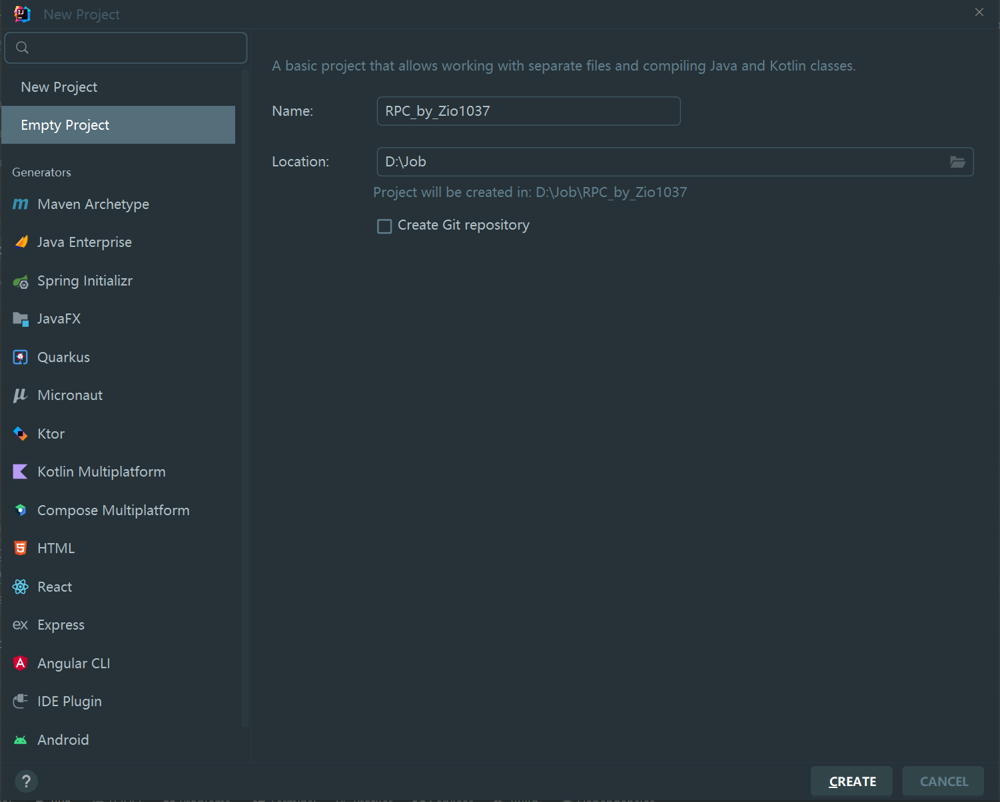

2.   设置项目JDK版本【这里用到的JDK 为 `11`】

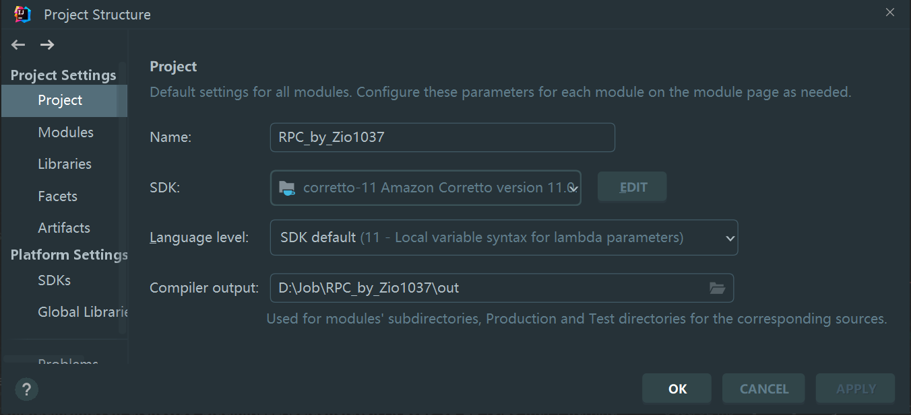

3.   在根目录下新建四个模块

- `example-common`: 示例代码的公共依赖，包括接口、Model等
- `example-consumer`: 示例服务消费者代码
- `example-provider`: 示例服务提供者代码
- `zio-rpc-easy`: 简易版RPC框架

以公共模块`example-common`举例，如下图所示：

运行模块中的`App.java`，测试模块是否正常：

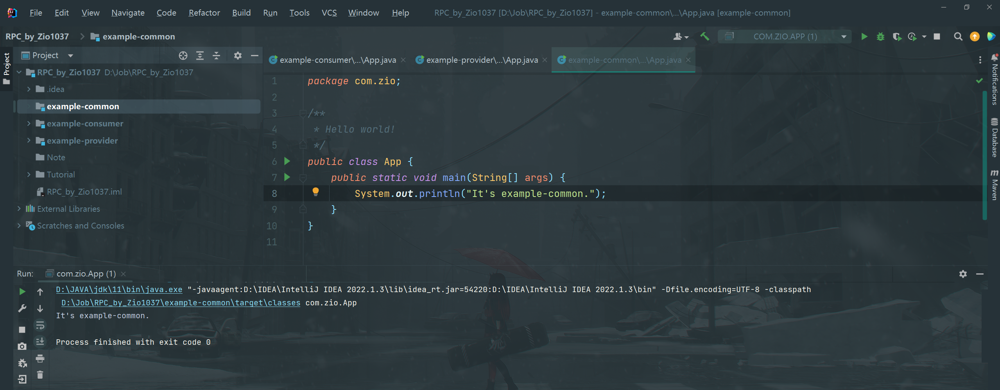

同样方式创建其它模块，最后删除每个模块下自动创建的`App.java`。

## 公共模块

公共模块需要同时被消费者和服务提供者引入，主要是编写和服务相关的接口和数据模型。

1.   在`example-common`模块下的`com.zio`包中创建`example.common.model`和`example.common.service`两个包。整个模块的结构如下图所示：

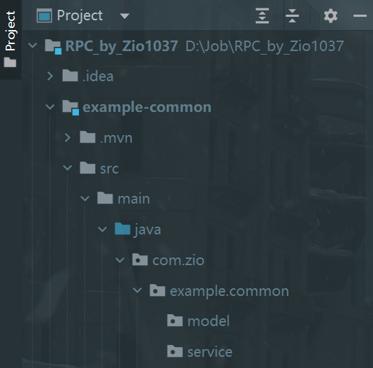

2.   在`model`包下创建用户实体类`User`：

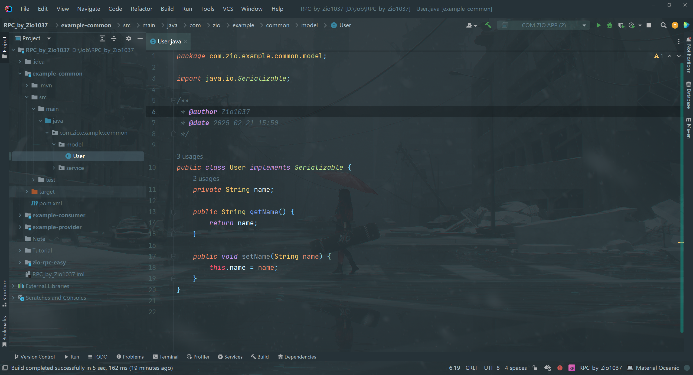

注意，对象需要实现序列化接口，为后续网络传输序列化提供支持。

3.   在`service`包下编写用户服务接口`UserService`，提供一个获取用户的方法：

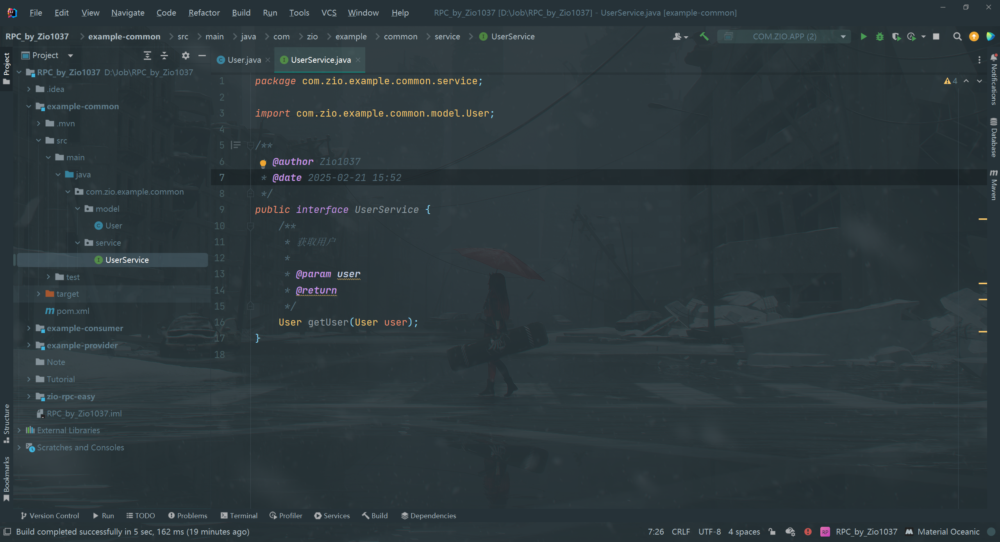

## 服务提供者

服务提供者是真正实现了接口的模块。

1.   打开`example-provider`模块，在`pom.xml`文件中引入要用到的依赖 (`zio-rpc-easy`, `example-common`, `hutool`和`lombook`)：

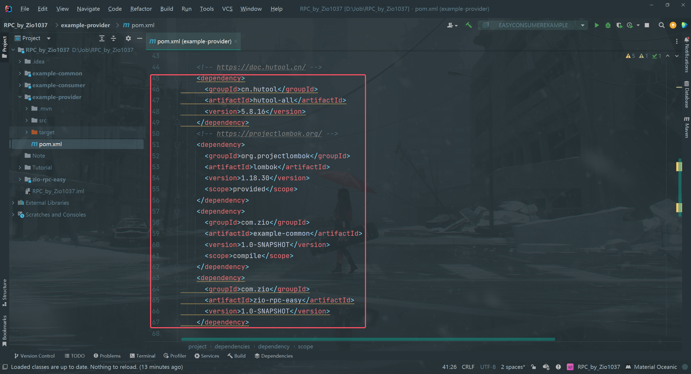

2.   在`com.zio`包下创建`example.provider`包，并在该包下编写服务实现类`UserServiceImpl`，实现公共模块中定义的用户服务接口。功能是打印用户的名称，并将用户名反转后返回。

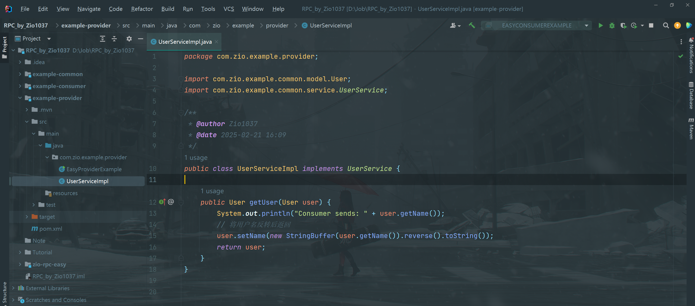

3.   在`example.provider`包下编写服务提供者启动类`EasyProviderExample`，之后会在该类的`main`方法中编写提供服务的代码。

## 服务消费者

服务消费者是需要调用服务的模块。

1.   打开`example-consumer`模块，在`pom.xml`文件中引入依赖，和`example-provider`模块的依赖一致：

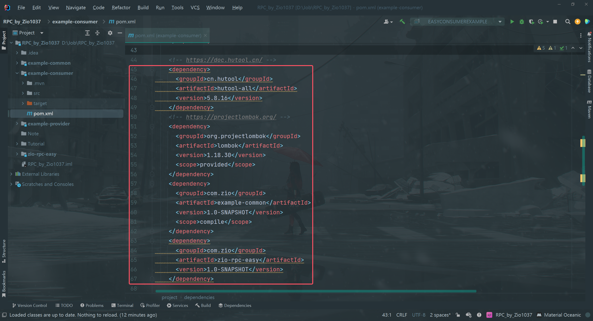

2.   在`com.zio`包下创建`example.consumer`包，并在该包下创建服务消费者启动类`EasyConsumerExample`，编写调用接口的代码。该实现类将打印调用提供者的服务（反转name的字符串）后的输出。

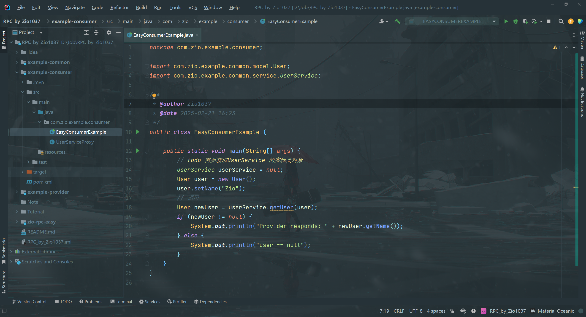

需要注意的是，现在是无法获取到`userService`实例的，所以预留为`null`。我们之后的目标是，能够通过RPC框架，快速得到一个支持远程调用服务提供者的代理对象，像调用本地方法一样调用`UserService`的方法。

## web服务器

接下来，我们要先让服务提供者提供可远程访问的服务。那么，就需要一个web服务器，能够接受处理请求、并返回响应。

web服务器的选择有很多，比如`Spring Boot`内嵌的`Tomcat`、`NIO`框架`Netty`和`Vert.x`等等。

此处使用高性能的`NIO`框架`Vert.x`来作为RPC框架的web服务器。

官方文档：https://vertx.io/

1.   打开`zio-rpc-easy`模块，在`pom.xml`文件中引入`Vert.x`和工具类的依赖：

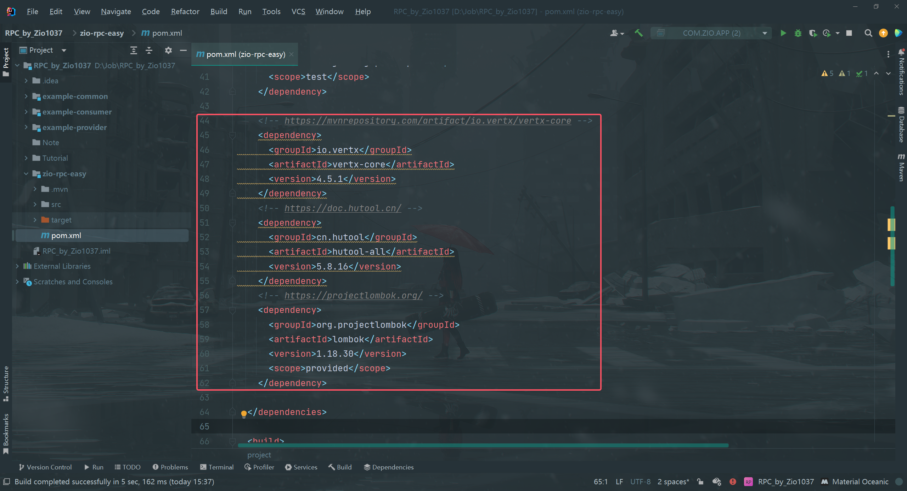

2.   在`com.zio`包中创建`ziorpc.server`包，并在该包下编写一个web服务器的接口`HttpServer`，定义统一的启动服务器方法，便于后续的扩展，比如实现多种不同的web服务器。

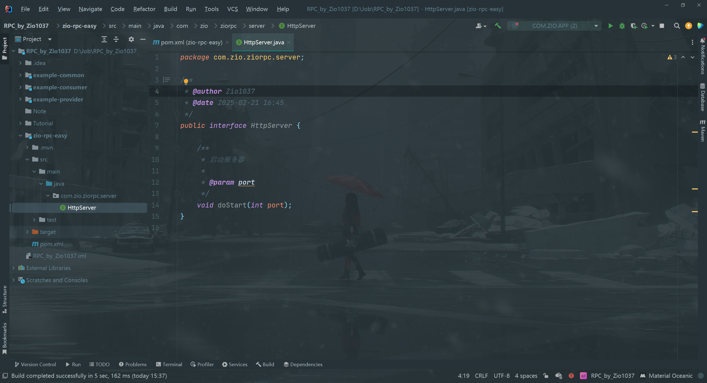

3.   编写基于`Vert.x`实现的web服务器`VertxHttpServer`，能够监听指定端口并处理请求。

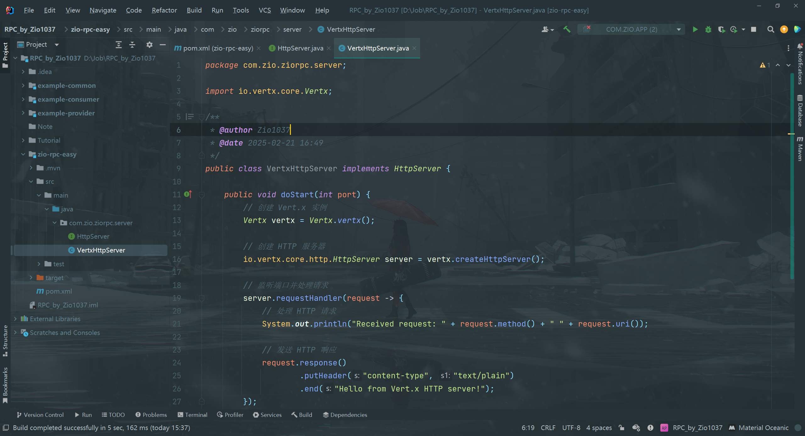

4.   验证web服务器能否启动成功并接受请求。

修改示例服务提供者模块的`EasyProviderExample`类，编写启动web服务的代码，如下：

直接运行，在浏览器中访问8080端口：

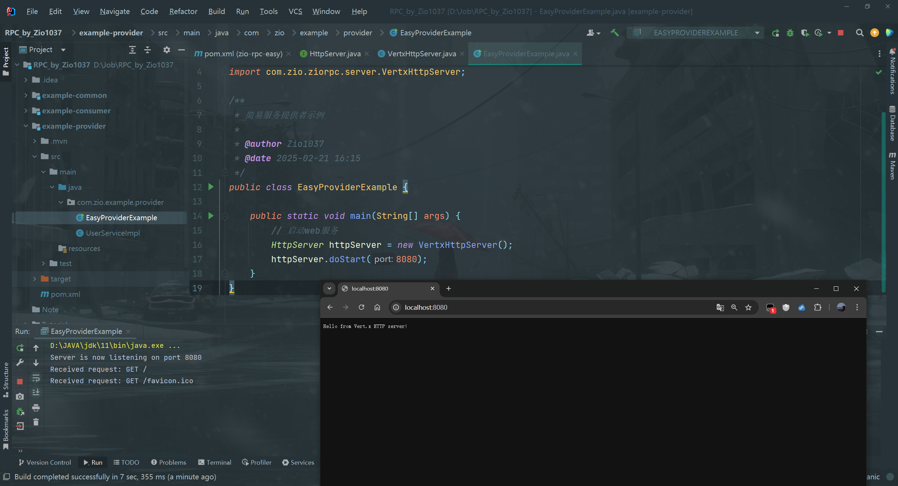

能够正常访问并看到输出的文字，说明服务启动成功。

## 本地服务注册器

目前做的简易RPC框架主要是跑通流程，所以暂时先不用第三方注册中心，直接把服务注册到服务提供者本地即可。

1.   打开`zio-rpc-easy`模块，在`com.zio`包下创建`ziorpc.registry`包，并在该包下创建本地服务注册器`LocalRegistry`，当前目录结构如下：

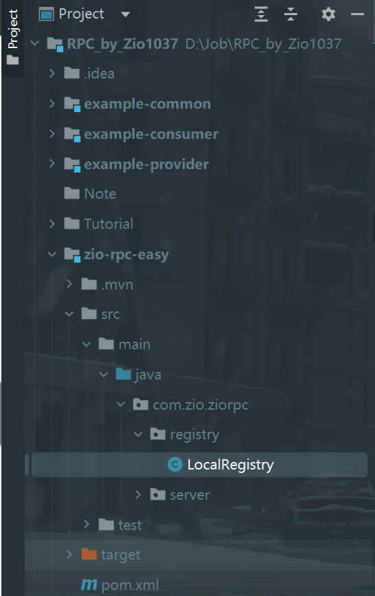

2.   编写本地服务注册器`LocalRegistry`的代码，使用线程安全的`ConcurrentHashMap`存储服务注册信息，key为服务名称，value为服务的实现类。之后就可以根据要调用的服务名称获取到对应的实现类，然后通过反射进行方法调用了。

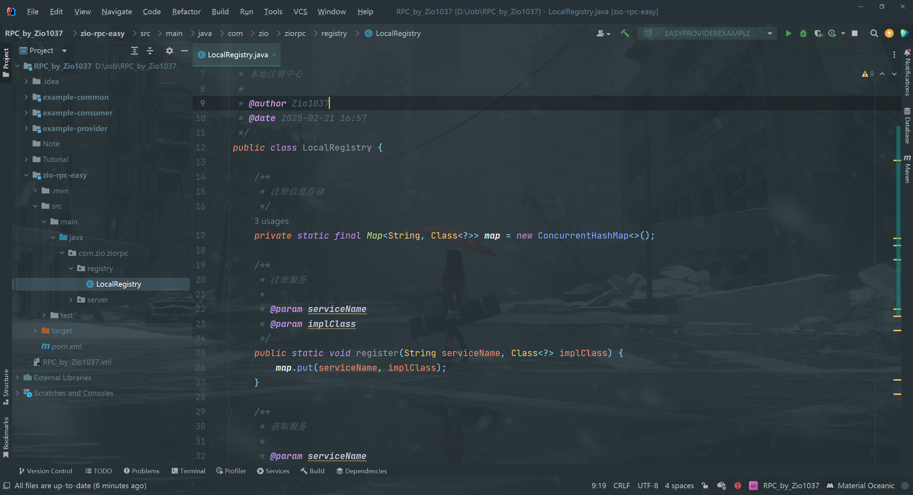

注意，本地服务注册器和注册中心的作用是有区别的。注册中心的作用侧重于管理注册的服务、提供服务信息给消费者；而本地服务注册器的作用是根据服务名获取到对应的实现类，是完成调用必不可少的模块。

3.   服务提供者启动时，需要注册服务到注册器中，因此需要修改`EasyProviderExample`代码如下：

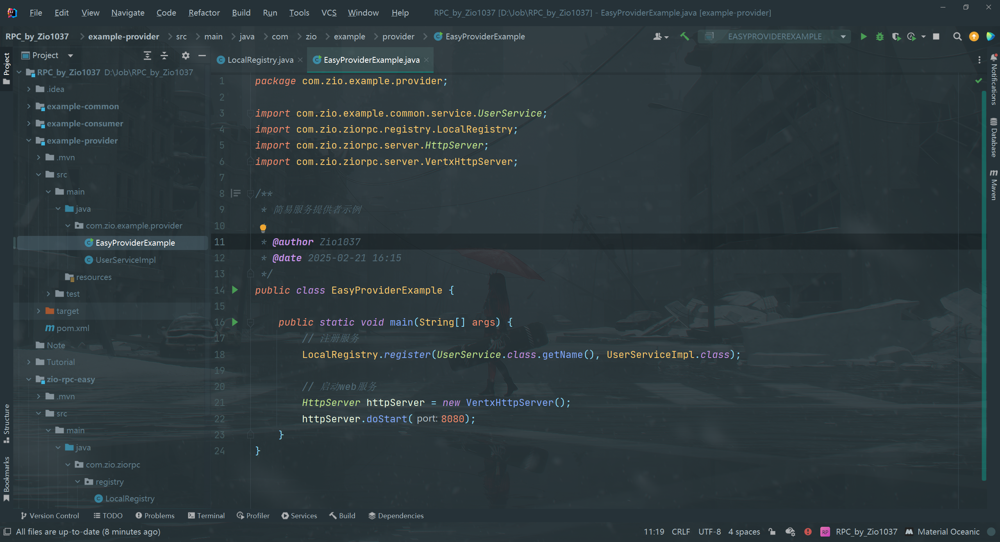

## 序列化器

服务在本地注册后，我们就可以根据请求信息取出实现类并调用方法了。

但是在编写处理请求的逻辑前，我们要先实现序列化器模块。因为无论是请求或响应，都会涉及参数的传输。而`Java`对象是存活在`JVM`虚拟以机中的，如果想在其他位置存储并访问、或者在网络中进行传输，就需要进行序列化和反序列化。

**序例化**和**反序列化**：

- 序列化：将`Java`对象转为可传输的字节数组。
- 反序列化：将字节数组转换为`Java`对象。

有很多种不同的序列化方式，比如`Java`原生序列化、JSON、Hessian、Kryo、protobuf等。

为了实现方便，此处选择`Java`原生的序列化器。

1.   在`zio-rpc-easy`模块中创建`com.zio.ziorpc.serializer`包，并在该包下编写序列化接口`Serializer`，提供序列化和反序列化两个方法，便于后续扩展更多的序列化器。

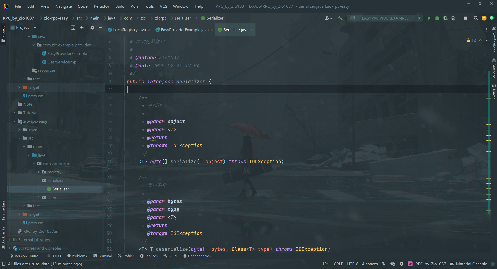

2.   在`serializer`包下基于`Java`自带的序列化器实现`JdkSerializer`，代码如下：

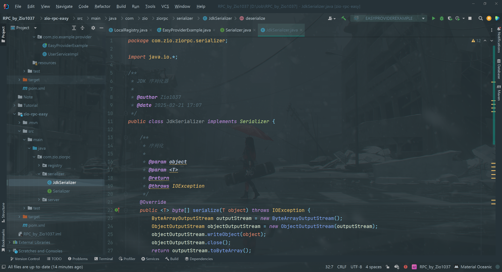

## 提供者处理调用 - 请求处理器

请求处理器是RPC框架的实现关键，它的作用是：处理接收到的请求，并根据请求参数找到对应的服务和方法，通过反射实现调用，最后封装返回结果并响应请求。

1.   在`zio-rpc-easy`模块中创建`com.zio.ziorpc.model`包，并在该包下编写请求类`RpcRequest`和响应封装类`RpcResponce`。

请求类`RpcRequest`的作用是封装调用所需的信息，比如服务名称、方法名称、调用参数的类型列表、参数列表。这些都是`Java`反射机制所需的参数。

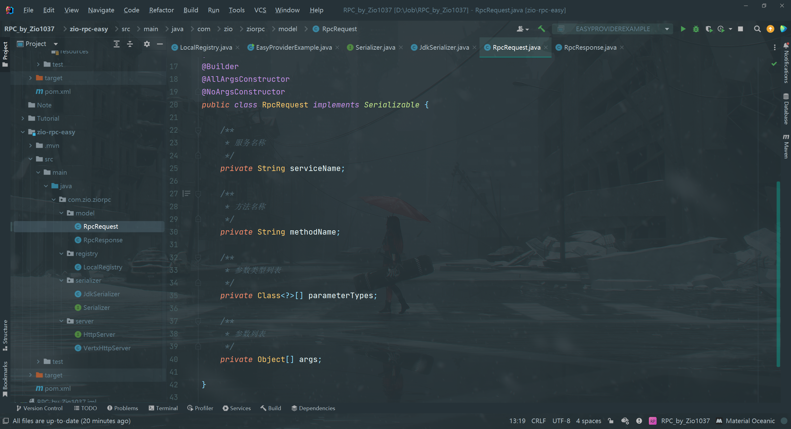

响应类`RpcResponse`的作用是封装调用方法得到的返回值、以及调用的信息（比如异常情况）等。

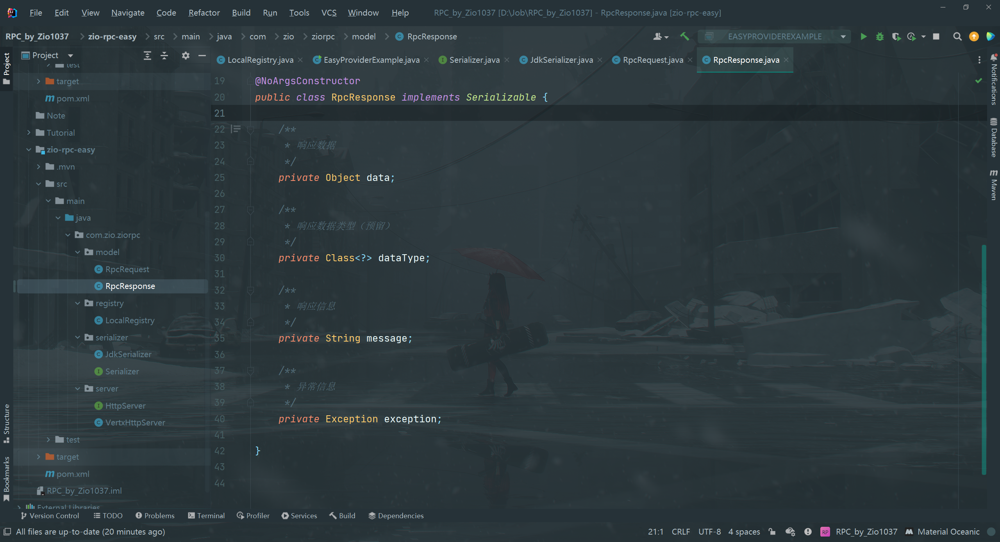

2.   在`zio-rpc-easy`模块中的`com.zio.ziorpc.server`包下编写请求处理器`HttpServerHandler`：

`HttpServerHandler`应当完成的业务流程如下：

1. 反序列化请求为对象，并从请求对象中获取参数。
2. 根据服务名称从本地注册器中获取到对应的服务实现类。
3. 通过反射机制调用方法，得到返回结果。
4. 对返回结果进行封装和序列化，并写入到响应中。

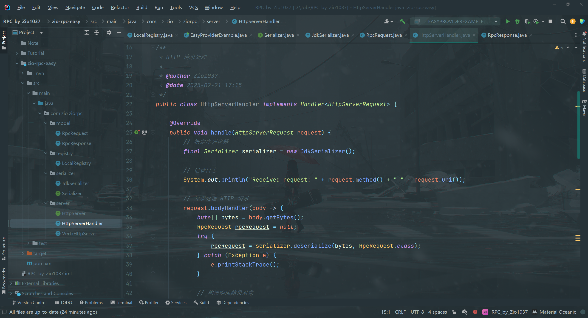

需要注意，不同的web服务器对应的请求处理器实现方式也不同，比如`Vert.x`中是通过实现`Handler<HttpServerRequest>`接口来自定义请求处理器的。并且可以通过`request.bodyHandler`异步处理请求。

3.    给`HttpServer`绑定请求处理器。

修改`VertxHttpServer`的代码，通过`server.requestHandler`绑定请求处理器。

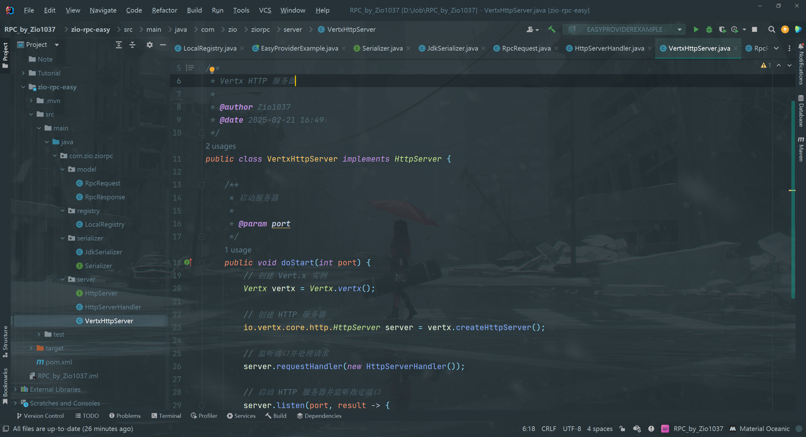

至此，引入了RPC框架的服务提供者模块，己经能够接受请求并完成服务调用了。

## 消费方发起调用 - 代理

在`example-consumer`消费者模块中，我们预留了一段调用服务的代码，只要能够获取到`UserService`对象（实现类），就能跑通整个流程。但这个实现类哪里来呢？

**==>** 我们可以通过生成**代理对象**来简化消费方的调用。

代理的实现方式大致分为2类，静态代理和动态代理，这里依次实现：

#### **静态代理**

静态代理是指为每一个特定类型的接口或对象，编写一个代理类。

比如在`example-consumer`模块中，创建一个静态代理`UserServiceProxy`，实现`UserService`接口和`getUser`方法。只不过实现`getUser`方法时，不是复制粘贴服务提供者`UserServicelmpl`中的代码，而是要构造HTTP请求去调用服务提供者。

1.   需要注意发送请求前要将参数序列化，代码如下：

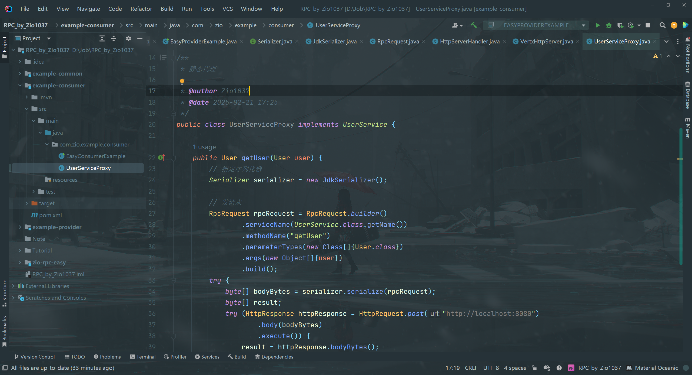

2.   然后修改`EasyConsumerExample`，new一个代理对象并赋值给`userService`就能完成调用：

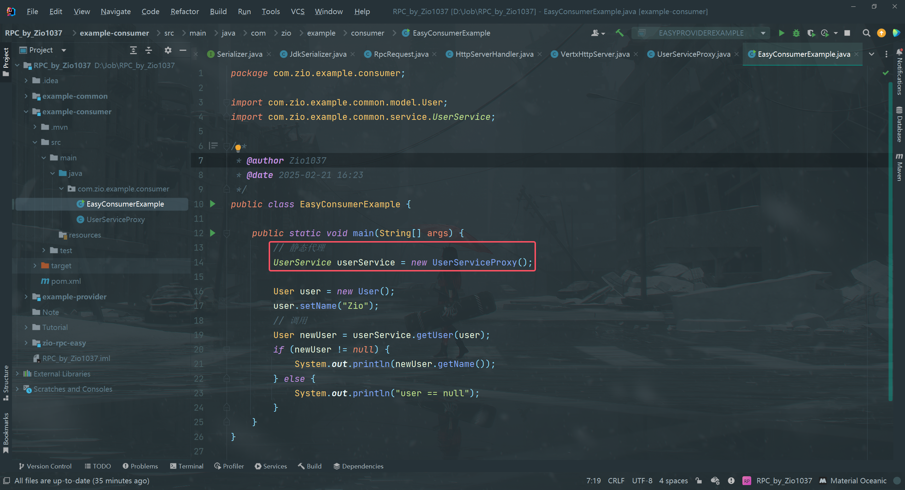

静态代理虽然很好理解（就是写个实现类），但缺点也很明显，我们如果要给每个服务接口都写一个实现类，是非常麻烦的，这种代理方式的灵活性很差！

因此本项目使用动态代理。

#### **动态代理**

动态代理的作用是，根据要生成的对象的类型，自动生成一个代理对象。

常用的动态代理实现方式有`JDK`动态代理和基于字节码生成的动态代理（比如`CGLB`)。前者简单易用、无需引入额外的库，但缺点是只对接口进行代理；后者更灵活、可以对任何类进行代理，但性略低于`JDK`动态代理。
此处使用`JDK`动态代理。

1.   在`zio-rpc-easy`模块中创建`com.zio.ziorpc.proxy`，并在该包中编写动态代理类`ServiceProxy`，实现`InvocationHandler`接口的`invoke`方法。代码如下（几乎就是把静态代理的代码搬运过来）：

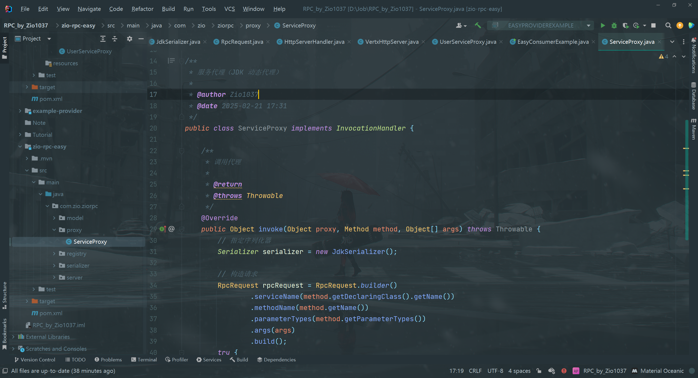

解释下上述代码，当用户调用某个接口的方法时，会改为调用`invoke`方法。在`invoke`方法中，我们可以获取到要调用的方法信息、传入的参数列表等，这不就是我们服务提供者需要的参数么？用这些参数来构造请求对象就可以完成调用了。

但需要注意的是，上述代码中，请求的服务提供者地址被硬编码了，是很不方便使用和维护的，后续将使用注册中心和服务发现机制来解决。

2.   创建动态代理工厂`ServiceProxyFactory`，作用是根据指定类创建动态代理对象，简化对象的创建过程：

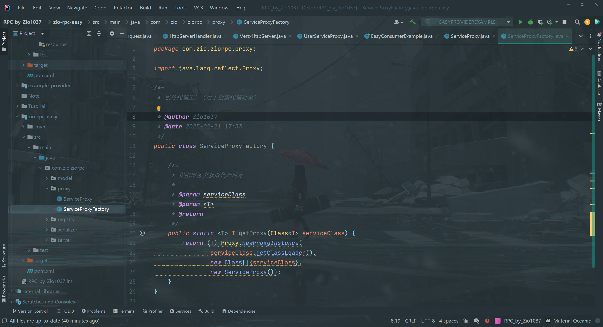

上述代码中，主要是通过`Proxy.newProxyInstance`方法为指定类型创建代理对象。

3.   最后，在`EasyConsumerExample`中，就可以通过调用工厂来为`UserService`获取动态代理对象了。

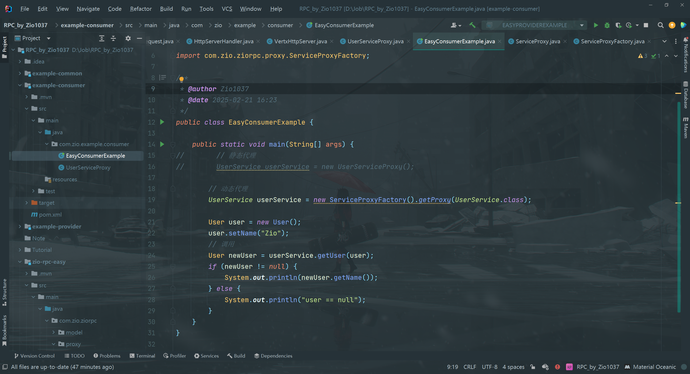

至此，简易版的RPC框架已经开发完成，下面进行测试。

## 测试验证

1.   以debug模式启动`example-provider`服务提供者模块，执行`main`方法：

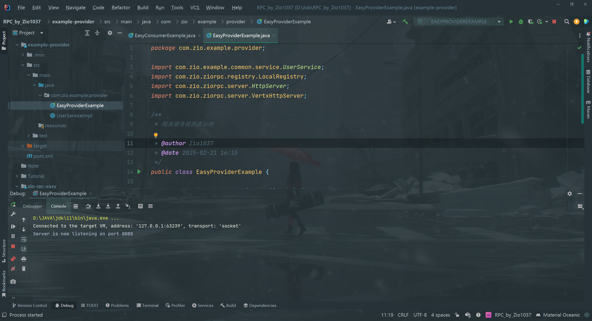

2.   以debug模式启动`example-consumer`服务消费者模块，执行`main`方法。

在`ServiceProxy`代理类中添加断点，可以看到调用`userService`时，实际是调用了代理对象的`invoke`方法，并且获取到了`serviceName`、`methodName`、参数类型和列表等信息。

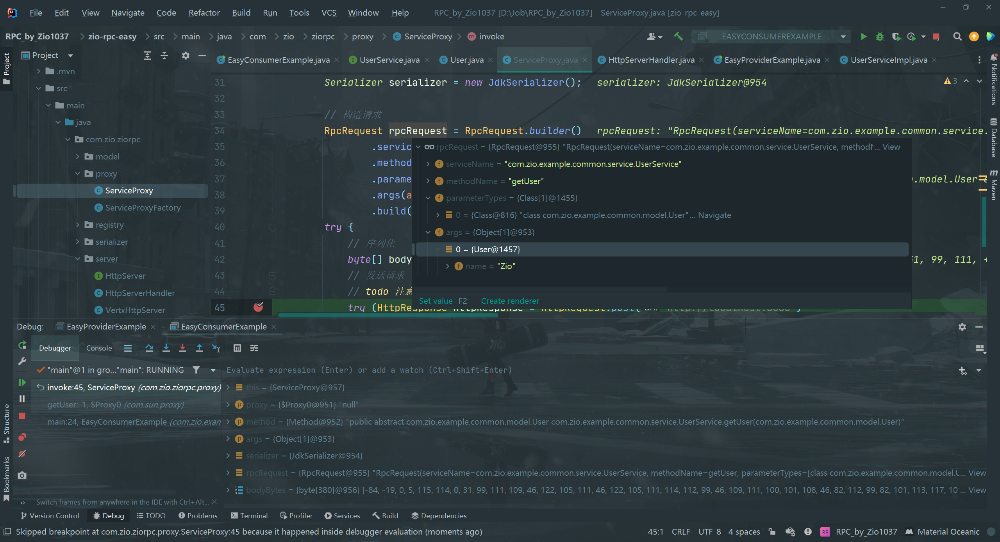

3.   继续`debug`，可以看到序列化后的请求对象，结构是字节数组：

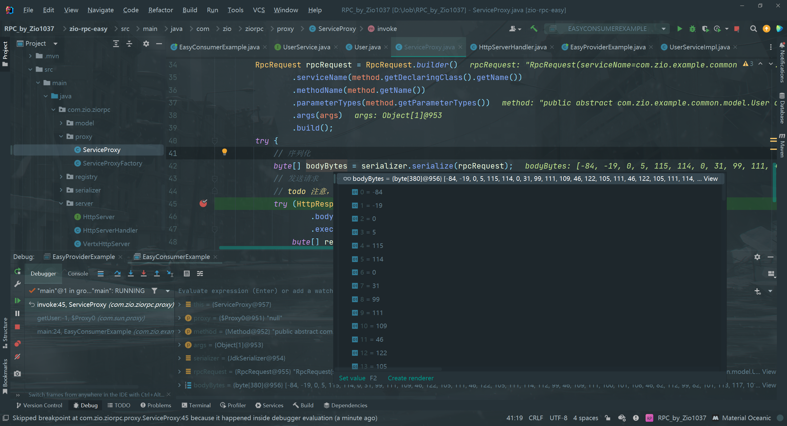

4.   在服务提供者模块的请求处理器中打断点，可以看到接受并反序列化后的请求，跟发送时的内容一致：

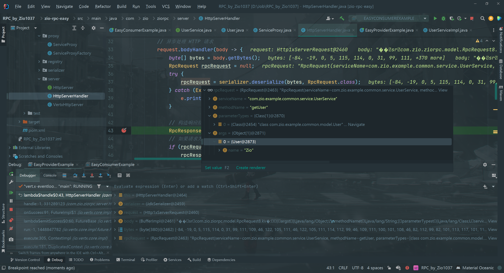

5.   继续`debug`，可以看到在请求处理器中，通过反射成功调用了方法，并得到了返回的User对象。

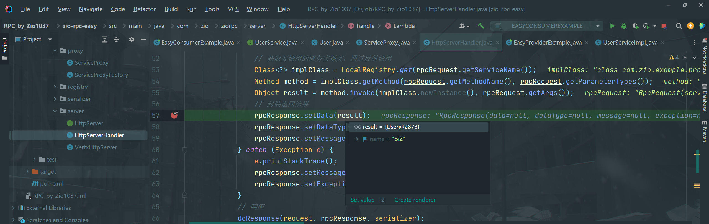

6.   最后，在服务提供者和消费者模块中都输出了用户名称，说明整个调用过程成功。

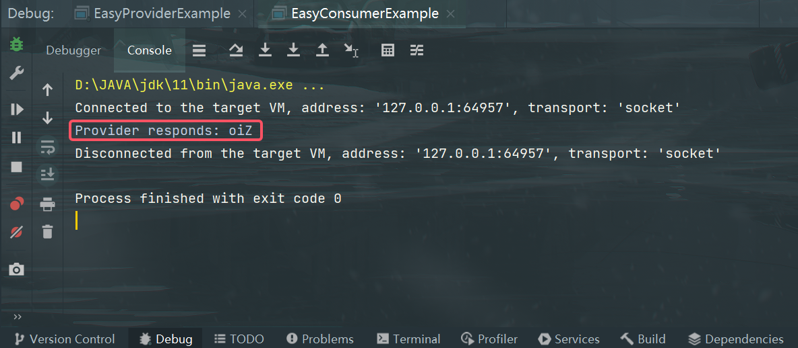

至此，简易版RPC框架就已经完成了，好耶！
